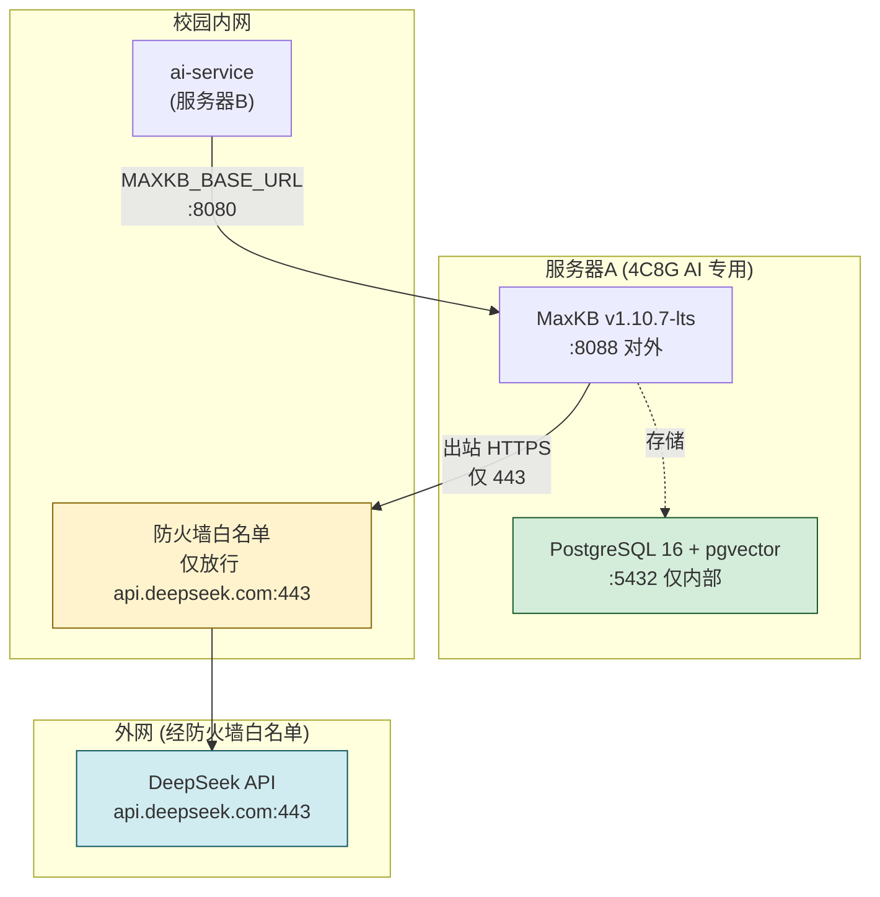

# INFRA-1.3 MaxKB + DeepSeek 内网部署文档

| 项目 | 内容 |
| --- | --- |
| 文档编号 | INFRA-1.3 |
| 任务名称 | MaxKB + DeepSeek 内网部署 |
| 所属项目 | 微迎新 CampusArrive |
| 版本 | v1.0 |
| 编写日期 | 2026-08-07 |
| 依据文档 | 《04-系统架构设计文档》第 7 节、《07-AI智能助手设计文档》、《10-测试计划与验收方案》 |
| 关联需求 | FR-01-07 ~ FR-01-14 |
| 关联测试 | UT-INFRA-007、UT-INFRA-008、UT-INFRA-009 |

---

## 1. 部署架构

### 1.1 架构图

依据 SAD 第 7 节「三服务器 + Docker 容器化精简拓扑」，MaxKB 部署于服务器A（AI 专用）。



### 1.2 组件说明

| 组件 | 镜像 | 端口 | 网络 | 说明 |
| --- | --- | --- | --- | --- |
| MaxKB | `1panel/maxkb:v1.10.7-lts` | 8080（容器）→ 8088（宿主机） | campus-ai | 知识库问答引擎，管理 UI 对外暴露 |
| PostgreSQL/pgvector | `pgvector/pgvector:pg16` | 5432（仅内部） | campus-ai | 向量存储库，MaxKB 的后端数据库 |

### 1.3 网络与安全策略

- **campus-ai 网络**：bridge 类型，MaxKB、pgvector 与 ai-service 共享，供 ai-service 调用 MaxKB。
- **出站策略**：MaxKB 仅允许出站到 `api.deepseek.com:443`（DeepSeek API），经校园网防火墙白名单放行。
- **PII 脱敏**：出站流量经 PII 脱敏后才发出（工作流编排，AI-3.2 实现）。
- **数据不出校**：所有知识库数据存储于内网 pgvector，不外传。

### 1.4 数据卷

| 服务 | 宿主机路径 | 容器路径 | 用途 |
| --- | --- | --- | --- |
| MaxKB | `./data/maxkb` | `/var/lib/maxkb` | 应用配置与缓存 |
| PostgreSQL/pgvector | `./data/postgres-pgvector` | `/var/lib/postgresql/data` | 向量数据持久化 |

---

## 2. 前置条件检查清单

部署前需逐项确认：

| # | 检查项 | 验证命令 | 期望结果 |
| --- | --- | --- | --- |
| 1 | Docker Engine ≥ 24.0 | `docker version` | 版本号 ≥ 24.0 |
| 2 | Docker Compose v2 | `docker compose version` | v2.20+ |
| 3 | campus-ai 网络已创建 | `docker network inspect campus-ai` | 存在 |
| 4 | 服务器A 联网（可拉镜像） | `docker pull 1panel/maxkb:v1.10.7-lts` | 拉取成功 |
| 5 | DeepSeek API Key 已申请 | `grep DEEPSEEK_API_KEY deploy/.env` | `sk-xxxx` 非占位值 |
| 6 | DeepSeek API 连通测试 | `curl -fsS https://api.deepseek.com/` | HTTP 响应 |
| 7 | 端口 8088 未占用 | `ss -tlnp \| grep 8088` | 无输出 |
| 8 | 磁盘空间充足 | `df -h .` | 可用 ≥ 10GB |
| 9 | .env 配置完整 | 见下方配置项 | 全部填写 |

### 2.1 必须配置的环境变量（`deploy/.env`）

```ini
# MaxKB 配置
MAXKB_VERSION=v1.10.7-lts
MAXKB_PORT=8088
MAXKB_ADMIN_USER=admin
MAXKB_ADMIN_PASSWORD=MaxKB@123..          # 首登后修改
MAXKB_SECRET_KEY=ChangeMe-MaxKB-Secret-Key-32chars-Min  # ≥32 字符随机串
MAXKB_DB_NAME=maxkb
MAXKB_DB_USER=maxkb
MAXKB_DB_PASSWORD=ChangeMeMaxKbDb#2024

# DeepSeek API
DEEPSEEK_API_KEY=sk-Replace-With-Your-DeepSeek-API-Key
DEEPSEEK_BASE_URL=https://api.deepseek.com
DEEPSEEK_MODEL_FLASH=deepseek-v4-flash
DEEPSEEK_MODEL_PRO=deepseek-v4-pro
```

---

## 3. MaxKB 部署步骤

### 3.1 拉起 MaxKB + PostgreSQL/pgvector

```bash
cd deploy

# 方式一：通过部署脚本（推荐）
./scripts/deploy.sh sit maxkb

# 方式二：直接 docker compose
docker compose -f docker-compose.maxkb.yml --env-file .env up -d
```

### 3.2 确认容器启动

```bash
docker compose -f docker-compose.maxkb.yml ps
```

预期输出：

```
NAME                       STATUS                   PORTS
campus-maxkb               Up (healthy)             0.0.0.0:8088->8080/tcp
campus-postgres-pgvector   Up (healthy)             5432/tcp
```

### 3.3 关键配置说明

| 配置项 | 值 | 说明 |
| --- | --- | --- |
| 镜像 | `1panel/maxkb:v1.10.7-lts` | 固定 LTS 版本，不使用 latest |
| 健康检查 | `curl -fsS http://localhost:8080/ -o /dev/null` | 根路径探活（UT-INFRA-007） |
| DB 环境变量前缀 | `DB_`（非 `MAXKB_DB_`） | v1.10 外部 PG 连接约定 |
| SECRET_KEY | 从 `.env` 的 `MAXKB_SECRET_KEY` 注入 | 会话签名与加密 |
| DeepSeek 透传 | `DEEPSEEK_API_KEY`、`DEEPSEEK_BASE_URL` | 供 MaxKB 内部 LLM 适配器读取 |

---

## 4. DeepSeek API 配置步骤

### 4.1 验证 DeepSeek API 连通性（部署层）

```bash
# 在服务器A 上测试 DeepSeek API 直连
curl -fsS https://api.deepseek.com/chat/completions \
  -H "Authorization: Bearer $(grep DEEPSEEK_API_KEY deploy/.env | cut -d= -f2)" \
  -H "Content-Type: application/json" \
  -d '{"model":"deepseek-v4-flash","messages":[{"role":"user","content":"ping"}]}'
```

预期返回 JSON，包含 `"content":"..."`。

### 4.2 在 MaxKB 控制台配置 DeepSeek 模型

详见 `deploy/maxkb/maxkb-app-config-guide.md` 步骤 2，关键配置：

| 配置项 | 值 |
| --- | --- |
| 供应商 | DeepSeek |
| 模型名称 | `deepseek-v4-flash` |
| 基础模型 | `deepseek-v4-flash` |
| API Key | 从 `.env` 获取 |
| API 地址 | `https://api.deepseek.com` |

---

## 5. 知识库初始化步骤

### 5.1 运行初始化引导脚本

```bash
./scripts/init-maxkb-knowledge-base.sh
```

脚本将交互式引导完成：
1. 修改默认密码
2. 配置 DeepSeek 模型供应商
3. 创建 4 个知识库（报到流程手册 / 校园POI / FAQ / 材料清单）
4. 创建 AI 应用并关联知识库
5. 获取应用 API Key

### 5.2 知识库规划

| 知识库名称 | 对应需求 | 内容 |
| --- | --- | --- |
| `freshman-checkin-guide` | FR-01-07 | 报到流程手册 |
| `campus-poi` | FR-01-08 | 校园 POI 信息 |
| `freshman-faq` | FR-01-09 | 常见问题 FAQ |
| `checkin-materials` | FR-01-10 | 材料清单模板 |

### 5.3 验证知识库就绪

```bash
# 通过 MaxKB API 列出知识库
TOKEN=$(curl -s http://localhost:8088/api/user/login \
  -H "Content-Type: application/json" \
  -d '{"username":"admin","password":"<密码>"}' | grep -oE '"data":"[^"]+"' | cut -d'"' -f4)

curl -s http://localhost:8088/api/dataset/current/page/1/page_size/100 \
  -H "Authorization: Bearer $TOKEN" | python3 -m json.tool
```

---

## 6. 网络隔离与防火墙配置

### 6.1 DeepSeek API 出站防火墙白名单

配置 iptables 规则，使 MaxKB 容器网段仅能出站到 DeepSeek API。

```bash
# 添加白名单规则（需 root）
sudo ./maxkb/deepseek-egress-firewall.sh add

# 查看规则状态
sudo ./maxkb/deepseek-egress-firewall.sh status

# 测试连通性
sudo ./maxkb/deepseek-egress-firewall.sh test
```

**规则说明**：

| 规则 | 动作 | 说明 |
| --- | --- | --- |
| campus-ai 子网 → DeepSeek API IP:443 | ACCEPT | 仅允许访问 DeepSeek API |
| campus-ai 子网 → 内网网段（RFC1918） | ACCEPT | 容器间通信、DNS |
| campus-ai 子网 → 其他外网 | DROP（含日志） | 阻止数据外泄 |

> **注意**：规则为内存态，重启后失效。持久化方法：
> - Debian/Ubuntu：`apt-get install -y iptables-persistent && netfilter-persistent save`
> - CentOS/RHEL：`iptables-save > /etc/sysconfig/iptables`

### 6.2 移除规则（临时排查时）

```bash
sudo ./maxkb/deepseek-egress-firewall.sh remove
```

---

## 7. 健康检查与验证

### 7.1 测试用例矩阵

| 测试编号 | 测试项 | 验证脚本 | DoD |
| --- | --- | --- | --- |
| UT-INFRA-007 | MaxKB 健康：API 可达且返回正常状态 | `./scripts/verify-maxkb-deepseek.sh` | 容器健康 + Web UI 200 + PG 健康 |
| UT-INFRA-008 | DeepSeek 连通：发送测试 prompt 返回响应 | `./scripts/verify-maxkb-deepseek.sh` | HTTP 200 + 首词响应 < 3s |
| UT-INFRA-009 | 数据不出校：抓包确认无外网请求 | `sudo ./scripts/audit-network-egress.sh` | 无违规外网目标 |

### 7.2 执行验证

```bash
# 步骤 1：MaxKB + DeepSeek 连通性验证（UT-INFRA-007 / UT-INFRA-008）
./scripts/verify-maxkb-deepseek.sh

# 步骤 2：网络出站审计（UT-INFRA-009，需 root + 产生对话流量）
sudo ./scripts/audit-network-egress.sh --duration 60
```

### 7.3 验证输出示例

```
微迎新 CampusArrive — MaxKB + DeepSeek 连通性验证报告  2026-08-07 10:00:00
------------------------------------------------------------------------------------------
UT 编号        检查项                       状态     详情
UT-INFRA-007   MaxKB 容器健康状态            PASS     healthcheck=healthy
UT-INFRA-007   MaxKB Web UI 可达性           PASS     HTTP 200 @ 127.0.0.1:8088
UT-INFRA-007   PostgreSQL/pgvector 健康     PASS     healthcheck=healthy
UT-INFRA-008   DeepSeek API 连通性           PASS     HTTP 200，模型=deepseek-v4-flash
UT-INFRA-008   DeepSeek 首词响应时间 (TTFT)  PASS     TTFT=856ms，首词="你好"
------------------------------------------------------------------------------------------
汇总：通过 5  失败 0  跳过/警告 0
```

---

## 8. Go/No-Go 验证点

部署完成后，以下全部通过方可进入下一阶段（AI-3.x）：

| # | 验证点 | 验证方法 | Go/No-Go |
| --- | --- | --- | --- |
| 1 | MaxKB 可通过内网 IP 访问管理界面 | `curl -fsS http://<服务器A IP>:8088/` | HTTP 2xx |
| 2 | DeepSeek API 内网可达且响应正常 | `./scripts/verify-maxkb-deepseek.sh` | UT-INFRA-008 PASS |
| 3 | 知识库空间初始化完成 | MaxKB 控制台可见 4 个知识库 | 4 个知识库均已创建 |
| 4 | 网络流量审计确认数据不出校 | `sudo ./scripts/audit-network-egress.sh` | UT-INFRA-009 无违规 |
| 5 | 应用 API Key 已获取并写入 .env | `grep MAXKB_API_KEY deploy/.env` | 非占位值 |
| 6 | 默认密码已修改 | 使用新密码登录 MaxKB | 登录成功 |
| 7 | 防火墙白名单已配置 | `sudo ./maxkb/deepseek-egress-firewall.sh status` | 链已启用 |

> **No-Go 处理**：任一验证点未通过，不得进入 AI-3.x；按第 9 节故障排查处理。

---

## 9. 故障排查指南

| 现象 | 可能原因 | 排查方法 |
| --- | --- | --- |
| MaxKB 容器持续 starting | pgvector 未就绪或 DB 连接失败 | `docker logs campus-maxkb`；检查 `DB_*` 环境变量；确认 pgvector 健康 |
| MaxKB Web UI 返回 502 | 容器内应用未启动完成 | 等待 start_period（60s）；`docker logs campus-maxkb` 查看 migrate 日志 |
| DeepSeek API 测试失败 | API Key 错误 / 网络不通 | 验证 Key 格式 `sk-`；`curl https://api.deepseek.com/` 测试网络；检查防火墙 |
| DeepSeek TTFT > 3s | 网络延迟或模型负载高 | 检查校园网出口带宽；尝试 `deepseek-v4-flash`（低延迟）；非高峰期重测 |
| 网络审计发现违规目标 | 防火墙规则未配置 | `sudo ./maxkb/deepseek-egress-firewall.sh add`；检查 MaxKB 是否有遥测/更新检查 |
| pgvector 向量索引失败 | 磁盘空间不足或内存溢出 | `df -h`；`docker stats campus-postgres-pgvector`；检查 PG 日志 |
| 知识库上传后检索无结果 | 文档未向量化 / 相似度阈值过高 | 检查知识库详情中文档状态；降低相似度阈值至 0.3 测试 |
| 应用 API 调用 401 | API Key 错误或应用未发布 | 确认应用已发布；重新获取 API Key |

### 9.1 日志查看

```bash
# MaxKB 日志
docker logs campus-maxkb --tail 100 -f

# PostgreSQL 日志
docker logs campus-postgres-pgvector --tail 100 -f

# 容器健康检查详情
docker inspect --format '{{json .State.Health}}' campus-maxkb | python3 -m json.tool
```

### 9.2 防火墙日志

违规出站流量会记录到内核日志（LOG 目标，前缀 `CAMPUS_EGRESS_DROP:`）：

```bash
# 查看防火墙 DROP 日志
dmesg | grep CAMPUS_EGRESS_DROP
# 或
journalctl -k | grep CAMPUS_EGRESS_DROP
```

---

## 10. 回滚方案

### 10.1 回滚场景

| 场景 | 触发条件 | 回滚操作 |
| --- | --- | --- |
| MaxKB 版本异常 | 升级后功能不可用 | 回退镜像 tag |
| 配置错误导致不可用 | 环境变量配置错误 | 修正 `.env` 并重启 |
| 数据损坏 | pgvector 数据异常 | 从备份恢复数据卷 |
| 完全回退 | 需移除整个 AI 栈 | 停止容器并清理 |

### 10.2 回退镜像版本

```bash
# 编辑 docker-compose.maxkb.yml，将 image 改回上一个版本
# 例如：1panel/maxkb:v1.10.6-lts
vi deploy/docker-compose.maxkb.yml

# 重新拉起
docker compose -f docker-compose.maxkb.yml --env-file .env up -d
```

### 10.3 移除防火墙规则

```bash
sudo ./maxkb/deepseek-egress-firewall.sh remove
```

### 10.4 数据卷备份与恢复

```bash
# 备份（部署正常后立即执行）
cd deploy
tar -czf /backup/maxkb-data-$(date +%Y%m%d).tar.gz data/maxkb data/postgres-pgvector

# 恢复
cd deploy
docker compose -f docker-compose.maxkb.yml down
tar -xzf /backup/maxkb-data-YYYYMMDD.tar.gz
docker compose -f docker-compose.maxkb.yml --env-file .env up -d
```

### 10.5 完全回退（移除 AI 栈）

```bash
cd deploy
# 停止并删除容器
docker compose -f docker-compose.maxkb.yml --env-file .env down
# 移除防火墙规则
sudo ./maxkb/deepseek-egress-firewall.sh remove
# 清理数据卷（谨慎！将丢失知识库数据）
# docker compose -f docker-compose.maxkb.yml --env-file .env down -v
# rm -rf data/maxkb data/postgres-pgvector
```

---

## 11. 交付物清单

| 文件 | 说明 |
| --- | --- |
| `deploy/docker-compose.maxkb.yml` | MaxKB + pgvector 编排文件（已更新 v1.10.7-lts） |
| `deploy/scripts/verify-maxkb-deepseek.sh` | 连通性验证脚本（UT-INFRA-007/008） |
| `deploy/scripts/init-maxkb-knowledge-base.sh` | 知识库初始化引导脚本 |
| `deploy/scripts/audit-network-egress.sh` | 网络出站审计脚本（UT-INFRA-009） |
| `deploy/maxkb/deepseek-egress-firewall.sh` | DeepSeek API 防火墙白名单脚本 |
| `deploy/maxkb/maxkb-app-config-guide.md` | MaxKB 应用配置操作手册 |
| `deploy/docs/INFRA-1.3-部署文档.md` | 本文档 |
| `deploy/.env.example` | 环境变量模板（已补充 MaxKB/DeepSeek 配置项） |

---

## 12. 变更记录

| 日期 | 版本 | 变更内容 | 作者 |
| --- | --- | --- | --- |
| 2026-08-07 | v1.0 | 初始版本：MaxKB v1.10.7-lts + DeepSeek 部署 | DevOps |
