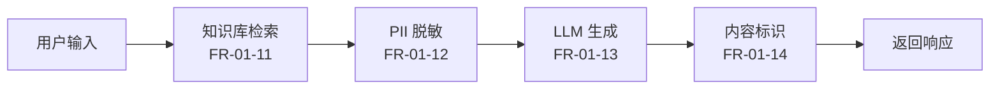

# MaxKB 应用配置操作手册 (INFRA-1.3)

> 面向运维与内容运营人员，指导在 MaxKB 控制台完成模型供应商配置、知识库创建、AI 应用编排与应用 API Key 获取。
>
> 对应需求：FR-01-07 ~ FR-01-14（AI 智能助手）

---

## 前置条件

- [ ] MaxKB 容器已启动且健康（`docker ps | grep campus-maxkb`）
- [ ] MaxKB Web UI 可达：`http://<服务器A IP>:8088`
- [ ] DeepSeek API Key 已申请并写入 `deploy/.env`（`DEEPSEEK_API_KEY=sk-xxxx`）
- [ ] 已运行初始化引导脚本：`./scripts/init-maxkb-knowledge-base.sh`

> 查看当前 DeepSeek API Key（从 .env 读取）：
> ```bash
> grep DEEPSEEK_API_KEY deploy/.env
> ```

---

## 步骤 1：修改默认密码

| 项目 | 内容 |
| --- | --- |
| 默认用户名 | `admin` |
| 默认密码 | `MaxKB@123..` |
| 安全要求 | 首次登录后立即修改为强密码（≥12 位，含大小写字母/数字/符号） |

**操作步骤**：

1. 浏览器访问 `http://<服务器A IP>:8088`，使用默认凭据登录。
2. 点击右上角用户名头像 -> **个人设置**（或「修改密码」）。
3. 输入旧密码 `MaxKB@123..`，设置新密码。
4. 保存后系统将自动登出，使用新密码重新登录。

> **截图位置说明**：右上角头像下拉菜单 -> 个人设置页面（截图保存至 `.screenshots/maxkb/01-change-password.png`）

5. 将新密码同步更新到 `deploy/.env`：
   ```bash
   # 编辑 .env
   vi deploy/.env
   # 修改：MAXKB_ADMIN_PASSWORD=<新密码>
   ```

---

## 步骤 2：添加 DeepSeek 模型供应商

对应需求：FR-01-11（AI 模型集成）

**操作步骤**：

1. 登录 MaxKB 控制台，进入 **系统设置** -> **模型管理**。
2. 点击 **添加模型**。

> **截图位置说明**：系统设置 -> 模型管理 -> 添加模型弹窗（截图保存至 `.screenshots/maxkb/02-add-model.png`）

3. 填写模型配置：

   | 配置项 | 值 | 说明 |
   | --- | --- | --- |
   | 供应商 | DeepSeek | 选择 DeepSeek 供应商（或 OpenAI 兼容自定义） |
   | 模型名称 | `deepseek-v4-flash` | 低延迟模型，用于实时对话 |
   | 基础模型 | `deepseek-v4-flash` | 对应 DeepSeek API 的 model 参数 |
   | API Key | （从 `.env` 获取 `DEEPSEEK_API_KEY`） | `sk-xxxx` 格式 |
   | API 地址 | `https://api.deepseek.com` | DeepSeek API base_url |
   | 上下文数 | 4096 | 根据实际需求调整 |

4. 点击 **保存**，然后点击 **测试** 按钮验证连通性。

> **截图位置说明**：模型添加成功后的测试通过提示（截图保存至 `.screenshots/maxkb/02b-model-test.png`）

5.（可选）添加高能力模型用于复杂问答：

   | 配置项 | 值 |
   | --- | --- |
   | 供应商 | DeepSeek |
   | 模型名称 | `deepseek-v4-pro` |
   | 基础模型 | `deepseek-v4-pro` |
   | API Key | （同上） |
   | API 地址 | `https://api.deepseek.com` |

**验证**：

```bash
# 通过脚本验证 DeepSeek 连通性（UT-INFRA-008）
./scripts/verify-maxkb-deepseek.sh
```

---

## 步骤 3：创建知识库空间

对应需求：FR-01-07 ~ FR-01-10

需创建 **4 个知识库**，分别覆盖报到流程、校园导航、常见问题与材料清单。

### 3.1 报到流程手册（FR-01-07）

**操作步骤**：

1. 进入 **知识库** -> 点击 **创建知识库**。
2. 填写信息：

   | 配置项 | 值 |
   | --- | --- |
   | 知识库名称 | `freshman-checkin-guide` |
   | 知识库描述 | 新生报到流程指引，含线上预登记、现场签到、宿舍分配、缴费确认等环节 |
   | 文本分段规则 | 自动分段（或按段落标记） |
   | 向量模型 | 默认（pgvector 内置） |

3. 点击 **创建**。
4. 进入知识库详情，点击 **上传文档**，上传以下内容：
   - 报到流程手册（PDF/Word/Markdown）
   - 各环节操作步骤说明
   - 时间节点与截止日期表

> **截图位置说明**：知识库创建弹窗 + 文档上传页面（截图保存至 `.screenshots/maxkb/03-kb-checkin-guide.png`）

### 3.2 校园 POI 信息（FR-01-08）

| 配置项 | 值 |
| --- | --- |
| 知识库名称 | `campus-poi` |
| 知识库描述 | 校园兴趣点（教学楼/食堂/图书馆/宿舍/快递点/医务室等）位置与导航信息 |
| 上传文档 | 地点信息表、校园地图标注、建筑说明 |

### 3.3 常见问题 FAQ（FR-01-09）

| 配置项 | 值 |
| --- | --- |
| 知识库名称 | `freshman-faq` |
| 知识库描述 | 新生高频问答，覆盖缴费、选课、军训、生活、校园卡办理等 |
| 上传文档 | Q&A 对（建议 CSV/Excel 格式，列：问题、答案）、FAQ 文档 |

> **建议**：FAQ 文档使用「问答对」分段模式，提高检索准确率。

### 3.4 材料清单模板（FR-01-10）

| 配置项 | 值 |
| --- | --- |
| 知识库名称 | `checkin-materials` |
| 知识库描述 | 报到所需材料清单与模板（身份证/录取通知书/照片/档案/户口迁移证等） |
| 上传文档 | 材料清单表格、各材料模板与填写说明 |

**验证知识库就绪**：

```bash
# 通过 MaxKB API 查看已创建知识库（替换 <TOKEN>）
curl -s http://localhost:8088/api/dataset/current/page/1/page_size/100 \
  -H "Authorization: Bearer <TOKEN>" | python3 -m json.tool
```

或运行初始化引导脚本的 API 验证：
```bash
./scripts/init-maxkb-knowledge-base.sh --non-interactive
```

---

## 步骤 4：创建 AI 应用

对应需求：FR-01-11 ~ FR-01-14

**操作步骤**：

1. 进入 **应用** -> 点击 **创建应用**。

> **截图位置说明**：应用创建页面（截图保存至 `.screenshots/maxkb/04-create-app.png`）

2. 填写应用配置：

   | 配置项 | 值 | 说明 |
   | --- | --- | --- |
   | 应用类型 | **SIMPLE** | 简单对话应用（工作流编排见步骤 6） |
   | 应用名称 | `campus-arrive-assistant` | 微迎新智能助手 |
   | 应用描述 | 新生报到智能问答助手 | |
   | 关联模型 | `deepseek-v4-flash` | 低延迟模型 |
   | 关联知识库 | 勾选以下 4 个 | |
   | | `freshman-checkin-guide` | 报到流程 |
   | | `campus-poi` | 校园 POI |
   | | `freshman-faq` | 常见问题 |
   | | `checkin-materials` | 材料清单 |

3. 设置 **开场白**：
   ```
   你好！我是微迎新智能助手，可以为你解答报到流程、校园导航、材料准备等问题。请问有什么可以帮助你的？
   ```

4. 设置 **多轮对话**：开启（保留上下文轮数建议 5~10）。
5. 设置 **知识库检索**：
   - Top-K：5（检索返回的文档片段数）
   - 相似度阈值：0.5（根据测试调优）
6. 点击 **保存** 并 **发布**。

> **截图位置说明**：应用配置完成 + 发布成功页面（截图保存至 `.screenshots/maxkb/04b-app-published.png`）

**测试应用**：

在应用详情页的「调试预览」中输入测试问题：
- 「请问报到需要准备哪些材料？」
- 「图书馆在哪里？」
- 「如何进行线上预登记？」

---

## 步骤 5：获取应用 API Key

对应需求：ai-service 调用 MaxKB 对话接口

**操作步骤**：

1. 进入已创建的应用详情页。
2. 点击 **API 文档**（或「嵌入」/「发布」->「API 访问」）。

> **截图位置说明**：应用详情 -> API 文档页面（截图保存至 `.screenshots/maxkb/05-api-key.png`）

3. 复制 **API Key**（格式形如 `xxxxxxxx-xxxx-xxxx-xxxx-xxxxxxxxxxxx`）。
4. 记录 **应用 ID**（API 路径中的 `<APP_ID>`）。
5. 将 API Key 写入 `deploy/.env`：
   ```bash
   vi deploy/.env
   # 修改：MAXKB_API_KEY=<你的应用 API Key>
   ```

**验证 API 调用**：

```bash
# 替换 <APP_ID> 和 <API_KEY>
curl -s http://localhost:8088/api/application/<APP_ID>/chat/completions \
  -H "Authorization: Bearer <API_KEY>" \
  -H "Content-Type: application/json" \
  -d '{
    "message": "你好，请问报到需要哪些材料？",
    "stream": false
  }' | python3 -m json.tool
```

---

## 步骤 6：MaxKB 工作流编排说明（FR-01-11 ~ FR-01-14）

> **注意**：工作流编排为后续 **AI-3.2** 任务实现，此处仅说明配置入口与预期设计，
> 当前阶段（INFRA-1.3）完成 SIMPLE 应用即可。

### 6.1 工作流设计（对应需求规格）

根据《07-AI智能助手设计文档》，AI 智能助手的工作流包含 4 个核心节点：



| 节点 | 需求编号 | 功能 | MaxKB 配置入口 |
| --- | --- | --- | --- |
| 知识库检索 | FR-01-11 | 从 4 个知识库检索相关文档片段 | 应用 -> 知识库关联 + 检索参数 |
| PII 脱敏 | FR-01-12 | 出站请求前脱敏（身份证号/手机号等） | 工作流 -> 函数节点（自定义脱敏脚本） |
| LLM 生成 | FR-01-13 | 调用 DeepSeek 生成回答 | 应用 -> 模型关联 |
| 内容标识 | FR-01-14 | 响应中标注来源与 AI 生成标识 | 工作流 -> 后处理节点 |

### 6.2 配置入口（AI-3.2 任务实现时使用）

1. 进入 **应用** -> 选择目标应用 -> **编辑工作流**（或创建「工作流类型」应用）。
2. **检索节点**：关联 4 个知识库，设置 Top-K 与相似度阈值。
3. **函数节点（PII 脱敏）**：
   - 类型：Python 函数节点
   - 输入：用户原始 query
   - 处理：正则替换身份证号（`\d{18}|\d{17}[Xx]`）、手机号（`1[3-9]\d{9}`）为掩码
   - 输出：脱敏后的 query（传递给 LLM 与出站请求）
4. **LLM 节点**：关联 `deepseek-v4-flash`，设置 system prompt 与检索结果拼装。
5. **后处理节点（内容标识）**：
   - 在响应末尾追加来源引用（命中的知识库名称与文档片段）
   - 追加 AI 生成标识：「本回答由 AI 智能助手生成，仅供参考」

> **截图位置说明**：工作流编辑器全貌（截图保存至 `.screenshots/maxkb/06-workflow.png`，AI-3.2 完成后补充）

### 6.3 当前阶段交付边界

| 交付项 | 状态 | 说明 |
| --- | --- | --- |
| MaxKB 部署与 DeepSeek 连通 | ✅ 已完成 | INFRA-1.3 |
| 4 个知识库创建 | ✅ 已完成 | 本文档步骤 3 |
| SIMPLE 应用创建 | ✅ 已完成 | 本文档步骤 4 |
| 工作 PII 脱敏节点 | ⏳ AI-3.2 | 工作流编排实现 |
| 内容标识节点 | ⏳ AI-3.2 | 工作流编排实现 |
| ai-service 集成 | ⏳ AI-3.x | 后端调用 MaxKB API |

---

## 附录：常见问题

**Q1：模型测试失败，提示鉴权错误。**
A：检查 `.env` 中 `DEEPSEEK_API_KEY` 是否正确（`sk-` 开头），且 MaxKB 控制台中填入的 Key 与之一致。可通过命令验证：
```bash
curl https://api.deepseek.com/chat/completions \
  -H "Authorization: Bearer $(grep DEEPSEEK_API_KEY deploy/.env | cut -d= -f2)" \
  -H "Content-Type: application/json" \
  -d '{"model":"deepseek-v4-flash","messages":[{"role":"user","content":"ping"}]}'
```

**Q2：知识库上传文档后检索不到结果。**
A：确认文档已「向量化」完成（知识库详情中状态为「成功」）。FAQ 类文档建议使用「问答对」分段模式。调整相似度阈值（降低至 0.3 测试）。

**Q3：应用 API 调用返回 401。**
A：检查 API Key 是否正确，应用是否已「发布」。未发布的应用 API 不可调用。

**Q4：MaxKB 控制台无法访问。**
A：检查容器状态 `docker ps | grep maxkb`，查看日志 `docker logs campus-maxkb`，确认端口映射 `docker port campus-maxkb`。

**Q5：如何重新获取应用 API Key？**
A：应用详情 -> API 文档 -> 点击「重置」生成新 Key（旧 Key 失效），需同步更新 `.env` 中的 `MAXKB_API_KEY`。
