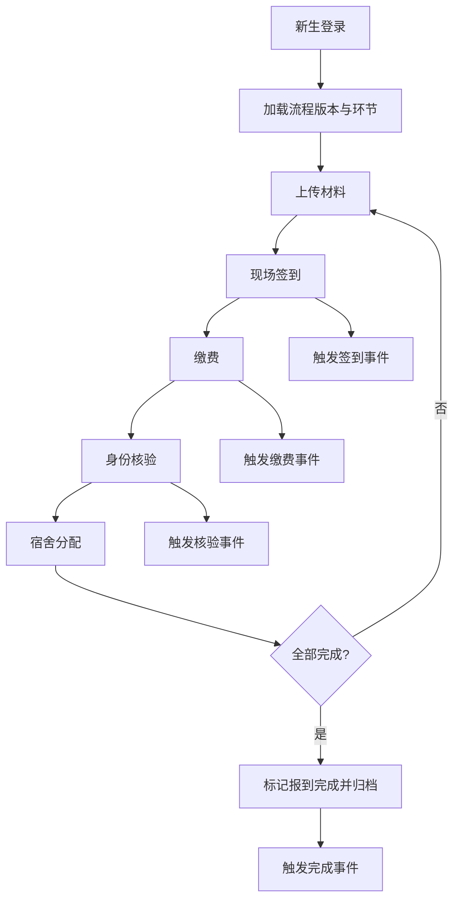
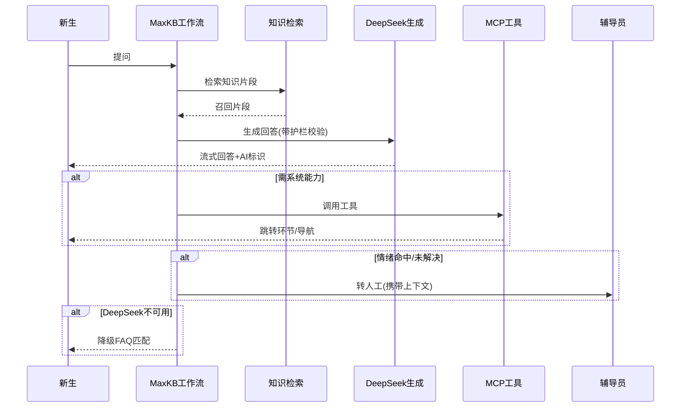
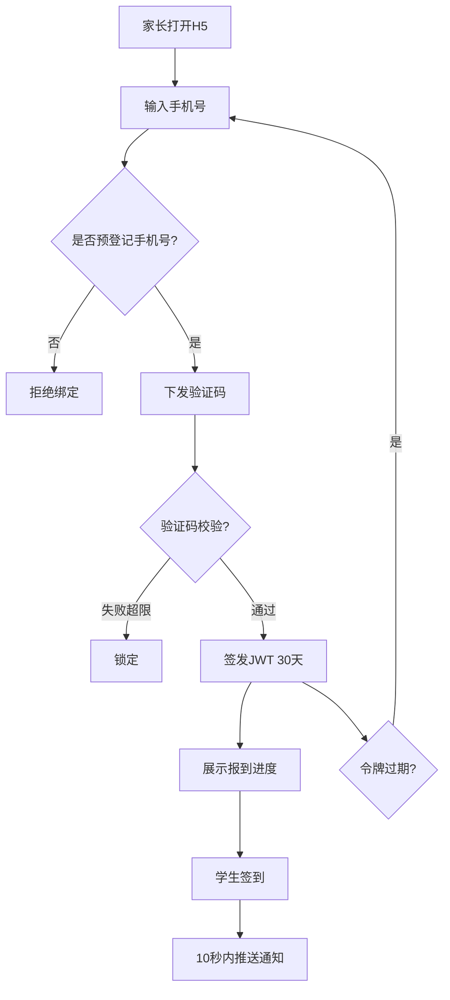
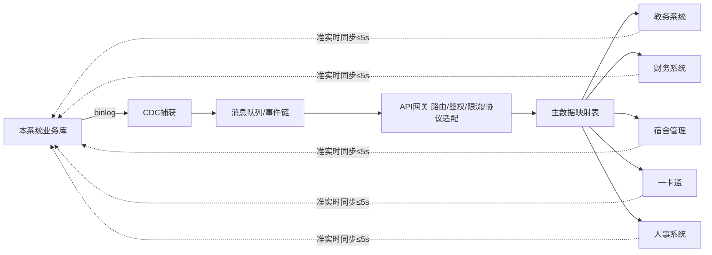

# 微迎新（CampusArrive） 需求规格说明书（SRS）

| 项目名称 | 微迎新（CampusArrive） |
| --- | --- |
| 文档版本 | v1.1.0 |
| 文档编号 | SRS-CA-2026-03 |
| 状态 | 正式发布 |
| 编制日期 | 2026-08-07 |
| 适用版本 | v1.1（基于 v1.0 迭代） |
| 密级 | L2 内部敏感 |

---

## 1 引言

### 1.1 编写目的

本说明书对微迎新（CampusArrive） v1.1 版本的功能需求、非功能需求、业务流程与验收标准进行完整、可验证的描述，作为后续系统设计、开发、测试、验收与运维的统一基准。文档面向产品经理、架构师、开发工程师、测试工程师、辅导员与校方信息中心管理人员。

v1.1 在 v1.0 已上线能力的基础上新增五大模块：AI 迎新智能助手、无障碍访问改造、家长查看端、系统集成中间件、安全与合规保障。学生前端沿用微信小程序，并采用"标准流程为主路径 + RAG 对话为辅助路径"的双层交互模式。

### 1.2 文档范围

本说明书覆盖以下内容：

- 系统概述与用户角色画像；
- v1.0 基线功能的保留性需求；
- v1.1 五大新增模块的详细功能需求清单（统一编号 `FR-XX-XX`）；
- 性能、可用性、安全、无障碍、兼容性等非功能需求；
- 标准报到流程、AI 对话流程、家长绑定流程、系统集成流程四类核心业务流程；
- 功能需求至模块与验收标准的追溯矩阵。

不在本文档范围内的事项：详细技术架构设计、数据库表结构、接口字段级定义、UI 视觉稿、项目排期与成本预算，上述内容由配套的架构设计文档、接口设计文档与项目计划文档承担。

### 1.3 术语与缩略语

| 术语 / 缩略语 | 含义 |
| --- | --- |
| SRS | 软件需求规格说明书（Software Requirements Specification） |
| RAG | 检索增强生成（Retrieval-Augmented Generation） |
| MCP | 模型上下文协议（Model Context Protocol），用于大模型调用外部工具 |
| MaxKB | 用于知识库构建与工作流编排的开源平台 |
| DeepSeek | 本项目采用的大语言模型服务 |
| POI | 兴趣点（Point of Interest），此处指校园地点信息 |
| FAQ | 常见问题（Frequently Asked Questions） |
| JWT | JSON Web Token，用于无状态身份鉴权 |
| CDC | 变更数据捕获（Change Data Capture），监听数据库 binlog 实现数据同步 |
| binlog | MySQL 二进制日志，记录数据库变更 |
| API 网关 | 统一入口，承担路由、鉴权、限流、协议适配 |
| PII | 个人身份信息（Personally Identifiable Information） |
| WCAG | Web 内容无障碍指南（Web Content Accessibility Guidelines） |
| ARIA | 可访问富互联网应用（Accessible Rich Internet Applications）语义标签 |
| Lighthouse | Google 提供的网页质量自动化审计工具 |
| OWASP | 开放 Web 应用安全项目（Open Web Application Security Project） |
| SOAP | 简单对象访问协议，部分遗留系统使用的通信协议 |
| REST | 表述性状态转移，主流 Web API 风格 |
| 首词响应 | AI 流式输出中首个 token 到达客户端的时间 |
| 降级 | 当主链路服务不可用时自动切换至备用方案 |
| 报到环节 | 报到流程中的一个步骤，如签到、缴费、核验、宿舍分配 |
| MCP 工具 | 经 MCP 协议暴露给大模型的系统能力，如跳转环节、调用导航 |

### 1.4 参考文献与依据

| 编号 | 名称 | 用途 |
| --- | --- | --- |
| REF-01 | GB/T 9385-2008《软件需求规格说明书规范》 | 文档体例参照 |
| REF-02 | ISO/IEC/IEEE 29148:2018 系统与软件工程生命周期需求 | 需求工程方法论 |
| REF-03 | WCAG 2.2 Web 内容无障碍指南 | 无障碍模块合规依据 |
| REF-04 | 《中华人民共和国个人信息保护法》 | PII 处理与隐私合规依据 |
| REF-05 | 《中华人民共和国数据安全法》 | 数据分级与安全防护依据 |
| REF-06 | OWASP Top 10（2021） | Web 安全防护基线 |
| REF-07 | 《生成式人工智能服务管理暂行办法》 | AI 内容标识与安全护栏依据 |
| REF-08 | 微迎新（CampusArrive） v1.0 需求规格说明书 | 基线需求来源 |
| REF-09 | 微迎新（CampusArrive） v1.1 立项报告 | 本次迭代范围来源 |

### 1.5 版本历史

| 版本 | 日期 | 修订人 | 修订说明 |
| --- | --- | --- | --- |
| v1.0.0 | 2025-08 | 产品组 | v1.0 首版发布，覆盖报到指引、校园导航、进度追踪、流程配置、三端协作 |
| v1.1.0-draft | 2026-07 | 产品组 | 新增 AI 助手、无障碍、家长端、集成中间件、安全合规五大模块草案 |
| v1.1.0 | 2026-08-07 | 产品组 | 正式发布，补全非功能需求、业务流程与追溯矩阵 |

---

## 2 项目概述

### 2.1 项目背景

微迎新（CampusArrive） v1.0 已上线运行一个学年，覆盖报到流程指引、校园导航、进度追踪、学校自主流程配置与三端协作五大能力，缓解了迎新季信息分散、流程混乱、人工核对成本高的问题。随着使用规模扩大与校方信息化整合推进，v1.0 暴露出三方面不足：

- 人工咨询压力大，辅导员与信息中心在迎新高峰期需重复回答同类问题；
- 报到信息对家长不可见，家长频繁致电学校询问孩子到校情况；
- 报到数据分散于教务、财务、宿舍、一卡通等系统，跨系统核对依赖人工导表，延迟与差错率较高。

v1.1 围绕上述痛点，新增 AI 迎新智能助手降低咨询压力，新增家长查看端满足家长知情需求，新增系统集成中间件打通异构系统并实现准实时数据同步，并以无障碍改造与安全合规保障两块底座能力贯穿全局，使系统满足更广人群与更高合规要求。

### 2.2 系统定位

系统是大学迎新工作的数字化主枢纽，承担三类职责：面向新生提供以微信小程序为载体的报到执行入口；面向辅导员与管理员提供流程编排、进度监控与异常处置工作台；面向家长提供只读的报到进度查询通道。v1.1 引入 AI 助手作为标准流程之外的辅助交互层，并通过集成中间件向下游教务、财务等系统输出一致的报到状态。

### 2.3 系统架构概述

系统采用前后端分离与事件驱动架构，关键分层如下：

- 接入层：微信小程序（新生端、辅导员端、管理员端共用主体，按角色路由）、家长端 H5 页面、各角色 Web 管理台；
- 网关层：统一 API 网关，承担路由、鉴权、限流、SOAP 与 REST 协议适配；
- 应用层：报到流程服务、导航服务、流程配置服务、AI 对话服务、家长服务、通知服务；
- AI 层：MaxKB 工作流编排 → 知识检索 → DeepSeek 生成 → 内容标识，含 MCP 工具调用与 FAQ 降级；
- 集成层：消息队列（事件驱动）、CDC 数据同步、主数据映射；
- 数据层：业务库、知识库、缓存、对象存储、日志库；
- 安全层：PII 五层防护、数据分级、AI 安全护栏、OWASP Top 10 防护，贯穿各层。

---

## 3 用户角色与画像

### 3.1 新生

| 维度 | 描述 |
| --- | --- |
| 身份构成 | 本科新生、研究生新生、留学生新生 |
| 终端 | 微信小程序 |
| 使用场景 | 报到前查阅材料清单与流程，到校后逐环节签到、缴费、核验、分配宿舍，过程中查询校园地点 |
| 核心诉求 | 流程清晰、地点好找、问题有人答、材料不漏带、操作可无障碍完成 |
| 交互模式 | 标准流程为主路径（约 80% 操作），点击悬浮按钮进入 AI 对话作为辅助路径（约 20%） |
| 行为特征 | 报到高峰期集中使用，移动端单手操作为主，部分留学生存在语言与网络环境差异 |
| 无障碍需求 | 视障、色弱、肢体不便等新生需依赖屏幕阅读器、高对比度与大触控目标完成报到 |

### 3.2 辅导员

| 维度 | 描述 |
| --- | --- |
| 终端 | 微信小程序辅导员端 + Web 工作台 |
| 使用场景 | 查看本班新生报到进度，处置未签到、材料异常等事项，向新生推送提醒 |
| 核心诉求 | 一屏掌握全班状态，异常自动浮现，可批量提醒，AI 转人工时能快速接续上下文 |
| 权限边界 | 仅可访问所辖班级新生数据，不可跨班级查询 |
| 行为特征 | 迎新季高频登录，偏好看板式呈现与一键操作 |

### 3.3 管理员

| 维度 | 描述 |
| --- | --- |
| 身份构成 | 校方信息中心运维与业务管理人员 |
| 终端 | Web 管理台 |
| 使用场景 | 配置报到流程与版本、管理系统参数与权限、查看全校统计、维护知识库与主数据映射 |
| 核心诉求 | 流程可可视化编排与版本回滚，系统可观测，数据可统计，集成可监控 |
| 权限边界 | 拥有系统级配置权限，敏感操作留审计日志 |
| 行为特征 | 低频高权限操作，强调配置正确性与变更可追溯 |

### 3.4 家长（v1.1 新增）

| 维度 | 描述 |
| --- | --- |
| 终端 | H5 页面（微信内打开或浏览器打开） |
| 使用场景 | 通过预登记手机号绑定孩子学号后，查看报到环节完成状态与到校状态 |
| 核心诉求 | 及时知道孩子是否安全到校、报到进行到哪一步，不被无关信息干扰 |
| 数据边界 | 遵循数据最小化原则，仅显示进度状态，不显示身份证号、宿舍门牌号、缴费金额等敏感信息 |
| 行为特征 | 到校前后集中访问，被动接收签到通知，操作能力与终端兼容性差异较大 |

---

## 4 功能需求清单

### 4.0 编号规则与优先级定义

功能需求统一采用 `FR-XX-XX` 编号，前两位标识模块归属，后两位为模块内序号：

| 模块编号 | 模块名称 |
| --- | --- |
| FR-00 | v1.0 基线功能（保留） |
| FR-01 | 模块一 AI 迎新智能助手 |
| FR-02 | 模块二 无障碍访问改造 |
| FR-03 | 模块三 家长查看端 |
| FR-04 | 模块四 系统集成中间件 |
| FR-05 | 模块五 安全与合规保障 |

优先级定义：

| 优先级 | 含义 | 说明 |
| --- | --- | --- |
| P0 | 必须（Must） | v1.1 必须实现，缺失则版本不可发布 |
| P1 | 应该（Should） | v1.1 应实现，可在资源受限时延后至 v1.1.1 |
| P2 | 可以（Could） | 锦上添花，视资源情况实现 |

每条功能需求包含：编号、优先级、需求描述、验收标准。

### 4.1 v1.0 基线功能（保留）

v1.0 已上线能力在 v1.1 中继续保留并作为新增模块的运行基座。本节仅列保留性需求，不展开 v1.0 细节，详细规格见 v1.0 需求规格说明书（REF-08）。

| 编号 | 优先级 | 需求描述 | 验收标准 |
| --- | --- | --- | --- |
| FR-00-01 | P0 | 报到流程指引-环节列表：按学校配置向新生展示报到全部环节及顺序 | 列表与配置版本一致，环节顺序正确，无遗漏 |
| FR-00-02 | P0 | 报到流程指引-状态追踪：实时显示每个环节的待办、进行中、已完成状态 | 状态与服务端一致，状态变更后 1 秒内刷新 |
| FR-00-03 | P0 | 报到流程指引-材料上传：支持新生按环节上传身份证、录取通知书等材料 | 支持图片与 PDF，单文件上限 10MB，上传后可预览 |
| FR-00-04 | P0 | 校园导航：基于 MCP 与高德地图提供室内外一体化导航 | 室外路线准确，室内可定位至楼层与房间，起终点可手动选择 |
| FR-00-05 | P0 | 报到进度追踪-实时状态：汇总各环节进度形成个人进度视图 | 进度条与明细一致，多端同步 |
| FR-00-06 | P0 | 报到进度追踪-待办提醒：对未完成环节按规则向新生与辅导员推送提醒 | 提醒时机符合规则，提醒内容指向具体环节 |
| FR-00-07 | P0 | 流程配置-拖拽式流程编辑器：管理员可视化编排报到环节 | 拖拽即可增删改环节与顺序，保存后生成新版本 |
| FR-00-08 | P0 | 流程配置-版本管理：流程配置可保存多版本并支持回滚 | 历史版本可查看，回滚后即时生效并记录变更人 |
| FR-00-09 | P0 | 三端协作：新生、辅导员、管理员三端基于同一数据源协同 | 任一端操作结果在三端可见，权限按角色隔离 |
| FR-00-10 | P1 | 三端协作-异常处置：辅导员可标记异常并处置 | 异常可标记、可指派、可闭环，处置记录可追溯 |

### 4.2 模块一 AI 迎新智能助手

模块一以 RAG 对话为辅助交互层，承接标准流程之外的咨询、查询与引导需求。系统链路为 MaxKB 工作流编排 → 知识检索 → DeepSeek 生成 → 内容标识，并通过 MCP 调用系统能力，DeepSeek 不可用时降级为 FAQ 关键词匹配。

#### 4.2.1 交互模式与核心对话能力

| 编号 | 优先级 | 需求描述 | 验收标准 |
| --- | --- | --- | --- |
| FR-01-01 | P0 | 双层交互入口：新生端以标准流程为主路径，悬浮按钮作为 AI 对话辅助入口 | 悬浮按钮常驻且可拖动避让，点击进入对话面板，主路径功能不因入口受遮挡 |
| FR-01-02 | P0 | 报到流程问答：针对报到环节顺序、所需材料、办理地点等问题作答 | 答案与当前流程版本一致，引用知识库片段可溯源 |
| FR-01-03 | P0 | 校园信息查询：回答食堂、银行、医务室、打印店等校园 POI 信息 | 信息与导航 POI 库一致，可一键发起导航 |
| FR-01-04 | P0 | 材料清单指引：根据新生身份（本科/研究生/留学生）给出所需材料清单 | 清单与材料模板一致，区分必带与选带 |
| FR-01-05 | P0 | 情绪识别与转人工：识别新生负面情绪或多次未解决，自动转人工辅导员 | 命中情绪或未解决阈值后转人工，转接时携带对话上下文摘要 |
| FR-01-06 | P1 | 多轮对话上下文：支持单会话多轮追问，保留上下文 | 同一会话内指代消解正确，跨会话不串扰 |

#### 4.2.2 知识库构建

| 编号 | 优先级 | 需求描述 | 验收标准 |
| --- | --- | --- | --- |
| FR-01-07 | P0 | 报到流程手册知识化：将各校报到流程手册结构化入库 | 按环节、身份维度切片，检索召回率≥85% |
| FR-01-08 | P0 | 校园 POI 信息入库：地点名称、位置、开放时间、说明等 | POI 与导航库同源，字段完整率≥95% |
| FR-01-09 | P0 | 常见问题 FAQ 入库：覆盖高频咨询问题及标准答案 | FAQ 经辅导员复核，可作为降级答案源 |
| FR-01-10 | P0 | 材料清单模板入库：按身份维护材料清单模板 | 模板可由管理员维护并生效，变更需审核 |

#### 4.2.3 系统架构与生成链路

| 编号 | 优先级 | 需求描述 | 验收标准 |
| --- | --- | --- | --- |
| FR-01-11 | P0 | MaxKB 工作流编排：编排检索、生成、工具调用、降级的执行流程 | 流程节点可视化配置，变更可版本化 |
| FR-01-12 | P0 | 知识检索：对用户问题检索相关知识片段供生成引用 | Top-K 召回相关性满足生成要求，引用片段可溯源 |
| FR-01-13 | P0 | DeepSeek 生成：基于检索结果生成自然语言回答 | 回答流畅、不臆造库外事实，首词响应≤2 秒 |
| FR-01-14 | P0 | 内容标识：对 AI 生成内容显式标识为"AI 生成" | 每条 AI 回复带可见标识与可点击来源说明 |

#### 4.2.4 MCP 工具调用

| 编号 | 优先级 | 需求描述 | 验收标准 |
| --- | --- | --- | --- |
| FR-01-15 | P0 | MCP 工具-跳转报到环节：AI 可调用工具将新生引导至指定环节页 | 跳转目标环节正确，携带必要上下文 |
| FR-01-16 | P0 | MCP 工具-调用校园导航：AI 可触发导航至某地点 | 导航起终点正确，室内外衔接一致 |

#### 4.2.5 降级方案

| 编号 | 优先级 | 需求描述 | 验收标准 |
| --- | --- | --- | --- |
| FR-01-17 | P0 | DeepSeek 不可用降级：自动切换为 FAQ 关键词匹配回答 | 主链路异常时 3 秒内降级，降级回答带"FAQ 模式"标识且不影响主流程 |
| FR-01-18 | P1 | 降级可观测：降级事件上报监控与告警 | 降级发生即记录，连续降级触发告警 |

### 4.3 模块二 无障碍访问改造

模块二以 WCAG 2.2 AA 级为目标，覆盖新生端、辅导员端、家长端 H5 与管理台，使视障、色弱、肢体不便等用户可独立完成报到。

| 编号 | 优先级 | 需求描述 | 验收标准 |
| --- | --- | --- | --- |
| FR-02-01 | P0 | WCAG 2.2 AA 级 11 项标准合规：满足所选 11 项 AA 级成功标准 | 第三方审计逐项通过，无 AA 级阻断项 |
| FR-02-02 | P0 | ARIA 语义标签：为交互元素补充 role、aria-label、aria-live 等语义 | 屏幕阅读器可正确朗读元素用途与状态变化 |
| FR-02-03 | P0 | 高对比度模式：提供高对比度主题切换 | 文本与背景对比度≥4.5:1，大文本≥3:1，切换后布局不错乱 |
| FR-02-04 | P0 | 拖拽替代方案：为拖拽式流程编辑器等提供键盘或按钮等替代操作 | 仅用键盘可完成拖拽等价操作，操作结果一致 |
| FR-02-05 | P0 | 触控目标尺寸：可点击元素触控区≥24×24 CSS 像素 | 全量页面元素达标，间距满足误触规避 |
| FR-02-06 | P1 | 字体缩放：支持系统级字体放大至 200% 不丢失内容与功能 | 200% 缩放下无横向滚动、无遮挡、无功能缺失 |
| FR-02-07 | P0 | 屏幕阅读器支持：兼容 VoiceOver 与 TalkBack | 关键流程在 iOS VoiceOver 与 Android TalkBack 下可独立完成 |

### 4.4 模块三 家长查看端

模块三面向家长提供只读的报到进度查询通道，采用手机号验证码绑定与 JWT 鉴权，遵循数据最小化原则，不暴露敏感信息。

#### 4.4.1 绑定与鉴权

| 编号 | 优先级 | 需求描述 | 验收标准 |
| --- | --- | --- | --- |
| FR-03-01 | P0 | 手机号验证码绑定：家长输入手机号，系统校验是否与预登记手机号匹配后下发验证码 | 仅预登记手机号可发起绑定，验证码 5 分钟有效、限频防刷 |
| FR-03-02 | P0 | JWT 令牌鉴权：绑定成功后签发 JWT，有效期 30 天，令牌仅关联学生 ID | 令牌不含敏感字段，过期需重新绑定，令牌可吊销 |

#### 4.4.2 报到进度可视化

| 编号 | 优先级 | 需求描述 | 验收标准 |
| --- | --- | --- | --- |
| FR-03-03 | P0 | 环节列表展示：向家长展示孩子报到环节列表 | 列表与新生端一致，仅显示环节名称与状态 |
| FR-03-04 | P0 | 完成状态展示：展示各环节完成情况 | 完成状态与新生端实时一致，无敏感细节 |
| FR-03-05 | P0 | 到校状态展示：展示是否已到校及到校时间（精确到日） | 到校状态在签到后即时更新，仅显示"已到校/未到校"及日期 |

#### 4.4.3 消息推送与数据最小化

| 编号 | 优先级 | 需求描述 | 验收标准 |
| --- | --- | --- | --- |
| FR-03-06 | P0 | 微信消息推送：学生签到后向绑定家长推送通知 | 签到后 10 秒内送达，推送内容仅含到校提示，不含敏感信息 |
| FR-03-07 | P0 | 数据最小化：家长端仅显示进度，不显示身份证号、宿舍门牌号、缴费金额等 | 接口与页面均不返回敏感字段，越权请求被拒 |

### 4.5 模块四 系统集成中间件

模块四以 API 网关、消息队列与 CDC 数据同步构成集成底座，打通教务、财务、宿舍、一卡通、人事等异构系统，并以主数据映射表统一标识。

#### 4.5.1 API 网关

| 编号 | 优先级 | 需求描述 | 验收标准 |
| --- | --- | --- | --- |
| FR-04-01 | P0 | 网关-路由：统一入口按路径与规则路由至后端服务 | 路由准确，无串服务，支持灰度分流 |
| FR-04-02 | P0 | 网关-鉴权：统一鉴权与权限校验 | 未授权请求被拒并记日志，越权访问不可达业务 |
| FR-04-03 | P0 | 网关-限流：按接口与租户限流，保护后端 | 超限请求返回限流码，后端不被压垮 |
| FR-04-04 | P0 | 网关-协议适配：将遗留系统 SOAP 接口适配为 REST | SOAP 与 REST 字段映射正确，往返结果一致 |

#### 4.5.2 消息队列与事件驱动

| 编号 | 优先级 | 需求描述 | 验收标准 |
| --- | --- | --- | --- |
| FR-04-05 | P0 | 事件驱动架构：核心业务以事件解耦生产者与消费者 | 事件异步可靠，生产消费解耦，故障隔离 |
| FR-04-06 | P0 | 核心事件链：签到、缴费、核验、完成四类核心事件依序流转 | 事件按业务顺序触发，缺环可被发现并补正 |

#### 4.5.3 数据同步

| 编号 | 优先级 | 需求描述 | 验收标准 |
| --- | --- | --- | --- |
| FR-04-07 | P0 | CDC 数据同步：监听业务库 binlog 捕获变更 | binlog 变更被捕获，断点可续传，无漏单 |
| FR-04-08 | P0 | 批量与准实时同步：支持批量初始化与准实时增量同步，端到端延迟≤5 秒 | 准实时同步 P95 延迟≤5 秒，批量任务可重跑 |

#### 4.5.4 对接系统与主数据映射

| 编号 | 优先级 | 需求描述 | 验收标准 |
| --- | --- | --- | --- |
| FR-04-09 | P0 | 对接教务系统：同步学籍、分班、专业等信息 | 数据字段映射正确，冲突有校验与告警 |
| FR-04-10 | P0 | 对接财务系统：同步缴费状态与票据 | 缴费状态一致，金额与票据可对账 |
| FR-04-11 | P0 | 对接宿舍管理：同步宿舍分配结果 | 分配结果回写正确，变更同步生效 |
| FR-04-12 | P0 | 对接一卡通：同步一卡通开通与余额状态 | 开通状态一致，余额展示脱敏合规 |
| FR-04-13 | P1 | 对接人事系统：同步辅导员与教师信息用于权限分配 | 人事变更后权限随之更新 |
| FR-04-14 | P0 | 主数据映射：维护学号-身份证号-一卡通号映射表 | 映射唯一且一致，可作为跨系统关联主键 |

### 4.6 模块五 安全与合规保障

模块五以 PII 五层防护、数据分级、AI 安全与隐私合规构成贯穿全局的安全底座，并落实 OWASP Top 10 防护。

#### 4.6.1 PII 五层防护

| 编号 | 优先级 | 需求描述 | 验收标准 |
| --- | --- | --- | --- |
| FR-05-01 | P0 | 采集脱敏：采集 PII 时按字段类型就地脱敏或最小化采集 | 仅采集必要字段，敏感字段采集即脱敏 |
| FR-05-02 | P0 | 传输加密：PII 传输全程 TLS 加密 | 全链路 HTTPS，证书有效，禁用弱算法 |
| FR-05-03 | P0 | 存储加密：PII 落库加密存储，密钥独立管理 | 字段级加密，密钥可轮换，数据库直读不可还原 |
| FR-05-04 | P0 | 展示脱敏：界面展示 PII 时按规则掩码 | 身份证、手机号等掩码展示，权限内可见明文受控 |
| FR-05-05 | P0 | 日志脱敏：日志中不出现明文 PII | 日志扫描无明文 PII，脱敏规则全覆盖 |

#### 4.6.2 数据分级

| 编号 | 优先级 | 需求描述 | 验收标准 |
| --- | --- | --- | --- |
| FR-05-06 | P0 | 数据分级管理：将数据分为 L1 公开、L2 内部敏感、L3 核心敏感 | 每类数据有分级标签，访问与传输按分级控制 |

#### 4.6.3 AI 安全

| 编号 | 优先级 | 需求描述 | 验收标准 |
| --- | --- | --- | --- |
| FR-05-07 | P0 | AI 内容标识：AI 生成内容显式标识 | 标识不可被轻易移除，与 FR-01-14 一致 |
| FR-05-08 | P0 | 拒答护栏：对超出范围、违法、敏感问题拒答并引导 | 命中护栏规则即拒答，拒答有统一话术与记录 |
| FR-05-09 | P0 | 知识库脱敏：入库知识不包含明文 PII | 入库前清洗脱敏，检索片段不含明文 PII |
| FR-05-10 | P0 | 提示词注入防护：防御用户输入的提示词注入攻击 | 注入测试用例不可越权获取系统信息或绕过护栏 |

#### 4.6.4 隐私合规

| 编号 | 优先级 | 需求描述 | 验收标准 |
| --- | --- | --- | --- |
| FR-05-11 | P0 | 知情同意：首次使用时向用户告知数据用途并取得同意 | 有同意记录与时间戳，不同意不影响必要功能外体验 |
| FR-05-12 | P0 | 最小必要：仅采集与功能直接相关的数据 | 字段清单经合规审核，无冗余采集 |
| FR-05-13 | P0 | 数据可删除：支持用户请求删除其个人数据 | 删除请求可在合理时限内完成并留痕 |
| FR-05-14 | P0 | 家长授权：家长端绑定需基于家长授权与预登记关系 | 绑定有授权依据，仅可查看本人关联学生 |

#### 4.6.5 OWASP 防护

| 编号 | 优先级 | 需求描述 | 验收标准 |
| --- | --- | --- | --- |
| FR-05-15 | P0 | OWASP Top 10 防护：覆盖注入、失效访问控制、安全误配置等 | 安全测试无高危漏洞，基线扫描通过 |

---

## 5 非功能需求

非功能需求统一采用 `NFR-{类别}-{序号}` 编号，类别缩写：PER 性能、AVA 可用性、SEC 安全、A11Y 无障碍、COMP 兼容性、MAINT 可维护性。

### 5.1 性能需求

| 编号 | 指标项 | 要求 | 度量方式 |
| --- | --- | --- | --- |
| NFR-PER-01 | 并发能力 | 系统支持 10000 并发用户在线 | 压测工具模拟 10000 并发，系统稳定运行 |
| NFR-PER-02 | 核心操作响应 | 报到签到、状态查询、进度刷新等核心操作响应时间<1 秒 | 压测 P95 响应时间<1 秒 |
| NFR-PER-03 | AI 首词响应 | AI 对话首 token 到达客户端≤2 秒 | 流式接口首词延迟 P95≤2 秒 |
| NFR-PER-04 | 数据同步延迟 | CDC 准实时同步端到端延迟≤5 秒 | 同步监控 P95 延迟≤5 秒 |
| NFR-PER-05 | 消息推送延迟 | 学生签到后家长通知 10 秒内送达 | 端到端计时 P95≤10 秒 |
| NFR-PER-06 | 页面加载 | 小程序首屏加载≤3 秒（4G 网络） | 真机弱网测试 |

### 5.2 可用性需求

| 编号 | 指标项 | 要求 | 度量方式 |
| --- | --- | --- | --- |
| NFR-AVA-01 | 系统可用性 | 全年可用性≥99.9% | 月度可用性统计，宕机时长≤43.8 分钟/月 |
| NFR-AVA-02 | 迎新高峰保障 | 迎新季峰值期间核心功能零不可用 | 高峰期监控无 P0 故障 |
| NFR-AVA-03 | 故障恢复 | 单点故障 RTO≤15 分钟，RPO≤1 分钟 | 故障演练验证 |
| NFR-AVA-04 | 降级可用 | AI 主链路故障时降级不影响标准流程 | 故障注入测试，标准流程不受影响 |

### 5.3 安全性需求

| 编号 | 指标项 | 要求 | 度量方式 |
| --- | --- | --- | --- |
| NFR-SEC-01 | PII 防护 | 落实采集/传输/存储/展示/日志五层脱敏与加密 | 五层逐项审计通过 |
| NFR-SEC-02 | OWASP 防护 | OWASP Top 10 无高危漏洞 | 第三方渗透测试报告 |
| NFR-SEC-03 | 鉴权安全 | JWT 与会话令牌防伪造、防重放、可吊销 | 安全测试用例通过 |
| NFR-SEC-04 | 审计留痕 | 敏感操作与权限变更全量审计 | 审计日志完整且不可篡改 |
| NFR-SEC-05 | AI 安全 | 拒答护栏与提示词注入防护有效 | 红队测试通过 |

### 5.4 无障碍需求

| 编号 | 指标项 | 要求 | 度量方式 |
| --- | --- | --- | --- |
| NFR-A11Y-01 | Lighthouse 评分 | 各端 Lighthouse Accessibility≥90 | 自动化审计 |
| NFR-A11Y-02 | WCAG 合规 | 所选 11 项 WCAG 2.2 AA 级标准逐项达标 | 第三方无障碍审计 |
| NFR-A11Y-03 | 屏幕阅读器 | VoiceOver、TalkBack 下关键流程可独立完成 | 真机辅助技术测试 |
| NFR-A11Y-04 | 触控目标 | 可点击元素≥24×24 CSS 像素 | 全量页面元素度量 |

### 5.5 兼容性需求

| 编号 | 指标项 | 要求 | 度量方式 |
| --- | --- | --- | --- |
| NFR-COMP-01 | 小程序兼容 | 兼容微信基础库主流版本与 iOS/Android 主流机型 | 矩阵测试 |
| NFR-COMP-02 | H5 兼容 | 家长端 H5 兼容主流移动浏览器（微信内置、Safari、Chrome） | 跨浏览器测试 |
| NFR-COMP-03 | 集成兼容 | SOAP 与 REST 适配兼容遗留系统与新建系统 | 联调测试 |
| NFR-COMP-04 | 字体缩放 | 200% 字体缩放下内容与功能完整 | 缩放测试 |

### 5.6 可维护性与可扩展性

| 编号 | 指标项 | 要求 | 度量方式 |
| --- | --- | --- | --- |
| NFR-MAINT-01 | 可观测性 | 全链路日志、指标、追踪覆盖核心服务 | 监控大盘与告警就绪 |
| NFR-MAINT-02 | 配置化 | 流程、知识库、主数据映射可配置生效 | 配置变更无需发版 |
| NFR-MAINT-03 | 可扩展 | 服务可水平扩展应对峰值 | 扩容演练通过 |
| NFR-MAINT-04 | 消息可靠性 | 消息不丢失、不重复，消费确认率 100% | 消息队列对账验证 |

---

## 6 业务流程定义

本章定义四类核心业务流程，明确触发条件、参与角色、步骤序列与异常处理，并标注关联功能需求编号。

### 6.1 标准报到流程

触发条件：新生首次登录小程序并完成身份核验。参与角色：新生、辅导员、管理员。该流程为双层交互模式的主路径，承载约 80% 操作。

步骤序列：

1. 新生登录小程序，系统按学号加载当前流程版本与环节列表（FR-00-01）；
2. 新生按顺序进入各环节，上传所需材料（FR-00-03）；
3. 到达学校后执行现场签到，系统更新到校状态（FR-00-05）；
4. 依次完成缴费、身份核验、宿舍分配等环节，每步状态实时同步（FR-00-02）；
5. 各环节完成后触发核心事件，经事件链驱动下游系统（FR-04-06）；
6. 全部环节完成后标记报到完成，归档报到记录。

异常处理：材料审核不通过回退至上传环节并提示；未按序签到由辅导员标记异常并处置（FR-00-10）；事件链缺环由集成层告警并支持补正。

### 6.2 AI 对话流程

触发条件：新生点击悬浮按钮进入对话（FR-01-01）。参与角色：新生、AI 助手、辅导员（转人工时）。

步骤序列：

1. 新生发起提问，MaxKB 工作流编排接管（FR-01-11）；
2. 知识检索召回相关片段（FR-01-12）；
3. 提示词注入防护与护栏前置校验（FR-05-10、FR-05-08）；
4. DeepSeek 基于检索结果生成回答并加内容标识（FR-01-13、FR-01-14）；
5. 若需系统能力，调用 MCP 工具跳转环节或发起导航（FR-01-15、FR-01-16）；
6. 情绪识别命中或多次未解决，转人工辅导员并携带上下文摘要（FR-01-05）；
7. DeepSeek 不可用时自动降级为 FAQ 关键词匹配，标识"FAQ 模式"（FR-01-17）。

异常处理：知识库未覆盖时引导转人工或主流程；工具调用失败回退为文字引导；降级事件上报监控（FR-01-18）。

### 6.3 家长绑定流程

触发条件：家长打开家长端 H5。参与角色：家长、系统、学生（间接）。

步骤序列：

1. 家长输入手机号，系统校验是否为预登记手机号（FR-03-01）；
2. 校验通过下发验证码，家长输入验证码完成验证；
3. 系统签发 JWT，有效期 30 天，仅关联学生 ID（FR-03-02）；
4. 家长进入进度页，查看环节列表、完成状态与到校状态（FR-03-03 至 FR-03-05）；
5. 学生签到后 10 秒内家长收到微信通知（FR-03-06）；
6. 令牌过期后需重新绑定。

异常处理：手机号非预登记则拒绝绑定；验证码错误超限锁定；越权请求被拒（FR-03-07）。

### 6.4 系统集成流程

触发条件：报到环节状态变更或下游系统数据变更。参与角色：本系统、API 网关、消息队列、教务/财务/宿舍/一卡通/人事系统。

步骤序列：

1. 业务库变更写入 binlog，CDC 捕获变更（FR-04-07）；
2. 变更转为事件投递至消息队列，按核心事件链流转（FR-04-05、FR-04-06）；
3. API 网关统一路由、鉴权、限流，SOAP 与 REST 协议适配（FR-04-01 至 FR-04-04）；
4. 通过主数据映射表以学号-身份证号-一卡通号关联各系统数据（FR-04-14）；
5. 各对接系统同步学籍、缴费、宿舍、一卡通、人事信息（FR-04-09 至 FR-04-13）；
6. 准实时同步端到端延迟≤5 秒，批量任务可重跑（FR-04-08）。

异常处理：同步失败入死信队列并告警，支持重放；字段冲突校验告警；断点续传保证不漏单。

---

## 7 需求追溯矩阵

本章建立功能需求至所属模块、关联业务流程、验收标准与关联非功能需求的追溯关系，用于设计、开发、测试与验收阶段的双向核对。矩阵按模块分组，"关联流程"列中 BP1=标准报到流程、BP2=AI 对话流程、BP3=家长绑定流程、BP4=系统集成流程。

### 7.1 v1.0 基线功能追溯

| FR 编号 | 所属模块 | 优先级 | 关联流程 | 验收标准摘要 | 关联 NFR |
| --- | --- | --- | --- | --- | --- |
| FR-00-01 | 基线 | P0 | BP1 | 环节列表与配置版本一致 | NFR-PER-02 |
| FR-00-02 | 基线 | P0 | BP1 | 状态变更 1 秒内刷新 | NFR-PER-02 |
| FR-00-03 | 基线 | P0 | BP1 | 支持图片/PDF，10MB 上限 | NFR-PER-02 |
| FR-00-04 | 基线 | P0 | BP1 | 室内外导航准确 | NFR-PER-06 |
| FR-00-05 | 基线 | P0 | BP1 | 进度条与明细一致 | NFR-PER-02 |
| FR-00-06 | 基线 | P0 | BP1 | 提醒时机与内容合规 | NFR-AVA-01 |
| FR-00-07 | 基线 | P0 | BP1 | 拖拽编排生效 | NFR-MAINT-02 |
| FR-00-08 | 基线 | P0 | BP1 | 版本可回滚并记录 | NFR-MAINT-02 |
| FR-00-09 | 基线 | P0 | BP1 | 三端同步、权限隔离 | NFR-SEC-04 |
| FR-00-10 | 基线 | P1 | BP1 | 异常可闭环、可追溯 | NFR-AVA-01 |

### 7.2 模块一 AI 迎新智能助手追溯

| FR 编号 | 所属模块 | 优先级 | 关联流程 | 验收标准摘要 | 关联 NFR |
| --- | --- | --- | --- | --- | --- |
| FR-01-01 | AI 助手 | P0 | BP2 | 悬浮按钮常驻可避让 | NFR-A11Y-04 |
| FR-01-02 | AI 助手 | P0 | BP2 | 答案与流程版本一致可溯源 | NFR-PER-03 |
| FR-01-03 | AI 助手 | P0 | BP2 | POI 一致可发起导航 | NFR-PER-03 |
| FR-01-04 | AI 助手 | P0 | BP2 | 清单与模板一致 | NFR-PER-03 |
| FR-01-05 | AI 助手 | P0 | BP2 | 转人工携带上下文 | NFR-AVA-04 |
| FR-01-06 | AI 助手 | P1 | BP2 | 多轮上下文正确 | NFR-PER-03 |
| FR-01-07 | AI 助手 | P0 | BP2 | 召回率≥85% | NFR-PER-03 |
| FR-01-08 | AI 助手 | P0 | BP2 | POI 同源完整率≥95% | NFR-MAINT-02 |
| FR-01-09 | AI 助手 | P0 | BP2 | FAQ 经复核可用 | NFR-AVA-04 |
| FR-01-10 | AI 助手 | P0 | BP2 | 模板可维护审核 | NFR-MAINT-02 |
| FR-01-11 | AI 助手 | P0 | BP2 | 工作流可版本化 | NFR-MAINT-02 |
| FR-01-12 | AI 助手 | P0 | BP2 | Top-K 可溯源 | NFR-PER-03 |
| FR-01-13 | AI 助手 | P0 | BP2 | 首词≤2 秒、不臆造 | NFR-PER-03 |
| FR-01-14 | AI 助手 | P0 | BP2 | 回复带 AI 标识 | NFR-SEC-05 |
| FR-01-15 | AI 助手 | P0 | BP2 | 跳转环节正确 | NFR-PER-02 |
| FR-01-16 | AI 助手 | P0 | BP2 | 导航起终点正确 | NFR-PER-02 |
| FR-01-17 | AI 助手 | P0 | BP2 | 3 秒内降级不影响主流程 | NFR-AVA-04 |
| FR-01-18 | AI 助手 | P1 | BP2 | 降级可观测告警 | NFR-MAINT-01 |

### 7.3 模块二 无障碍访问改造追溯

| FR 编号 | 所属模块 | 优先级 | 关联流程 | 验收标准摘要 | 关联 NFR |
| --- | --- | --- | --- | --- | --- |
| FR-02-01 | 无障碍 | P0 | BP1/BP3 | 11 项 AA 级逐项通过 | NFR-A11Y-02 |
| FR-02-02 | 无障碍 | P0 | BP1/BP3 | 屏幕阅读器朗读正确 | NFR-A11Y-03 |
| FR-02-03 | 无障碍 | P0 | BP1/BP3 | 对比度达标 | NFR-A11Y-01 |
| FR-02-04 | 无障碍 | P0 | BP1 | 键盘可替代拖拽 | NFR-A11Y-03 |
| FR-02-05 | 无障碍 | P0 | BP1/BP3 | 触控目标≥24×24 | NFR-A11Y-04 |
| FR-02-06 | 无障碍 | P1 | BP1/BP3 | 200% 缩放完整 | NFR-COMP-04 |
| FR-02-07 | 无障碍 | P0 | BP1/BP3 | VoiceOver/TalkBack 可完成 | NFR-A11Y-03 |

### 7.4 模块三 家长查看端追溯

| FR 编号 | 所属模块 | 优先级 | 关联流程 | 验收标准摘要 | 关联 NFR |
| --- | --- | --- | --- | --- | --- |
| FR-03-01 | 家长端 | P0 | BP3 | 仅预登记手机号可绑定 | NFR-SEC-03 |
| FR-03-02 | 家长端 | P0 | BP3 | JWT 30 天仅关联学生 ID | NFR-SEC-03 |
| FR-03-03 | 家长端 | P0 | BP3 | 环节列表与新生端一致 | NFR-PER-02 |
| FR-03-04 | 家长端 | P0 | BP3 | 完成状态实时一致 | NFR-PER-02 |
| FR-03-05 | 家长端 | P0 | BP3 | 到校状态即时更新 | NFR-PER-02 |
| FR-03-06 | 家长端 | P0 | BP3 | 签到后 10 秒内送达 | NFR-PER-05 |
| FR-03-07 | 家长端 | P0 | BP3 | 不返回敏感字段 | NFR-SEC-01 |

### 7.5 模块四 系统集成中间件追溯

| FR 编号 | 所属模块 | 优先级 | 关联流程 | 验收标准摘要 | 关联 NFR |
| --- | --- | --- | --- | --- | --- |
| FR-04-01 | 集成中间件 | P0 | BP4 | 路由准确支持灰度 | NFR-PER-01 |
| FR-04-02 | 集成中间件 | P0 | BP4 | 未授权请求被拒 | NFR-SEC-02 |
| FR-04-03 | 集成中间件 | P0 | BP4 | 超限返回限流码 | NFR-PER-01 |
| FR-04-04 | 集成中间件 | P0 | BP4 | SOAP/REST 映射一致 | NFR-COMP-03 |
| FR-04-05 | 集成中间件 | P0 | BP4 | 事件异步可靠 | NFR-MAINT-04 |
| FR-04-06 | 集成中间件 | P0 | BP1/BP4 | 事件链顺序可补正 | NFR-MAINT-04 |
| FR-04-07 | 集成中间件 | P0 | BP4 | binlog 断点续传 | NFR-AVA-03 |
| FR-04-08 | 集成中间件 | P0 | BP4 | P95 延迟≤5 秒 | NFR-PER-04 |
| FR-04-09 | 集成中间件 | P0 | BP4 | 教务字段映射正确 | NFR-MAINT-04 |
| FR-04-10 | 集成中间件 | P0 | BP4 | 缴费可对账 | NFR-MAINT-04 |
| FR-04-11 | 集成中间件 | P0 | BP4 | 宿舍分配回写正确 | NFR-MAINT-04 |
| FR-04-12 | 集成中间件 | P0 | BP4 | 一卡通状态一致 | NFR-MAINT-04 |
| FR-04-13 | 集成中间件 | P1 | BP4 | 人事变更权限更新 | NFR-MAINT-02 |
| FR-04-14 | 集成中间件 | P0 | BP4 | 映射唯一可关联 | NFR-SEC-04 |

### 7.6 模块五 安全与合规保障追溯

| FR 编号 | 所属模块 | 优先级 | 关联流程 | 验收标准摘要 | 关联 NFR |
| --- | --- | --- | --- | --- | --- |
| FR-05-01 | 安全合规 | P0 | BP1/BP3 | 采集即脱敏 | NFR-SEC-01 |
| FR-05-02 | 安全合规 | P0 | BP1/BP3/BP4 | 全链路 TLS | NFR-SEC-01 |
| FR-05-03 | 安全合规 | P0 | BP1/BP4 | 字段级加密可轮换 | NFR-SEC-01 |
| FR-05-04 | 安全合规 | P0 | BP1/BP3 | PII 掩码展示 | NFR-SEC-01 |
| FR-05-05 | 安全合规 | P0 | BP1/BP4 | 日志无明文 PII | NFR-SEC-01 |
| FR-05-06 | 安全合规 | P0 | BP4 | 数据分级可控 | NFR-SEC-02 |
| FR-05-07 | 安全合规 | P0 | BP2 | AI 标识不可移除 | NFR-SEC-05 |
| FR-05-08 | 安全合规 | P0 | BP2 | 护栏拒答有记录 | NFR-SEC-05 |
| FR-05-09 | 安全合规 | P0 | BP2 | 知识库无明文 PII | NFR-SEC-01 |
| FR-05-10 | 安全合规 | P0 | BP2 | 注入测试不可越权 | NFR-SEC-05 |
| FR-05-11 | 安全合规 | P0 | BP1/BP3 | 同意记录有时间戳 | NFR-SEC-04 |
| FR-05-12 | 安全合规 | P0 | BP1/BP3 | 字段经合规审核 | NFR-SEC-01 |
| FR-05-13 | 安全合规 | P0 | BP1/BP3 | 删除可完成留痕 | NFR-SEC-04 |
| FR-05-14 | 安全合规 | P0 | BP3 | 绑定有授权依据 | NFR-SEC-03 |
| FR-05-15 | 安全合规 | P0 | BP1/BP4 | 无高危漏洞 | NFR-SEC-02 |

### 7.7 需求覆盖统计

| 统计项 | 数量 |
| --- | --- |
| 功能需求总数（FR） | 71 |
| 其中 P0（必须） | 66 |
| 其中 P1（应该） | 5 |
| 其中 P2（可以） | 0 |
| 非功能需求总数（NFR） | 22 |
| 业务流程定义数 | 4 |

验收原则：所有 P0 功能需求与非功能需求在 v1.1 验收时必须 100% 通过；P1 需求如未在 v1.1 完成，须在 v1.1.1 补齐并经评审确认。追溯矩阵在需求、设计、测试用例、验收报告间保持编号一致，任一变更须同步更新本矩阵。

---

*文档结束*
