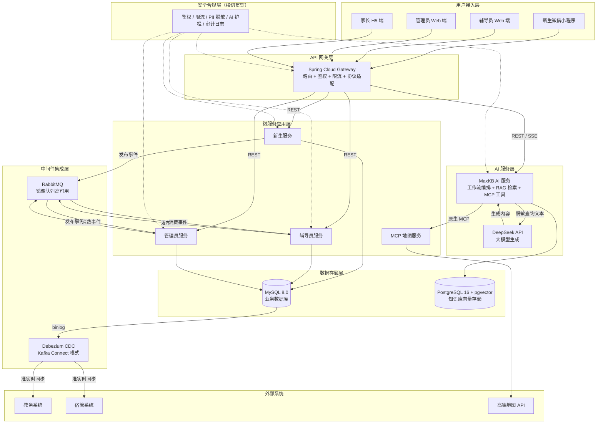
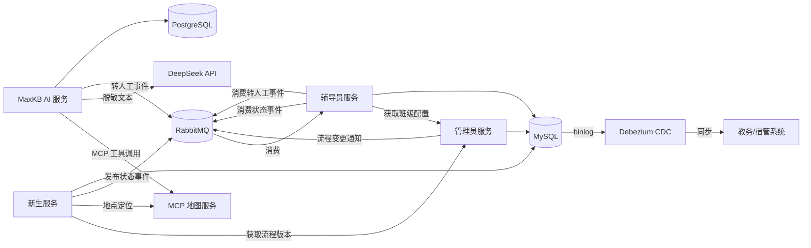
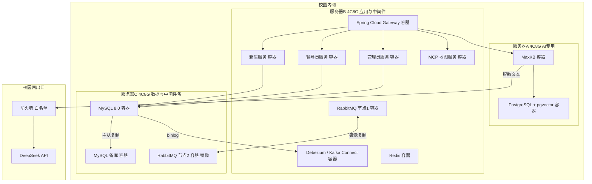
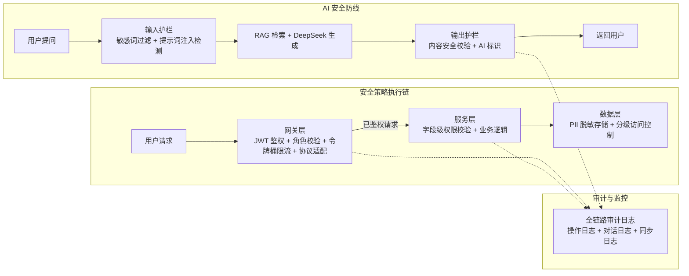
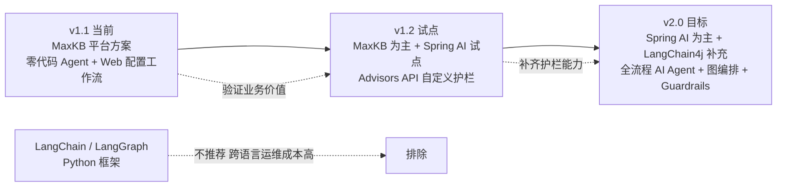

# 微迎新（CampusArrive） v1.1 系统架构设计文档（SAD）

| 项目名称 | 微迎新（CampusArrive） |
| --- | --- |
| 文档名称 | 系统架构设计文档（Software Architecture Description，SAD） |
| 文档编号 | SAD-CA-2026-04 |
| 文档版本 | v1.1.0 |
| 状态 | 基线发布 |
| 编制日期 | 2026-08-07 |
| 适用版本 | v1.1（基于 v1.0 迭代） |
| 密级 | L2 内部敏感 |

## 版本历史

| 版本 | 日期 | 修订人 | 修订说明 |
| --- | --- | --- | --- |
| v1.0.0 | 2025-08 | 架构组 | v1.0 首版发布，定义四微服务 + MCP 基础架构 |
| v1.1.0 | 2026-08-07 | 架构组 | v1.1 架构升级，新增 AI 服务层、消息中间件、API 网关、CDC 数据同步与安全层，补充技术演进路线与容灾设计 |

---

## 1 文档概述

### 1.1 编写目的

本文档为微迎新（CampusArrive） v1.1 的系统架构设计基线，定义从 v1.0「四服务 + MCP」到 v1.1「四服务 + MCP + AI + 中间件 + 安全层」的架构升级方案，作为后续详细设计、开发实现、部署运维与技术演进的一致性依据。文档面向架构师、开发工程师、DevOps 工程师、测试工程师与校方信息中心技术评审人员。

v1.1 在 v1.0 已稳定运行的四个微服务基础上，以增量集成方式引入 MaxKB AI 服务、RabbitMQ 消息队列、Spring Cloud Gateway API 网关与 Debezium CDC 数据同步四类组件，并叠加贯穿全局的安全合规层。本次升级不重构 v1.0 既有服务内部实现，所有新增组件通过标准协议与既有服务对接，保持低侵入与可回退。

### 1.2 文档范围

本文档覆盖以下内容：

- 架构设计原则与决策依据；
- v1.1 整体架构分层与组件关系（含 Mermaid 架构图）；
- 全量技术选型清单与选型理由；
- 各微服务与新组件的职责边界、接口契约与依赖关系；
- 同步 REST、异步消息、CDC 数据同步三种通信模式的设计与适用场景；
- 校园内网部署拓扑、Docker 容器编排、网络分区与服务器资源规划；
- 安全架构设计，含安全层、PII 防护链路、AI 安全与 OWASP 防护；
- v1.1 至 v2.0 的 AI 架构技术演进路线与决策依据；
- 可用性与容灾设计。

不在本文档范围内的事项：功能需求详细描述（见需求规格说明书 SRS-CA-2026-03）、数据库表结构与字段级定义、接口字段级契约、项目排期与成本预算（见 PC-CA-2026-01 与开发排期文档）。

### 1.3 术语与缩略语

| 术语 / 缩略语 | 含义 |
| --- | --- |
| SAD | 系统架构设计文档（Software Architecture Description） |
| MCP | 模型上下文协议（Model Context Protocol），用于大模型调用外部工具 |
| RAG | 检索增强生成（Retrieval-Augmented Generation） |
| MaxKB | 开源知识库构建与工作流编排平台，原生支持 MCP 工具调用 |
| DeepSeek | 本项目采用的大语言模型服务，V4 版本支持 1M 上下文 |
| CDC | 变更数据捕获（Change Data Capture），监听数据库 binlog 实现准实时同步 |
| binlog | MySQL 二进制日志，记录数据库所有变更操作 |
| pgvector | PostgreSQL 向量扩展插件，用于知识库文本向量化存储与相似度检索 |
| API 网关 | 系统统一入口，承担路由、鉴权、限流、协议适配 |
| RabbitMQ | 开源消息队列，支持镜像队列高可用与复杂路由 |
| 镜像队列 | RabbitMQ 队列高可用模式，队列在多节点间镜像复制 |
| Kafka Connect | Kafka 数据连接框架，Debezium 以此模式运行 |
| PII | 个人身份信息（Personally Identifiable Information） |
| 脱敏 | 对敏感字段进行遮蔽、替换或哈希处理，使原始值不可还原 |
| OWASP | 开放 Web 应用安全项目（Open Web Application Security Project） |
| LTS | 长期支持版本（Long Term Support） |
| Spring AI | Spring 官方 AI 应用开发框架，提供 Advisors API 等能力 |
| LangChain4j | Java 生态的大模型应用开发框架 |
| Advisors API | Spring AI 提供的拦截器机制，用于自定义 AI 护栏与审计 |
| Guardrails | AI 输入输出安全护栏，约束模型行为边界 |
| Debezium | 开源 CDC 工具，监听数据库 binlog 并发布变更事件 |

### 1.4 参考文档

| 编号 | 名称 | 用途 |
| --- | --- | --- |
| REF-01 | PC-CA-2026-01 微迎新（CampusArrive） v1.1 项目章程 | 项目范围、预算与验收标准来源 |
| REF-02 | SRS-CA-2026-03 微迎新（CampusArrive） v1.1 需求规格说明书 | 功能需求与非功能需求来源 |
| REF-03 | 02-开发排期与里程碑 | 开发阶段与里程碑节奏 |
| REF-04 | GB/T 22239-2019 网络安全等级保护基本要求 | 等保 2.0 合规依据 |
| REF-05 | GB/T 45654-2025 生成式人工智能服务安全基本要求 | AI 安全评估依据 |
| REF-06 | JY/T 0661-2025 教育数据分类分级指南 | 数据分级依据 |
| REF-07 | OWASP Top 10（2021） | Web 安全防护基线 |

---

## 2 架构设计原则

v1.1 架构在 v1.0 既有决策基础上延续并强化五项原则，每项原则对应具体的架构约束与权衡取舍。

### 2.1 微服务架构原则

系统按业务领域拆分为独立部署、独立演进的服务单元，每个服务对内高内聚、对外通过标准接口通信。v1.0 已确立新生服务、辅导员服务、管理员服务、MCP 地图服务四个边界，v1.1 在此基础上新增 MaxKB AI 服务作为第五个独立服务单元，不将 AI 能力嵌入既有服务内部。

该原则的权衡在于：服务拆分带来部署与运维复杂度上升，但换取了独立扩缩容与技术栈异构能力。MaxKB 采用独立 4C8G 服务器与独立 PostgreSQL 存储，与 Spring Boot 微服务的资源画像差异较大，独立部署避免资源争抢，也使 AI 能力可在不影响业务服务的情况下单独升级或回退。

### 2.2 内网优先原则

所有业务服务、数据存储、AI 平台与中间件均部署在校园内网，学生数据全程不出校园。唯一的跨网调用是 DeepSeek API，且仅在校内完成 PII 脱敏后，将脱敏查询文本通过校园网出口发送，模型返回的生成内容再经安全护栏校验后回传前端。

该原则直接源于《个人信息保护法》最小必要原则与校方数据不出校的合规要求。架构上，这一约束意味着 AI 平台 MaxKB 与知识库 PostgreSQL 必须内网本地化部署，而非采用云端 AI 服务；DeepSeek 调用链路在网关层与 AI 服务层双重脱敏，使出口流量中不含身份证号、学号等可识别字段。

### 2.3 开源优先原则

v1.1 新增组件全部选用成熟开源方案：MaxKB（LTS 版本）、RabbitMQ、Spring Cloud Gateway、Debezium、PostgreSQL + pgvector。开源优先的目标是消除许可费用、避免厂商锁定，并使校方具备自主运维与二次定制能力。

选型时在开源方案中进一步以「生态成熟度」与「运维复杂度」为筛选条件。例如消息队列在 RabbitMQ 与 Kafka 之间选择 RabbitMQ：本项目消息量级为迎新季峰值数千 QPS，不需要 Kafka 的流处理能力，而 RabbitMQ 的镜像队列高可用、复杂路由与轻量运维更贴合校方 DevOps 团队的运维能力。

### 2.4 安全合规贯穿原则

安全不是独立模块或末道工序，而是贯穿接入层、网关层、服务层、AI 层、数据层的横切关注点。v1.1 在架构上以 Spring Cloud Gateway 作为安全策略的统一执行点，将鉴权、限流、协议适配与 PII 脱敏前置到网关层；在 AI 链路上设置输入护栏、输出护栏与内容标识三重防线；在数据层执行字段级脱敏存储与分级访问控制。

该原则的落地依据是 GB/T 45654-2025（生成式 AI 安全）、JY/T 0661-2025（教育数据分级）与等保 2.0 三项标准，架构设计中的每一层都映射到具体合规条款，详见第 8 章。

### 2.5 渐进式演进原则

架构演进以「当前可交付、未来可扩展」为节奏，避免一步到位的全栈重构。v1.1 采用 MaxKB 平台方案实现零代码 AI Agent，以最低成本验证 AI 助手业务价值；v1.2 在 MaxKB 基础上试点 Spring AI Advisors API 自定义护栏；v2.0 再演进为 Spring AI 为主的全流程 AI Agent 架构。

该原则的实质是在「交付速度」与「架构灵活性」之间按版本递进权衡。v1.1 若直接采用 Spring AI 全栈方案，需在 6 周迭代周期内同时完成 RAG 检索、工作流编排、护栏体系与 MCP 集成的全部自研工作，风险超出团队承载能力。以 MaxKB 平台承接编排与检索，将自研范围收敛到知识库维护与安全护栏，是速度与风险的平衡点。详细演进路径见第 9 章。

---

## 3 整体架构设计

### 3.1 架构总览

v1.1 架构自上而下分为六层：用户接入层、API 网关层、微服务应用层、AI 服务层、中间件集成层与数据存储层，安全合规层作为横切关注点贯穿全部层级。下图以 Mermaid graph 语法呈现完整架构，标注各层组件及其调用关系。

### 3.2 架构分层说明

**用户接入层**承载四类终端：新生微信小程序（报到执行主入口）、辅导员 Web 端（班级报到看板与异常处置）、管理员 Web 端（流程配置与系统管理）、家长 H5 端（v1.1 新增，只读报到进度）。所有终端的请求统一汇聚至 API 网关层，不存在绕过网关直连微服务的路径。

**API 网关层**由 Spring Cloud Gateway 承担，是 v1.1 新增的统一入口。网关在 v1.0「前端直连各服务」的基础上收口为单一入口，执行四项职责：按路径与角色路由请求至目标微服务、校验 JWT 令牌与角色权限、对高频接口执行令牌桶限流、对遗留教务系统的 SOAP 协议与内部 REST 协议做适配转换。网关与既有 Spring Boot 微服务共部署在同一服务器集群，不额外占用独立服务器。

**微服务应用层**保留 v1.0 的四个服务。新生服务管理报到流程执行、材料上传与进度状态；辅导员服务提供班级看板、异常处置与批量提醒；管理员服务承担流程版本编排、系统参数与权限管理；MCP 地图服务封装高德地图能力，提供校园 POI 查询与路径规划，并经 MCP 协议暴露给 AI 服务调用。

**AI 服务层**是 v1.1 新增的核心能力层，由 MaxKB AI 服务与 DeepSeek API 构成。MaxKB 承担工作流编排、知识库 RAG 检索与 MCP 工具调用，DeepSeek 负责自然语言生成。两者之间仅传输脱敏查询文本，DeepSeek 不接触任何原始 PII。

**中间件集成层**包含 RabbitMQ 与 Debezium CDC 两个组件。RabbitMQ 以镜像队列模式部署，承接报到状态变更等异步事件，解耦服务间通知；Debezium 以 Kafka Connect 模式监听 MySQL binlog，将报到数据准实时同步至教务、宿管等下游老旧系统，避免对这些系统做侵入式改造。

**数据存储层**采用双库策略：MySQL 8.0 承载全部业务数据（报到记录、用户、流程配置），PostgreSQL 16 + pgvector 由 MaxKB 内置管理，承载知识库文档切片与向量化索引。两库物理隔离，不共享实例。

**安全合规层**作为横切关注点以虚线贯穿网关、AI 服务与微服务，其策略执行点集中在网关层与 AI 服务层，具体设计见第 8 章。

### 3.3 v1.0 到 v1.1 架构演进对比

| 维度 | v1.0 架构 | v1.1 架构 | 演进动因 |
| --- | --- | --- | --- |
| 服务数量 | 4 个微服务 + MCP | 4 个微服务 + MCP + MaxKB AI 服务 | 新增 AI 答疑能力，独立部署避免资源争抢 |
| 入口方式 | 前端直连各服务 | 统一经 Spring Cloud Gateway 入口 | 收口鉴权限流，协议适配遗留系统 |
| 服务间通信 | 同步 REST 为主 | 同步 REST + 异步消息 + CDC 三种模式 | 解耦异步通知，打通下游系统数据 |
| 数据同步 | 人工导表 | Debezium CDC 准实时同步 | 消除数据孤岛与人工搬运差错 |
| AI 能力 | 无 | MaxKB + DeepSeek RAG 对话 | 承接高频咨询，降低辅导员答疑负荷 |
| 安全层 | 服务内零散校验 | 网关统一执行 + AI 护栏 + 数据分级 | 对标 PIPL、等保 2.0、GB/T 45654-2025 |
| 数据库 | 单一 MySQL | MySQL + PostgreSQL/pgvector | 知识库向量化检索需要专用向量存储 |

---

## 4 技术选型清单与选型理由

### 4.1 技术选型总表

| 组件 | 选型 | 版本 | 部署方式 | 选型理由 |
| --- | --- | --- | --- | --- |
| 后端框架 | Spring Boot | 3.x | Docker 容器 | 微服务基础框架，生态成熟，v1.0 已采用，保持技术栈连续性 |
| AI 平台 | MaxKB | v1.10 LTS | Docker 容器，4C8G 独立服务器 | 开源、原生支持 MCP 工具调用、Web 界面零代码配置工作流，降低 AI 开发门槛 |
| 大模型 | DeepSeek | V4 | 校园网出口远程调用 | 1M 超长上下文窗口、Flash 推理低延迟、调用成本约为同能力模型的十分之一 |
| API 网关 | Spring Cloud Gateway | 4.x | 与 Spring Boot 服务共部署 | Spring 原生生态，路由 + 鉴权 + 限流 + SOAP/REST 协议适配一体化 |
| 消息队列 | RabbitMQ | 3.13 | Docker 容器，2C4G | 镜像队列高可用、复杂路由能力、运维轻量，贴合校方运维能力与消息量级 |
| CDC 工具 | Debezium | 2.x | Kafka Connect 模式 | 监听 MySQL binlog 实现准实时同步，对源库零侵入，无需改造老旧下游系统 |
| 前端框架 | uni-app / 微信原生 | - | 小程序 + H5 | 跨平台覆盖微信生态，家长端 H5 无需安装即可访问 |
| 业务数据库 | MySQL | 8.0 | Docker 容器 | v1.0 已有基础，binlog 原生支持 CDC，运维团队熟悉 |
| 向量数据库 | PostgreSQL + pgvector | 16 | MaxKB 内置管理 | MaxKB 默认内置，知识库文档向量化存储与相似度检索，无需额外引入独立向量库 |
| 容器化 | Docker | - | 校园内网部署 | v1.0 已采用，环境一致性与快速部署 |
| 缓存 | Redis | 7.x | Docker 容器 | 会话令牌、热点配置与限流计数器存储 |

### 4.2 关键选型决策说明

**AI 平台：MaxKB vs 自研 Spring AI（v1.1 阶段）**

v1.1 选择 MaxKB 平台方案而非直接自研，核心考量是交付周期与团队 AI 工程化经验。MaxKB v1.10 LTS 提供 Web 界面配置工作流、内置 RAG 检索与 pgvector 向量存储、原生支持 MCP 工具调用，使后端团队无需从零实现检索引擎与编排框架即可在两周内完成 AI 助手原型。自研方案的灵活性优势在 v1.1 阶段无法转化为业务价值，反而会挤占安全合规与集成中间件的开发产能。该决策的代价是护栏定制能力受限，v1.2 将以 Spring AI Advisors API 弥补。

**大模型：DeepSeek V4 vs 本地开源模型**

DeepSeek V4 的 1M 上下文窗口可容纳完整的报到流程手册与政策文档，Flash 推理模式首词响应控制在 2 秒内，满足新生对话体验要求。本地部署开源模型（如 Llama 系列）虽可实现数据完全不出校，但需要 GPU 服务器投入与模型运维能力，与项目约 5600 元/年的成本约束冲突。折中方案是 MaxKB 与知识库内网本地化、仅生成环节调用远程 DeepSeek，且出口流量经脱敏处理，在成本与合规之间取得平衡。

**消息队列：RabbitMQ vs Kafka**

本项目消息场景为报到状态变更通知、家长进度推送与异步任务分发，峰值吞吐在数千 QPS 量级，消息需要保证不丢失且支持复杂路由（如按事件类型分发至不同消费者）。Kafka 的优势在于高吞吐流处理与日志聚合，但运维复杂度高、需要 ZooKeeper/KRaft 集群，对本项目量级过重。RabbitMQ 的镜像队列在两节点间复制队列数据实现高可用，topic exchange 支持灵活路由，单容器部署即可满足需求。

**CDC 工具：Debezium vs Canal**

Debezium 以 Kafka Connect 模式运行，社区活跃、连接器生态完善，对 MySQL binlog 的解析稳定性经过大规模生产验证。Canal 虽为阿里开源且在国内使用广泛，但其架构为独立 Server 模式，与 Kafka Connect 生态集成度低于 Debezium。选择 Debezium 的另一原因是其 schema 变更传播能力，可在源表结构变更时同步通知下游，减少手工维护。

**向量数据库：PostgreSQL + pgvector vs 独立向量库**

MaxKB 默认使用 PostgreSQL + pgvector 作为知识库后端，无需额外引入 Milvus 或 Qdrant 等独立向量数据库。本项目知识库规模为数千篇文档切片，pgvector 的 HNSW 索引在该量级下检索延迟在毫秒级，完全满足需求。独立向量库的分布式优势在当前规模下无法体现，反而增加运维负担。

---

## 5 微服务划分

v1.1 共包含五个服务单元：四个 v1.0 既有微服务（新生服务、辅导员服务、管理员服务、MCP 地图服务）与一个 v1.1 新增 AI 服务（MaxKB）。每个服务拥有独立的数据库 schema 或存储实例，服务间通过标准协议通信，不共享数据库表。

### 5.1 新生服务

| 维度 | 说明 |
| --- | --- |
| 职责 | 管理新生报到全流程执行，包括流程版本加载、环节签到、材料上传与预览、个人进度状态汇总与待办提醒触发 |
| 技术栈 | Spring Boot 3.x + MySQL 8.0 |
| 对外接口 | REST API，经网关路由；包含流程查询、签到提交、材料上传、进度查询四组端点 |
| 数据归属 | 报到记录表、材料表、进度状态表 |
| 上游依赖 | 管理员服务（获取流程版本配置）、MCP 地图服务（环节办理地点定位） |
| 下游消费 | 向 RabbitMQ 发布签到、缴费、核验等状态变更事件；被 Debezium CDC 监听 binlog |
| v1.1 变更 | 新增事件发布能力（对接 RabbitMQ），服务内部逻辑不变 |

### 5.2 辅导员服务

| 维度 | 说明 |
| --- | --- |
| 职责 | 提供辅导员工作台能力，包括班级报到进度看板、异常标记与处置、批量提醒推送、AI 转人工接续 |
| 技术栈 | Spring Boot 3.x + MySQL 8.0 |
| 对外接口 | REST API，经网关路由；包含看板查询、异常处置、批量提醒、人工接续四组端点 |
| 数据归属 | 班级分配表、异常处置记录表、提醒记录表 |
| 上游依赖 | 新生服务（报到进度数据）、管理员服务（班级与权限配置） |
| 下游消费 | 消费 RabbitMQ 中的状态变更事件以实时刷新看板；消费 AI 转人工事件以接续对话上下文 |
| v1.1 变更 | 新增 RabbitMQ 事件消费能力，支持 AI 转人工场景的上下文接收 |

### 5.3 管理员服务

| 维度 | 说明 |
| --- | --- |
| 职责 | 承担系统级管理，包括报到流程可视化编排与版本管理、系统参数配置、角色权限管理、全校统计报表、知识库维护与主数据映射 |
| 技术栈 | Spring Boot 3.x + MySQL 8.0 |
| 对外接口 | REST API，经网关路由；包含流程编排、版本回滚、参数配置、权限管理、统计查询、主数据映射六组端点 |
| 数据归属 | 流程版本表、系统参数表、权限角色表、主数据映射表（学号-身份证号-一卡通号关联） |
| 上游依赖 | 无（为配置源，不被其他业务服务反向依赖） |
| 下游消费 | 流程版本变更通过 RabbitMQ 通知新生服务与辅导员服务热加载；主数据映射表供 CDC 同步链路关联各系统 |
| v1.1 变更 | 新增主数据映射管理能力（支撑 CDC 同步）；新增知识库维护端点（代理至 MaxKB） |

### 5.4 MCP 地图服务

| 维度 | 说明 |
| --- | --- |
| 职责 | 封装高德地图能力，提供校园 POI 查询、室外路径规划、室内定位至楼层与房间；并经 MCP 协议将上述能力暴露为 AI 可调用的工具 |
| 技术栈 | Spring Boot 3.x + 高德地图 API |
| 对外接口 | REST API（供前端直接调用）+ MCP 工具接口（供 MaxKB AI 服务调用） |
| 数据归属 | 校园 POI 数据（与高德地图同步） |
| 上游依赖 | 高德地图 API（外部） |
| 下游消费 | 无 |
| v1.1 变更 | 新增 MCP 工具暴露能力，使 AI 助手可通过 MCP 协议调用导航与 POI 查询，实现「问路即导航」的工具化应答 |

### 5.5 MaxKB AI 服务

| 维度 | 说明 |
| --- | --- |
| 职责 | 承担 AI 迎新智能助手全部能力，包括工作流编排、知识库 RAG 检索、MCP 工具调用、DeepSeek 生成对接、内容标识、敏感词过滤与 FAQ 降级 |
| 技术栈 | MaxKB v1.10 LTS + PostgreSQL 16 + pgvector + DeepSeek V4 |
| 对外接口 | REST + SSE 流式输出，经网关路由；包含对话发起、流式回答、对话历史、转人工通知四组端点 |
| 数据归属 | 知识库文档切片与向量索引（PostgreSQL + pgvector）、对话日志与审计记录 |
| 上游依赖 | MCP 地图服务（经 MCP 协议调用导航与 POI 工具）、DeepSeek API（生成能力）、辅导员服务（转人工通知） |
| 下游消费 | 对话日志写入本地 PostgreSQL；转人工事件通过 RabbitMQ 通知辅导员服务 |
| v1.1 变更 | v1.1 全新服务，独立部署于 4C8G 服务器 |

### 5.6 服务依赖关系

依赖关系遵循两条约束：一是依赖方向单向，不存在循环依赖（管理员服务为配置源，不被业务服务反向依赖）；二是 AI 服务对业务服务的依赖仅通过 MCP 工具协议与消息队列间接发生，AI 服务不直接读写业务数据库，使 AI 能力可独立升级而不影响业务数据一致性。

---

## 6 服务间通信设计

v1.1 的服务间通信归纳为三种模式：同步 REST、异步消息与 CDC 数据同步。三种模式各对应不同的业务场景与一致性要求，不混用。

### 6.1 同步 REST 通信

同步 REST 适用于需要即时返回结果、调用方必须等待响应才能继续后续操作的场景。v1.1 中所有经网关路由的用户请求均采用此模式，包括新生签到提交、材料上传、进度查询、辅导员看板查询、管理员流程编排等。

通信规范：

- 所有 REST 请求经 Spring Cloud Gateway 统一入口，网关完成 JWT 鉴权与角色校验后转发至目标服务，服务间不互相直接发起 REST 调用，避免网状依赖；
- 前端至网关、网关至微服务均采用 HTTPS（内网 TLS），请求与响应体使用 JSON；
- AI 对话采用 REST 发起 + SSE（Server-Sent Events）流式返回，使首个 token 到达客户端时间控制在 2 秒内，后续内容增量推送；
- 同步调用的超时阈值在网关层统一配置，默认连接超时 3 秒、读取超时 10 秒，AI 流式接口读取超时放宽至 60 秒。

适用场景判断标准：调用方在当前请求上下文中必须拿到结果才能响应用户，且被调用方的处理延迟在秒级可控范围内。

### 6.2 异步消息通信

异步消息适用于调用方无需等待结果、事件需广播至多个消费者、或处理耗时较长的场景。v1.1 通过 RabbitMQ 实现服务间异步解耦。

消息设计：

- Exchange 采用 topic 类型，routing key 按事件域与事件类型编排，如 `checkin.event.created`、`payment.event.confirmed`、`ai.event.transfer_human`，支持按前缀模糊匹配订阅；
- 队列按消费者分组持久化，镜像队列模式在两个 RabbitMQ 节点间复制队列数据，单节点故障时备节点自动接管；
- 消息体采用 JSON，包含事件类型、时间戳、业务主键（学号、环节 ID）与变更内容快照，不含完整 PII，敏感字段在发布前由生产方脱敏；
- 消费失败的消息进入死信队列（DLX），触发告警后由运维人工重放或排查，避免消息丢失。

典型链路：新生完成签到后，新生服务向 RabbitMQ 发布 `checkin.event.created` 事件；辅导员服务消费该事件刷新班级看板；家长端通知服务消费该事件后在 10 秒内向家长推送微信通知。三个消费动作并行执行、互不阻塞，签到接口本身在写入数据库后即返回，不被通知链路拖慢。

适用场景判断标准：调用方只需通知「某事已发生」而无需等待处理结果，或同一事件需要多个独立消费者各自处理。

### 6.3 CDC 数据同步

CDC 数据同步适用于跨系统数据准实时同步、且源系统与目标系统不应互相侵入的场景。v1.1 通过 Debezium 监听 MySQL binlog，将报到系统数据变更同步至教务、宿管等下游老旧系统。

同步链路设计：

- Debezium 以 Kafka Connect 模式部署，连接 MySQL 业务库读取 binlog（ROW 格式），将每条变更转为事件写入内部 Kafka topic；
- 下游同步任务订阅 topic，经管理员服务维护的主数据映射表（学号-身份证号-一卡通号）关联各系统主键后，通过 API 网关的 SOAP/REST 协议适配写入教务、宿管系统；
- 同步端到端延迟控制在 5 秒内（binlog 读取 + Kafka 传输 + 下游写入），满足迎新季准实时要求；
- Debezium 记录 binlog 位点（offset），故障恢复后从断点续传，保证不漏单；同步失败的事件进入死信队列告警重放。

CDC 模式的关键优势是对源库零侵入：新生服务只需正常写入 MySQL，不需要在业务代码中嵌入「同步至教务系统」的逻辑，业务代码与集成代码彻底解耦。同时，下游老旧系统通过标准接口接收数据，无需改造其内部实现。

适用场景判断标准：数据需在异构系统间准实时同步，源系统不应为同步需求修改业务代码，目标系统数量可能增长。

### 6.4 三种通信模式对比

| 维度 | 同步 REST | 异步消息（RabbitMQ） | CDC 数据同步（Debezium） |
| --- | --- | --- | --- |
| 一致性模型 | 强一致，调用方等待结果 | 最终一致，事件异步处理 | 最终一致，准实时同步 |
| 耦合度 | 调用方与被调用方直接耦合 | 生产者与消费者通过 broker 解耦 | 源系统与下游系统完全解耦 |
| 延迟 | 毫秒至秒级 | 毫秒级投递，处理异步 | 5 秒内端到端 |
| 适用场景 | 用户请求需即时响应 | 事件广播、异步通知、多消费者 | 跨系统数据同步、零侵入集成 |
| 失败处理 | 调用方直接感知失败并重试 | 死信队列 + 告警重放 | 断点续传 + 死信队列重放 |
| v1.1 典型用例 | 签到、查询、流程编排、AI 对话 | 状态变更通知、家长推送、AI 转人工 | 报到数据同步至教务/宿管系统 |

---

## 7 部署拓扑设计

### 7.1 校园内网部署方案

v1.1 全部业务服务、数据存储、AI 平台与中间件均部署在校园内网，无外部云服务依赖。唯一的跨网出口是 DeepSeek API 调用，该出口经校园网防火墙白名单限制，仅允许 MaxKB 服务器向 DeepSeek API 域名发起 HTTPS 请求，且出站流量在 MaxKB 内完成 PII 脱敏后才发出。

部署方案的设计约束有三条：一是数据不出校，学生 PII 全程留在内网；二是复用 v1.0 既有服务器资源，控制硬件投入；三是迎新季结束后系统可低成本缩容至日常运维状态。基于此，v1.1 采用「三服务器 + Docker 容器化」的精简拓扑，不引入 Kubernetes 以避免运维复杂度超出校方 DevOps 团队承载能力。

### 7.2 Docker 容器编排

所有组件以 Docker 容器方式部署，使用 docker-compose 编排单服务器内的多容器依赖关系。每台服务器的容器编排在独立的 `docker-compose.yml` 中定义，容器间通过网络别名通信。

容器编排规范：

- 每个微服务构建独立镜像，镜像基于统一的基础镜像（eclipse-temurin JDK 21），按服务名打标签并推送至内网镜像仓库；
- 配置通过环境变量注入，敏感配置（数据库密码、DeepSeek API Key）使用 Docker Secret 或环境变量文件管理，不写入镜像；
- 数据库与消息队列的数据卷挂载至宿主机持久化目录，容器重建不丢失数据；
- 容器重启策略统一设为 `unless-stopped`，异常退出后自动拉起；
- 日志通过 Docker logging driver 收集至宿主机文件，由日志采集脚本归集至日志库。

迎新季结束后，可通过缩容命令将应用服务器容器实例数减半，AI 服务器保留待机状态，将运行成本降至日常水平。

### 7.3 网络分区设计

校园内网内部按安全等级划分为三个网络分区，区间通过防火墙规则隔离：

| 网络分区 | 部署组件 | 安全等级 | 访问规则 |
| --- | --- | --- | --- |
| 接入区 | Spring Cloud Gateway | 边界 | 接受校园网用户请求，仅放行 443 端口；拒绝校外 IP |
| 应用区 | 四个微服务、MaxKB、RabbitMQ、Redis、Debezium | 内部 | 仅接受接入区网关转发的请求；服务间按端口白名单通信 |
| 数据区 | MySQL、PostgreSQL、MySQL 备库 | 核心 | 仅接受应用区指定容器的数据库端口连接；拒绝应用区以外的所有访问 |

网络分区的目标是实现纵深防御：即便接入区网关被攻破，攻击者仍无法直接访问数据区的数据库，需再突破应用区的服务层。DeepSeek API 出口在接入区防火墙上单独配置白名单规则，仅允许 MaxKB 容器所在 IP 向 DeepSeek 域名发起出站请求。

### 7.4 服务器资源规划

v1.1 共规划三台物理或虚拟服务器，资源配置如下：

| 服务器 | 规格 | 部署组件 | 资源分配说明 |
| --- | --- | --- | --- |
| 服务器 A（AI 专用） | 4C8G | MaxKB 容器 + PostgreSQL/pgvector 容器 | MaxKB 工作流编排与 RAG 检索为 CPU 密集型，独立部署避免与业务服务争抢；PostgreSQL 与 MaxKB 共置降低检索网络延迟 |
| 服务器 B（应用与中间件） | 4C8G | Gateway + 四微服务 + RabbitMQ 节点 1 + Redis + Debezium | Spring Boot 服务与网关共部署，单容器限内存 1G；RabbitMQ 节点 1 限 1.5G；Redis 限 512MB |
| 服务器 C（数据与备机） | 4C8G | MySQL 主库 + MySQL 备库 + RabbitMQ 节点 2 | MySQL 主库限 3G，备库限 2G；RabbitMQ 节点 2 作为镜像队列备节点，限 1.5G |

资源规划依据迎新季峰值负载估算：新生并发报到约 1000 人同时在线，AI 对话峰值约 50 并发会话，消息队列峰值数千 QPS。三台 4C8G 服务器在压测中可承载 10000 并发请求（见开发排期文档 W6 压测里程碑），满足迎新季需求并留有冗余。MaxKB 独立占用服务器 A 的原因是其 Java 进程与 PostgreSQL 在高并发检索时内存占用波动较大，与业务服务共部署存在 OOM 风险。

---

## 8 安全架构

### 8.1 安全层设计

v1.1 的安全架构以 Spring Cloud Gateway 为统一策略执行点，将鉴权、限流与协议适配前置到网关层，使安全策略集中管理而非分散在各服务内部。安全层在架构上表现为「一道边界、两重防线」：

- 边界防线（网关层）：所有外部请求经网关鉴权与限流，未通过鉴权的请求在到达微服务前即被拒绝；网关同时承担 SOAP/REST 协议适配，使遗留系统对接也纳入统一安全管控；
- 数据防线（服务层与数据层）：微服务内部执行字段级权限校验与数据分级访问控制，数据库层对 PII 字段做脱敏存储或加密存储。

### 8.2 PII 防护链路

PII 防护覆盖数据从采集、存储、传输到销毁的全生命周期，依据 JY/T 0661-2025 教育数据分类分级指南，将报到相关数据划分为三级并施加差异化防护：

| 数据分级 | 数据示例 | 防护措施 |
| --- | --- | --- |
| L3 高敏感 | 身份证号、家庭住址、家庭收入 | 数据库字段级加密存储（AES-256）；展示时全部遮蔽；仅管理员经二次审批可解密查看 |
| L2 中敏感 | 学号、手机号、宿舍门牌号、缴费金额 | 数据库明文存储但访问受角色控制；展示时部分遮蔽（如手机号中间四位）；家长端仅显示进度状态不显示此类字段 |
| L1 低敏感 | 报到环节名称、完成状态、校园 POI 信息 | 常规访问控制，无额外脱敏 |

PII 防护在 DeepSeek 调用链路上的执行逻辑是整个安全架构的关键节点。新生提问经网关到达 MaxKB 后，MaxKB 在调用 DeepSeek 前执行脱敏预处理：将提问文本中的学号、身份证号、手机号等模式化 PII 替换为占位符（如 `[STUDENT_ID]`），仅将脱敏后的查询文本发送至 DeepSeek。DeepSeek 返回的生成内容再经输出护栏校验，若检测到模型生成了被占位符替换的真实 PII（理论上不应发生，因模型未接触原始值），则拦截并降级为 FAQ 回答。

家长端的 PII 防护遵循数据最小化原则：家长经手机号绑定后获得的 JWT 仅关联学生 ID，家长端可查看的内容限定为报到环节名称与完成状态（L1 低敏感），不返回身份证号、宿舍门牌号、缴费金额等 L2/L3 字段，从接口层即阻断越权获取。

### 8.3 AI 安全

AI 安全对标 GB/T 45654-2025《生成式人工智能服务安全基本要求》，在输入、生成、输出三个环节设置护栏：

**输入护栏**：对新生提问执行敏感词过滤与提示词注入检测。敏感词词表覆盖政治敏感、暴力、色情等违规内容类别；提示词注入检测识别「忽略上述指令」「你现在是另一个角色」等典型越狱模式，命中后拒绝生成并引导返回标准流程。

**生成约束**：DeepSeek 的系统提示词中注入角色边界约束，限定模型仅回答迎新报到相关问题，对超出范围的问题返回引导语而非自由发挥。知识库 RAG 检索提供事实依据，使生成内容锚定在知识库片段上，降低模型臆造库外事实的概率。

**输出护栏**：对 DeepSeek 生成内容执行二次安全校验，过滤违规内容后追加「AI 生成」可见标识与可点击来源说明（引用的知识库片段），满足《生成式人工智能服务管理暂行办法》对 AI 生成内容显式标识的要求。

**降级机制**：当 DeepSeek API 不可用、响应超时或输出护栏拦截时，自动降级为 FAQ 关键词匹配返回预设标准答案，并在前端标识「FAQ 模式」，使 AI 助手在异常情况下仍有可用兜底。

对话日志全量记录至 MaxKB 本地 PostgreSQL，包含提问内容（脱敏后）、检索片段、生成内容、护栏拦截结果与时间戳，供安全审计与效果评估回溯。

### 8.4 OWASP 防护

v1.1 针对 OWASP Top 10（2021）逐项设计防护措施，执行点集中在网关层与微服务层：

| OWASP 风险 | v1.1 防护措施 |
| --- | --- |
| A01 失效的访问控制 | 网关统一 JWT 鉴权与角色校验；服务层字段级权限校验；辅导员仅可访问所辖班级数据，越权请求在网关层拒绝 |
| A02 加密机制失效 | 全链路 HTTPS（内网 TLS）；PII 字段 AES-256 加密存储；DeepSeek API Key 使用 Docker Secret 管理 |
| A03 注入 | 全部数据库访问使用 MyBatis 参数化查询，禁止字符串拼接 SQL；输入参数在网关层做格式校验 |
| A04 不安全设计 | STRIDE 威胁建模在 W1 阶段完成（见开发排期），安全需求纳入设计评审 |
| A05 安全配置错误 | Docker 容器以非 root 用户运行；数据库默认端口在内网防火墙限制；管理端接口默认关闭外网访问 |
| A06 脆弱过时组件 | CI/CD 流水线集成依赖漏洞扫描（Trivy），高危漏洞阻塞发布 |
| A07 身份认证失败 | JWT 令牌有效期限制（家长端 30 天、学生端按会话）；验证码错误超限锁定；令牌刷新机制 |
| A08 软件与数据完整性失效 | 镜像签名验证；知识库文档变更需管理员审核后生效 |
| A09 安全日志与监控失败 | 全链路审计日志（操作、对话、同步）；异常访问与护栏拦截触发告警 |
| A10 服务端请求伪造（SSRF） | MCP 工具调用与 DeepSeek 调用的目标地址在配置中白名单限定，不接受用户输入的 URL |

---

## 9 技术演进路线

### 9.1 演进路线总览

v1.1 的 AI 架构并非终态，而是按版本递进的技术演进起点。演进路线围绕一条主线展开：从平台化零代码方案逐步过渡到框架化自定义方案，在保持每版本可交付的前提下，逐步获得更细粒度的护栏定制与编排控制能力。

### 9.2 v1.1 MaxKB 平台方案

v1.1 采用 MaxKB v1.10 LTS 作为 AI 能力的唯一承载平台。MaxKB 提供 Web 界面的工作流可视化编排，后端团队通过拖拽节点配置「检索 → 生成 → 工具调用 → 降级」的执行流程，无需编写编排代码；知识库文档上传后由 MaxKB 自动完成切片、向量化（写入 pgvector）与检索召回；MCP 工具调用为 MaxKB 原生能力，可直接对接 v1.0 既有 MCP 地图服务。

该方案的优势是交付速度快、AI 工程化门槛低，使团队在 6 周内即可上线可用 AI 助手。其局限是护栏体系依赖 MaxKB 内置能力，自定义输入输出过滤逻辑的灵活性不足，复杂的提示词注入检测与多级内容分级需通过 MaxKB 的 API 扩展点间接实现，开发体验受限。这一局限正是 v1.2 引入 Spring AI 的动因。

### 9.3 v1.2 MaxKB 为主 + Spring AI 试点

v1.2 保持 MaxKB 作为主力 AI 平台承载日常对话与知识库检索，同时试点引入 Spring AI 的 Advisors API 构建自定义护栏层。Advisors API 是 Spring AI 提供的拦截器机制，可在模型调用前（`before`）与调用后（`after`）插入自定义逻辑，用于实现比 MaxKB 内置护栏更精细的提示词注入检测、PII 脱敏与内容分级过滤。

试点范围限定在 AI 助手的安全护栏链路，不替换 MaxKB 的工作流编排与 RAG 检索。架构上，Spring AI 护栏作为 MaxKB 与 DeepSeek 之间的代理层插入：MaxKB 工作流在调用 DeepSeek 前，先经 Spring AI Advisor 执行输入校验与脱敏，DeepSeek 返回后再经 Advisor 执行输出校验与内容标识。这一改动对 MaxKB 工作流配置侵入小，且使护栏逻辑可独立于 MaxKB 版本演进。

v1.2 的决策依据是：v1.1 上线后积累的对话日志与护栏拦截数据将揭示 MaxKB 内置护栏的覆盖盲区，Spring AI 试点针对这些盲区补齐自定义规则，为 v2.0 全栈迁移积累工程经验。

### 9.4 v2.0 Spring AI 为主 + LangChain4j 补充

v2.0 将 AI 架构从 MaxKB 平台方案迁移至以 Spring AI 为主的自研框架方案。Spring AI 承担工作流编排、RAG 检索、MCP 工具调用与护栏体系的全部职责，MaxKB 退化为知识库内容管理工具（仅用于文档上传与切片预处理），不再承担运行时编排。LangChain4j 作为补充，在 Spring AI 尚未覆盖的图编排（多步骤 Agent 状态机）与复杂 Guardrails 场景中提供能力。

迁移至自研框架的核心收益是获得全流程控制力：工作流节点可按业务需要自由组合，护栏规则可随合规要求动态调整，AI Agent 可编排多轮复杂任务（如「查询报到状态 → 判断未完成环节 → 发起导航 → 推送提醒」的端到端任务链），这些能力在 MaxKB 平台的固定工作流模板下难以实现。

v2.0 的前置条件是 v1.2 试点验证了 Spring AI 护栏的稳定性，且团队已具备 Spring AI 工程化能力。在条件未成熟前不强行迁移，避免重蹈「为灵活性牺牲交付速度」的覆辙。

### 9.5 选型排除说明

**不推荐 LangChain / LangGraph**

LangChain 与 LangGraph 是 Python 生态的 AI 应用框架，在 RAG 编排与 Agent 图状态机方面生态成熟。本项目排除这两个框架的唯一原因是跨语言运维成本：v1.0 与 v1.1 的全部微服务基于 Java/Spring Boot 技术栈，运维团队熟悉 JVM 调优与 Docker 部署。引入 Python 框架意味着新增 Python 运行时、独立依赖管理与第二套监控告警体系，使本就精简的 DevOps 团队（1 人）运维负担翻倍。

Spring AI 与 LangChain4j 同属 Java 生态，与既有 Spring Boot 微服务共享运行时与部署流程，护栏与编排逻辑可直接集成到现有服务中，不引入跨语言集成成本。在能力对等的前提下，同语言方案的运维经济性是决定性因素。

---

## 10 可用性与容灾设计

### 10.1 高可用设计

v1.1 的高可用设计以「单点不致命」为目标，对每个可能成为单点的组件设计冗余或自动恢复机制：

| 组件 | 单点风险 | 高可用措施 | 故障切换行为 |
| --- | --- | --- | --- |
| Spring Cloud Gateway | 网关宕机则全站不可访问 | 网关容器设 `restart: unless-stopped`，Docker 自动拉起；后续可部署双实例 + Nginx 负载均衡 | 容器崩溃后秒级自动重启 |
| RabbitMQ | 单节点宕机则异步消息丢失 | 双节点镜像队列，队列数据在两节点间实时复制 | 主节点故障时备节点自动接管，消息不丢失 |
| MySQL | 数据库宕机则业务中断 | 主从复制（主库 → 备库），备库实时同步 binlog | 主库故障时手动切换至备库（RTO 约 15 分钟） |
| MaxKB AI 服务 | AI 助手不可用 | DeepSeek 不可用时降级为 FAQ 匹配；MaxKB 容器自动重启 | AI 对话降级为 FAQ 模式，业务流程不受影响 |
| DeepSeek API | 远程 API 不可用 | 降级机制 + 超时熔断 | 自动降级为 FAQ 关键词匹配 |

高可用设计的优先级排序是：业务服务可用性优先于 AI 服务可用性。新生报到流程（签到、缴费、核验）不依赖 AI 助手，即使 MaxKB 与 DeepSeek 同时不可用，新生仍可沿标准流程完成报到，AI 助手仅降级为 FAQ 模式或暂时不可用。这一设计使 AI 能力的引入不成为业务连续性的单点风险。

### 10.2 数据备份与恢复

| 数据类型 | 备份方式 | 备份频率 | 保留周期 | 恢复方式 |
| --- | --- | --- | --- | --- |
| MySQL 业务数据 | mysqldump 逻辑备份 + binlog 物理备份 | 全量每日凌晨 1 次 + binlog 实时 | 全量 30 天 + binlog 7 天 | 全量恢复 + binlog 重放至故障点 |
| PostgreSQL 知识库 | pg_dump 逻辑备份 | 每周 1 次 | 4 周 | pg_dump 恢复 + MaxKB 重新向量化 |
| RabbitMQ 消息 | 镜像队列实时复制 + 持久化磁盘 | 实时 | 队列消费后清除 | 备节点接管，未消费消息不丢失 |
| 对话日志 | PostgreSQL 本地存储 + 每日导出 | 每日 | 1 年 | 从导出文件恢复 |

备份脚本通过 crontab 定时执行，备份文件存储在服务器 C 的独立磁盘并同步至校方 NAS 异地副本。恢复演练在每迎新季前执行一次，验证备份可用性与恢复流程时效。

### 10.3 容灾策略

v1.1 的容灾定位为「迎新季高可用 + 本地灾备」，不建设异地双活数据中心，原因有三：一是系统使用周期集中在迎新季数周，非持续高负载；二是校方预算约束不支持异地容灾基础设施；三是数据不出校的合规要求使公有云灾备不可行。

容灾策略按故障影响范围分三级响应：

- 组件级故障（单容器崩溃）：Docker 自动重启策略恢复，RTO 秒级，无需人工介入；
- 节点级故障（单服务器宕机）：RabbitMQ 镜像队列备节点接管、MySQL 主从切换，应用服务迁移至其余服务器重启，RTO 约 15 分钟；
- 数据级故障（数据损坏或误删）：从最近全量备份 + binlog 重放恢复，RTO 约 1 小时，RPO（数据丢失窗口）取决于最近 binlog 位点，通常在分钟级。

迎新季前两周执行一次全链路故障演练，模拟网关宕机、RabbitMQ 主节点故障、MySQL 主库故障与 DeepSeek API 不可用四类场景，验证自动恢复与降级机制的有效性。

### 10.4 监控与告警

v1.1 采用轻量监控方案，不引入 Prometheus + Grafana 全套可观测体系（运维成本超出团队承载），而是通过以下组合实现核心指标监控：

| 监控对象 | 监控指标 | 采集方式 | 告警阈值 |
| --- | --- | --- | --- |
| 微服务健康 | HTTP 健康检查端点状态 | Docker healthcheck + 简单心跳脚本 | 连续 3 次健康检查失败 |
| MySQL | 连接数、慢查询、主从延迟 | mysqld exporter 脚本 | 主从延迟 > 10 秒；慢查询 > 5 秒 |
| RabbitMQ | 队列堆积数、镜像同步状态 | RabbitMQ Management API 轮询 | 队列堆积 > 1000 条；镜像节点失联 |
| MaxKB AI 服务 | 对话成功率、首词响应时间、护栏拦截率 | MaxKB API 日志统计 | 对话成功率 < 90%；首词响应 > 3 秒 |
| DeepSeek API | 调用成功率、响应延迟 | MaxKB 调用日志统计 | 连续失败率 > 20% |
| 系统资源 | CPU、内存、磁盘使用率 | 服务器主机 agent | CPU > 80% 持续 5 分钟；磁盘 > 90% |

告警通过校园企业微信机器人推送至 DevOps 群组，分级响应：组件级告警由 DevOps 工程师处理，数据级与安全级告警同步通知技术负责人与安全合规负责人。迎新季期间 DevOps 工程师保持 7×24 响应，非迎新季按工作日响应。
