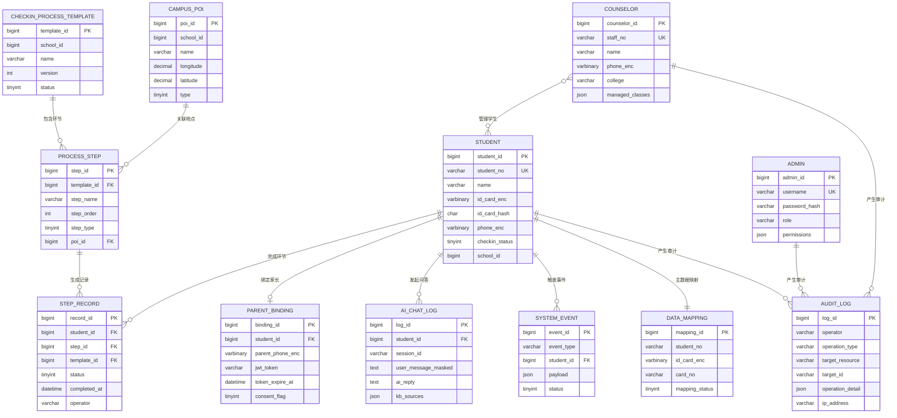
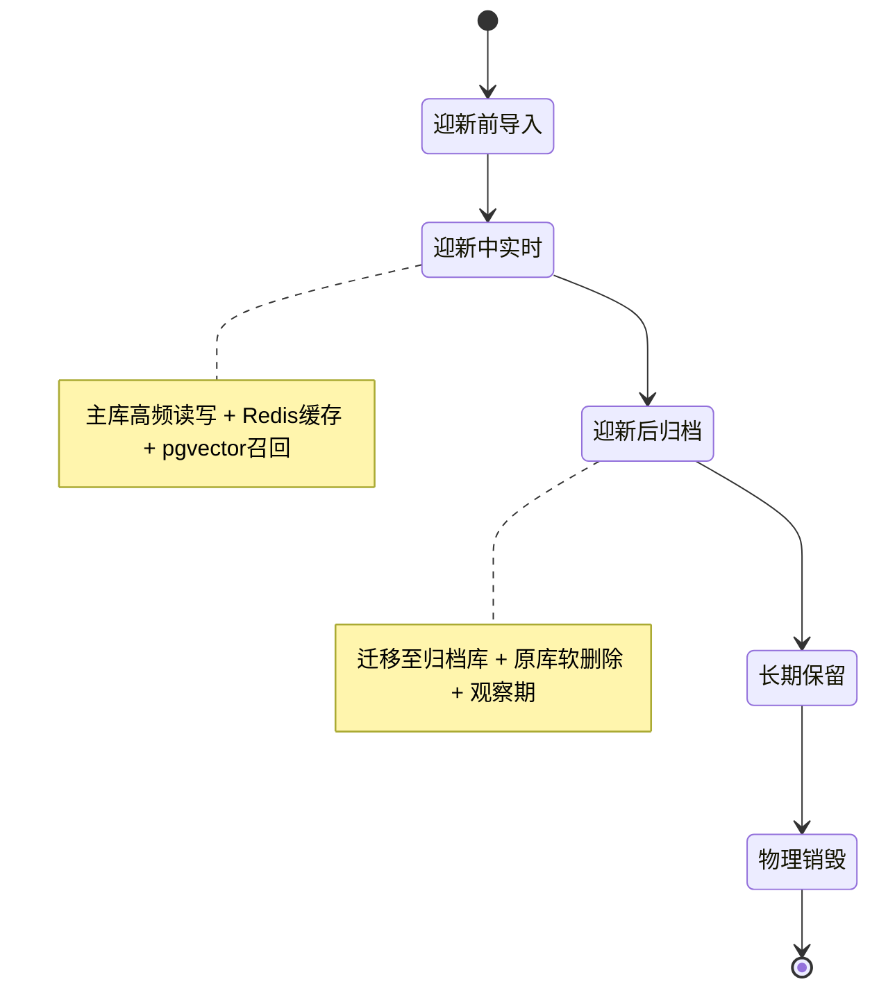
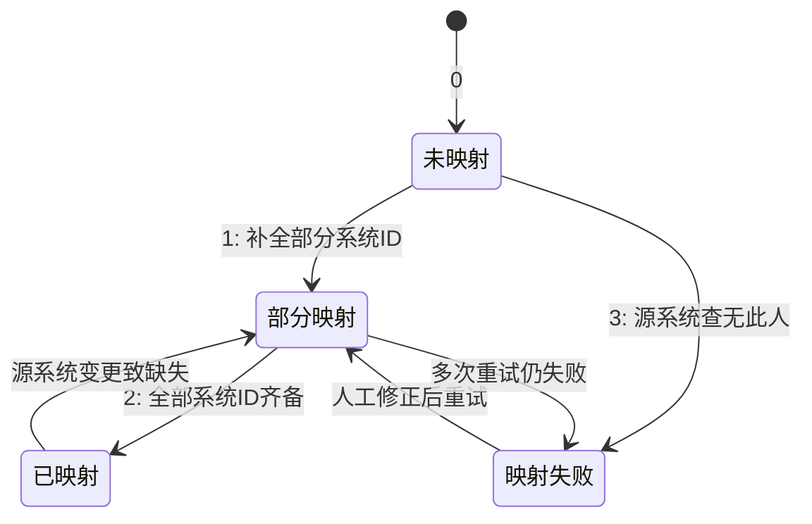

# 微迎新（CampusArrive） 数据库设计文档（DBDD）

| 项目名称 | 微迎新（CampusArrive） |
| --- | --- |
| 文档名称 | 数据库设计文档（Database Design Document） |
| 文档编号 | DBDD-CA-2026-05 |
| 文档版本 | v1.1.0 |
| 状态 | 待评审 |
| 编制日期 | 2026-08-07 |
| 适用版本 | v1.1（基于 v1.0 迭代） |
| 主数据库 | MySQL 8.0（InnoDB / utf8mb4） |
| 向量数据库 | PostgreSQL 15 + pgvector 0.5（MaxKB 知识库向量存储） |
| 密级 | L2 内部敏感 |

## 版本历史

| 版本 | 日期 | 修订人 | 修订说明 |
| --- | --- | --- | --- |
| v1.0.0 | 2025-08 | 架构组 | v1.0 首版，覆盖学生、流程模板、环节记录、校园 POI 等核心表结构 |
| v1.1.0 | 2026-08-07 | 架构组 | 配合 v1.1 迭代新增家长绑定、AI 对话日志、系统事件、主数据映射、审计日志表；补全数据分类分级方案、PII 加密脱敏策略、索引设计、数据生命周期与 CDC 同步章节 |

## 审批签署

| 角色 | 姓名/单位 | 签字 | 日期 |
| --- | --- | --- | --- |
| 技术负责人 |  |  |  |
| 安全合规负责人 |  |  |  |
| 数据库管理员（DBA） |  |  |  |
| 校方信息中心负责人 |  |  |  |

> 本文档经上述角色签署后生效，作为 v1.1 迭代数据库建设的正式基线。表结构、索引、加密策略的任何变更须更新本文档版本号并经 DBA 与安全合规负责人确认。

---

## 1 文档概述

### 1.1 编写目的

本文档对微迎新（CampusArrive） v1.1 的数据库逻辑结构、物理结构、数据分类分级、PII 加密脱敏、索引设计、数据生命周期与跨系统同步进行完整、可落地的描述，作为数据库开发、迁移、运维与安全审计的统一基准。文档面向架构师、后端开发工程师、DBA、测试工程师与安全合规审计人员。

v1.1 在 v1.0 既有数据库基础上，围绕"AI 迎新智能助手、家长查看端、系统集成中间件、安全与合规保障"四大新增模块引入家长绑定、AI 对话日志、系统事件、主数据映射、审计日志等数据结构，并建立覆盖 L1/L2/L3 三级的数据分类分级体系与 PII 加密脱敏机制，满足《个人信息保护法》《数据安全法》及教育行业现行法规要求。

### 1.2 文档范围

本文档覆盖以下内容：

- 数据库总体架构（MySQL 主库 + PostgreSQL/pgvector 向量库的双库协同）；
- 数据库设计原则（命名规范、字符集、软删除、审计字段、主键策略）；
- 核心实体 ER 关系图（Mermaid `erDiagram`）；
- 12 张核心业务数据表与 1 张向量库表的逐表详细定义（字段、类型、约束、索引、注释）；
- 数据分类分级方案（L1 公开 / L2 内部敏感 / L3 核心敏感）及对应的加密策略与访问控制；
- PII 加密与脱敏策略（加密算法、KMS 密钥管理、展示脱敏、日志脱敏）；
- 索引设计（主键、唯一、联合、查询性能优化）；
- 数据生命周期管理（迎新前导入、迎新中实时操作、迎新后归档删除）；
- 数据迁移与同步（CDC binlog 监听、批量同步、主数据映射表）。

不在本文档范围内的事项：应用层 ORM 映射细节、API 接口字段级契约、UI 展示逻辑、备份恢复运维操作手册，上述内容由配套的接口设计文档与运维手册承担。

### 1.3 术语与缩略语

| 术语 / 缩略语 | 含义 |
| --- | --- |
| DBDD | 数据库设计文档（Database Design Document） |
| MySQL | 本项目主数据库，采用 8.0 版本、InnoDB 引擎 |
| PostgreSQL | 本项目向量数据库底座，承载 MaxKB 知识库 |
| pgvector | PostgreSQL 向量检索扩展，用于语义相似度召回 |
| MaxKB | 知识库构建与工作流编排平台，承接 AI 问答 |
| TDE | 透明数据加密（Transparent Data Encryption），数据库级全盘加密 |
| KMS | 密钥管理服务（Key Management Service），校园自建密钥托管 |
| AES-256-ECB | 256 位密钥的 AES 加密算法，电子密码本模式 |
| PII | 个人身份信息（Personally Identifiable Information） |
| 脱敏 | 对敏感数据按规则进行部分隐藏或替换的处理 |
| 哈希索引字段 | 对加密字段计算确定性哈希（SHA-256）后存储，用于等值查询 |
| CDC | 变更数据捕获（Change Data Capture），监听 binlog 同步数据 |
| binlog | MySQL 二进制日志，记录所有 DDL/DML 变更 |
| 主数据映射 | 报到系统与教务/宿管/一卡通系统间的学生主键映射关系表 |
| 软删除 | 通过 `is_deleted` 标记逻辑删除，物理数据保留以备审计 |
| 审计字段 | `created_at`/`updated_at`/`created_by`/`updated_by` 等追溯字段 |
| L1/L2/L3 | 数据分级标识：L1 公开、L2 内部敏感、L3 核心敏感 |
| POI | 兴趣点（Point of Interest），此处指校园地点 |
| JWT | JSON Web Token，家长查看端无状态鉴权令牌 |
| 归档 | 迎新季结束后将活跃数据迁移至归档表/冷存储的过程 |

### 1.4 参考文献与依据

| 编号 | 名称 | 用途 |
| --- | --- | --- |
| REF-01 | 《中华人民共和国个人信息保护法》 | PII 处理与脱敏合规依据 |
| REF-02 | 《中华人民共和国数据安全法》 | 数据分类分级与安全防护依据 |
| REF-03 | GB/T 35273-2020《信息安全技术 个人信息安全规范》 | PII 识别与脱敏规则参照 |
| REF-04 | GB/T 22239-2019《信息安全技术 网络安全等级保护基本要求》 | 数据库等保基线 |
| REF-05 | MySQL 8.0 官方参考手册 | InnoDB/utf8mb4/索引语法依据 |
| REF-06 | pgvector 官方文档 | 向量类型与索引语法依据 |
| REF-07 | 微迎新（CampusArrive） v1.1 需求规格说明书（SRS-CA-2026-03） | 字段需求来源 |
| REF-08 | 微迎新（CampusArrive） v1.1 项目章程（PC-CA-2026-01） | 合规与密级要求来源 |
| REF-09 | OWASP Top 10（2021） | 数据库访问与注入防护基线 |

---

## 2 数据库设计原则

### 2.1 设计目标

数据库设计以"合规优先、性能可控、可追溯、可归档"为核心目标：

- **合规优先**：所有 PII 字段在物理层加密存储，展示层与日志层均经脱敏处理，满足数据分类分级与最小必要原则；
- **性能可控**：核心查询路径均由索引覆盖，迎新高峰期单库支撑并发报到与 AI 问答；
- **可追溯**：所有业务表具备审计字段，关键操作写入审计日志，支持事后回溯；
- **可归档**：通过软删除与归档表机制支撑迎新季数据生命周期管理。

### 2.2 命名规范

| 对象 | 规范 | 示例 |
| --- | --- | --- |
| 库名 | 小写蛇形，业务域前缀 | `fcs_core`、`fcs_kb` |
| 表名 | 小写蛇形，单数形式，业务语义优先 | `student`、`step_record` |
| 字段名 | 小写蛇形，布尔型以 `is_` 开头，时间型以 `_at`/`_time` 结尾 | `is_deleted`、`created_at`、`bind_time` |
| 主键 | 统一 `{表名去前缀}_id`，BIGINT 自增或雪花 ID | `student_id`、`step_id` |
| 外键字段 | `{引用表名去前缀}_id` | `student_id`、`template_id`、`poi_id` |
| 索引名 | 普通索引 `idx_`，唯一索引 `uk_`，联合索引 `idx_{col1}_{col2}` | `uk_student_no`、`idx_student_status` |
| 加密字段 | 以 `_enc` 结尾，配套 `_hash` 哈希字段 | `id_card_enc`、`id_card_hash` |
| 脱敏字段 | 以 `_masked` 结尾 | `user_message_masked` |
| 枚举字段 | 使用 TINYINT 数值编码，注释内写明字典 | `status TINYINT -- 0待处理 1已处理 2失败` |

> 说明：本项目不使用数据库物理外键约束（FOREIGN KEY），实体间引用关系由应用层与索引保证，以降低写入开销并便于分库分表演进。

### 2.3 字符集与排序规则

- 全库统一字符集 `utf8mb4`，排序规则 `utf8mb4_0900_ai_ci`，完整支持 4 字节字符（含 Emoji 与生僻汉字）；
- MySQL 配置参数：`character_set_server=utf8mb4`、`collation_server=utf8mb4_0900_ai_ci`、`default_storage_engine=InnoDB`；
- 连接层强制 `SET NAMES utf8mb4`，避免乱码与隐式字符集转换导致的索引失效；
- PostgreSQL 向量库使用 UTF8 编码，`pgvector` 扩展在 `public` schema 下创建。

### 2.4 主键策略

- 所有业务表主键采用 `BIGINT UNSIGNED AUTO_INCREMENT`，预留分布式迁移空间（必要时切换为雪花算法 ID）；
- 主键索引为聚簇索引，单调整数自增，避免页分裂与二级索引膨胀；
- 对外暴露的业务编号（学号 `student_no`、工号 `staff_no`、用户名 `username`）以唯一索引约束，不作为主键。

### 2.5 软删除

- 所有业务表统一包含 `is_deleted TINYINT NOT NULL DEFAULT 0`，`0` 为正常、`1` 为已删除；
- 所有查询默认追加 `WHERE is_deleted = 0`（通过 MyBatis-Plus 逻辑删除插件统一注入）；
- 软删除数据保留至迎新季归档周期结束，再按归档策略物理清理；
- 审计日志 `audit_log`、AI 对话日志 `ai_chat_log`、系统事件 `system_event` 三张只增表不设软删除，仅做归档。

### 2.6 审计字段

所有可变业务表统一包含以下审计字段：

| 字段 | 类型 | 说明 |
| --- | --- | --- |
| `created_at` | DATETIME NOT NULL DEFAULT CURRENT_TIMESTAMP | 创建时间 |
| `updated_at` | DATETIME NOT NULL DEFAULT CURRENT_TIMESTAMP ON UPDATE CURRENT_TIMESTAMP | 最后更新时间 |
| `created_by` | VARCHAR(64) | 创建人（用户标识或 `system`） |
| `updated_by` | VARCHAR(64) | 最后更新人 |

### 2.7 时间与存储

- 时间字段统一 `DATETIME`，存储本地时间（UTC+8），不使用 `TIMESTAMP` 以规避 2038 问题与隐式时区转换；
- 金额、经纬度等高精度数值使用 `DECIMAL`，禁用 `FLOAT`/`DOUBLE` 存储敏感数值；
- 加密字段统一 `VARBINARY(255)`，容纳 AES-256 密文与 IV/Tag；
- 大文本（AI 回复、操作详情）使用 `TEXT`/`JSON`，JSON 字段使用 MySQL 8.0 原生 JSON 类型并配函数索引。

---

## 3 总体架构

### 3.1 双库协同架构

系统采用 MySQL 主库 + PostgreSQL/pgvector 向量库的双库协同架构，职责分离：

```
┌─────────────────────────────────────────────────────────────────┐
│                       应用服务层（Spring Boot）                  │
│   学生端 / 辅导员端 / 管理员端 / 家长端 / AI 助手                 │
└──────────────┬───────────────────────────────┬──────────────────┘
               │ 业务事务读写                   │ 语义检索（召回）
               ▼                                ▼
┌──────────────────────────────┐   ┌──────────────────────────────┐
│   MySQL 8.0 主库（fcs_core）  │   │ PostgreSQL 15 + pgvector     │
│   ──────────────────────────  │   │   （fcs_kb，MaxKB 知识库）    │
│   • 学生/流程/环节/记录        │   │   ────────────────────────── │
│   • 家长绑定/辅导员/管理员     │   │   • 知识切片向量表            │
│   • 主数据映射/审计日志        │   │   • 嵌入模型元数据            │
│   • 系统事件/AI 对话日志       │   │   • 检索命中记录              │
│   • TDE 透明数据加密           │   │   • HNSW 向量索引             │
└──────────────┬───────────────┘   └──────────────┬───────────────┘
               │                                   │
               ▼                                   ▼
┌──────────────────────────────┐   ┌──────────────────────────────┐
│   校园 KMS（密钥管理服务）     │   │   MaxKB（RAG 工作流编排）     │
│   • AES-256 主密钥轮转        │   │   • DeepSeek 嵌入/生成        │
│   • DEK/KEK 两级密钥体系      │   │   • 知识库切片与索引          │
└──────────────────────────────┘   └──────────────────────────────┘
```

### 3.2 库职责划分

| 数据库 | 引擎/扩展 | 职责 | 数据示例 |
| --- | --- | --- | --- |
| `fcs_core`（MySQL 8.0） | InnoDB | 承载全部业务事务数据，强一致、ACID | 学生、流程、环节记录、家长绑定、审计日志 |
| `fcs_kb`（PostgreSQL+pgvector） | HNSW 索引 | 承载 MaxKB 知识库向量切片，支撑语义召回 | 迎新手册切片、FAQ 切片、政策文档切片 |

### 3.3 物理部署

- MySQL 与 PostgreSQL 均部署于校园内网 Docker 容器，学生数据不出校；
- MySQL 开启 TDE 透明数据加密，对 L2 内部敏感数据落盘加密；
- PostgreSQL 数据卷加密由宿主机 LUKS 承载；
- 两库通过应用层编排协同，无跨库事务，AI 问答链路为"先向量召回、再业务库关联"。

---

## 4 ER 关系图

### 4.1 核心实体关系（Mermaid erDiagram）



### 4.2 关系说明

| 关系 | 基数 | 说明 |
| --- | --- | --- |
| 学生 ↔ 环节记录 | 1 : N | 一个学生在每个环节产生一条记录，`uk_student_step` 保证同一学生同一环节唯一 |
| 学生 ↔ 家长绑定 | 1 : 1（逻辑） | 一个学生同时仅允许一个有效家长绑定，历史绑定以 `status=已过期/已解绑` 保留 |
| 学生 ↔ AI 对话日志 | 1 : N | 一个学生可发起多次问答，按 `session_id` 聚合会话 |
| 学生 ↔ 系统事件 | 1 : N | 报到成功、环节完成等均产生事件，驱动家长端通知与跨系统同步 |
| 学生 ↔ 主数据映射 | 1 : 1 | 一个学号对应一条主数据映射，贯通教务/宿管/一卡通 |
| 流程模板 ↔ 流程环节 | 1 : N | 一个模板包含多个有序环节，`uk_template_order` 保证顺序号唯一 |
| 流程环节 ↔ 环节记录 | 1 : N | 一个环节被多名学生完成，产生多条记录 |
| 校园 POI ↔ 流程环节 | 1 : N | 一个 POI 可被多个环节引用为地点 |
| 辅导员 ↔ 学生 | N : N | 辅导员通过 `managed_classes` 管理多个班级的学生，弱关联，无物理外键 |
| 管理员/学生/辅导员 ↔ 审计日志 | 1 : N | 所有角色操作均落审计日志，`operator` 记录操作人标识 |

---

## 5 数据表详细定义

### 5.1 总览

| 序号 | 表名 | 中文名 | 所属库 | 分级 | 说明 |
| --- | --- | --- | --- | --- | --- |
| 5.2 | `student` | 学生表 | fcs_core | L2/L3 混合 | 报到主体，含加密 PII |
| 5.3 | `checkin_process_template` | 报到流程模板表 | fcs_core | L1 | 学校级流程模板与版本 |
| 5.4 | `process_step` | 流程环节表 | fcs_core | L1 | 模板下的有序环节 |
| 5.5 | `step_record` | 环节记录表 | fcs_core | L2 | 学生逐环节完成记录 |
| 5.6 | `parent_binding` | 家长绑定表 | fcs_core | L3 | 家长查看端绑定与 JWT |
| 5.7 | `ai_chat_log` | AI 对话日志表 | fcs_core | L2 | AI 问答日志（脱敏） |
| 5.8 | `system_event` | 系统事件表 | fcs_core | L2 | 事件驱动与跨系统同步 |
| 5.9 | `data_mapping` | 主数据映射表 | fcs_core | L2/L3 混合 | 跨系统学生主键映射 |
| 5.10 | `counselor` | 辅导员表 | fcs_core | L2/L3 混合 | 辅导员账户与所辖班级 |
| 5.11 | `admin` | 管理员表 | fcs_core | L2 | 管理员账户与权限 |
| 5.12 | `campus_poi` | 校园 POI 表 | fcs_core | L1 | 校园兴趣点（公开） |
| 5.13 | `audit_log` | 审计日志表 | fcs_core | L2 | 全操作审计追溯 |
| 5.14 | `kb_document_chunk` | 知识切片向量表 | fcs_kb | L1/L2 | MaxKB 知识库向量存储 |

> 字段说明约定：约束列标注 `PK` 主键、`UK` 唯一、`NN` 非空、`FK` 逻辑外键（无物理约束）；分级列标注该字段的数据分级（L1/L2/L3）；索引列标注索引名与类型。

### 5.2 student（学生表）

承载新生基本信息与报到状态，是系统核心实体。身份证号、手机号、家长手机号、人脸照片 URL 为 L3 核心敏感字段，AES-256 加密存储；学号、学院、专业、报到状态为 L2 内部敏感。

**建表语句：**

```sql
CREATE TABLE `student` (
  `student_id`        BIGINT UNSIGNED NOT NULL AUTO_INCREMENT COMMENT '学生内部ID',
  `student_no`        VARCHAR(32)     NOT NULL COMMENT '学号（L2）',
  `name`              VARCHAR(64)     NOT NULL COMMENT '姓名（L2）',
  `id_card_enc`       VARBINARY(255)  NOT NULL COMMENT '身份证号密文（L3，AES-256-ECB）',
  `id_card_hash`      CHAR(64)        NOT NULL COMMENT '身份证号SHA-256哈希（用于等值查询）',
  `phone_enc`         VARBINARY(255)  NOT NULL COMMENT '手机号密文（L3，AES-256-ECB）',
  `phone_hash`        CHAR(64)        NOT NULL COMMENT '手机号SHA-256哈希',
  `gender`            TINYINT         NOT NULL DEFAULT 0 COMMENT '性别 0未知 1男 2女',
  `college`           VARCHAR(128)    NOT NULL COMMENT '学院（L2）',
  `major`             VARCHAR(128)    NOT NULL COMMENT '专业（L2）',
  `class_name`        VARCHAR(64)             DEFAULT NULL COMMENT '班级名称（L2）',
  `photo_url`         VARCHAR(512)            DEFAULT NULL COMMENT '人脸照片URL（L3，对象存储加密桶）',
  `parent_phone_enc`  VARBINARY(255)          DEFAULT NULL COMMENT '家长手机号密文（L3）',
  `parent_phone_hash` CHAR(64)                DEFAULT NULL COMMENT '家长手机号SHA-256哈希',
  `checkin_status`    TINYINT         NOT NULL DEFAULT 0 COMMENT '报到状态 0未报到 1报到中 2已完成 3已跳过',
  `school_id`         BIGINT UNSIGNED NOT NULL COMMENT '学校ID',
  `enrollment_year`   SMALLINT        NOT NULL COMMENT '入学年份',
  `is_deleted`        TINYINT         NOT NULL DEFAULT 0 COMMENT '软删除 0正常 1已删除',
  `created_at`        DATETIME        NOT NULL DEFAULT CURRENT_TIMESTAMP COMMENT '创建时间',
  `updated_at`        DATETIME        NOT NULL DEFAULT CURRENT_TIMESTAMP ON UPDATE CURRENT_TIMESTAMP COMMENT '更新时间',
  `created_by`        VARCHAR(64)     NOT NULL DEFAULT 'system' COMMENT '创建人',
  `updated_by`        VARCHAR(64)             DEFAULT NULL COMMENT '更新人',
  PRIMARY KEY (`student_id`),
  UNIQUE KEY `uk_student_no` (`student_no`),
  UNIQUE KEY `uk_id_card_hash` (`id_card_hash`),
  KEY `idx_phone_hash` (`phone_hash`),
  KEY `idx_school_status` (`school_id`, `checkin_status`, `is_deleted`),
  KEY `idx_college_major` (`college`, `major`),
  KEY `idx_enrollment_year` (`enrollment_year`)
) ENGINE=InnoDB DEFAULT CHARSET=utf8mb4 COLLATE=utf8mb4_0900_ai_ci COMMENT='学生表';
```

**字段定义：**

| 字段名 | 类型 | 约束 | 分级 | 索引 | 注释 |
| --- | --- | --- | --- | --- | --- |
| student_id | BIGINT UNSIGNED | PK, NN, AUTO_INCREMENT | L2 | 主键 | 学生内部ID |
| student_no | VARCHAR(32) | UK, NN | L2 | uk_student_no | 学号 |
| name | VARCHAR(64) | NN | L2 | — | 姓名 |
| id_card_enc | VARBINARY(255) | NN | L3 | — | 身份证号密文（AES-256-ECB） |
| id_card_hash | CHAR(64) | UK, NN | L3 | uk_id_card_hash | 身份证号 SHA-256 哈希 |
| phone_enc | VARBINARY(255) | NN | L3 | — | 手机号密文 |
| phone_hash | CHAR(64) | NN | L3 | idx_phone_hash | 手机号 SHA-256 哈希 |
| gender | TINYINT | NN, DEFAULT 0 | L2 | — | 性别 0未知 1男 2女 |
| college | VARCHAR(128) | NN | L2 | idx_college_major | 学院 |
| major | VARCHAR(128) | NN | L2 | idx_college_major | 专业 |
| class_name | VARCHAR(64) | NULL | L2 | — | 班级名称 |
| photo_url | VARCHAR(512) | NULL | L3 | — | 人脸照片 URL（对象存储加密桶） |
| parent_phone_enc | VARBINARY(255) | NULL | L3 | — | 家长手机号密文 |
| parent_phone_hash | CHAR(64) | NULL | L3 | — | 家长手机号 SHA-256 哈希 |
| checkin_status | TINYINT | NN, DEFAULT 0 | L2 | idx_school_status | 报到状态 0未报到 1报到中 2已完成 3已跳过 |
| school_id | BIGINT UNSIGNED | NN | L2 | idx_school_status | 学校ID |
| enrollment_year | SMALLINT | NN | L2 | idx_enrollment_year | 入学年份 |
| is_deleted | TINYINT | NN, DEFAULT 0 | L2 | idx_school_status | 软删除标记 |
| created_at / updated_at / created_by / updated_by | 审计字段 | 见 2.6 | L2 | — | 审计追溯 |

### 5.3 checkin_process_template（报到流程模板表）

学校级报到流程模板，支持版本化与多模板并存。属 L1 公开数据，明文存储。

**建表语句：**

```sql
CREATE TABLE `checkin_process_template` (
  `template_id`     BIGINT UNSIGNED NOT NULL AUTO_INCREMENT COMMENT '模板ID',
  `school_id`       BIGINT UNSIGNED NOT NULL COMMENT '学校ID',
  `name`            VARCHAR(128)    NOT NULL COMMENT '模板名称',
  `version`         INT             NOT NULL DEFAULT 1 COMMENT '版本号',
  `status`          TINYINT         NOT NULL DEFAULT 0 COMMENT '状态 0草稿 1已发布 2已停用',
  `description`     VARCHAR(512)             DEFAULT NULL COMMENT '模板描述',
  `effective_from`  DATE                     DEFAULT NULL COMMENT '生效开始日期',
  `effective_to`    DATE                     DEFAULT NULL COMMENT '生效结束日期',
  `is_deleted`      TINYINT         NOT NULL DEFAULT 0 COMMENT '软删除',
  `created_at`      DATETIME        NOT NULL DEFAULT CURRENT_TIMESTAMP,
  `updated_at`      DATETIME        NOT NULL DEFAULT CURRENT_TIMESTAMP ON UPDATE CURRENT_TIMESTAMP,
  `created_by`      VARCHAR(64)     NOT NULL DEFAULT 'system',
  `updated_by`      VARCHAR(64)             DEFAULT NULL,
  PRIMARY KEY (`template_id`),
  UNIQUE KEY `uk_school_name_version` (`school_id`, `name`, `version`),
  KEY `idx_school_status` (`school_id`, `status`, `is_deleted`)
) ENGINE=InnoDB DEFAULT CHARSET=utf8mb4 COLLATE=utf8mb4_0900_ai_ci COMMENT='报到流程模板表';
```

**字段定义：**

| 字段名 | 类型 | 约束 | 分级 | 索引 | 注释 |
| --- | --- | --- | --- | --- | --- |
| template_id | BIGINT UNSIGNED | PK, NN, AUTO_INCREMENT | L1 | 主键 | 模板ID |
| school_id | BIGINT UNSIGNED | NN | L1 | uk_school_name_version, idx_school_status | 学校ID |
| name | VARCHAR(128) | NN | L1 | uk_school_name_version | 模板名称 |
| version | INT | NN, DEFAULT 1 | L1 | uk_school_name_version | 版本号 |
| status | TINYINT | NN, DEFAULT 0 | L1 | idx_school_status | 状态 0草稿 1已发布 2已停用 |
| description | VARCHAR(512) | NULL | L1 | — | 模板描述 |
| effective_from | DATE | NULL | L1 | — | 生效开始日期 |
| effective_to | DATE | NULL | L1 | — | 生效结束日期 |
| is_deleted | TINYINT | NN, DEFAULT 0 | L1 | idx_school_status | 软删除标记 |
| 审计字段 | — | 见 2.6 | L1 | — | — |

### 5.4 process_step（流程环节表）

模板下的有序环节定义，含环节类型、所需材料、地点与关联 POI。属 L1 公开数据。

**建表语句：**

```sql
CREATE TABLE `process_step` (
  `step_id`           BIGINT UNSIGNED NOT NULL AUTO_INCREMENT COMMENT '环节ID',
  `template_id`       BIGINT UNSIGNED NOT NULL COMMENT '模板ID（FK→checkin_process_template）',
  `step_name`         VARCHAR(128)    NOT NULL COMMENT '环节名称',
  `step_order`        INT             NOT NULL COMMENT '顺序号（同模板内唯一）',
  `step_type`         TINYINT         NOT NULL COMMENT '环节类型 0签到 1缴费 2核验 3宿舍分配 4材料提交 5其他',
  `required_materials` JSON                    DEFAULT NULL COMMENT '所需材料清单（JSON数组）',
  `location`          VARCHAR(256)             DEFAULT NULL COMMENT '环节地点描述',
  `poi_id`            BIGINT UNSIGNED          DEFAULT NULL COMMENT '关联POI（FK→campus_poi）',
  `description`       VARCHAR(512)             DEFAULT NULL COMMENT '环节说明',
  `is_optional`       TINYINT         NOT NULL DEFAULT 0 COMMENT '是否可选 0必选 1可选',
  `is_deleted`        TINYINT         NOT NULL DEFAULT 0 COMMENT '软删除',
  `created_at`        DATETIME        NOT NULL DEFAULT CURRENT_TIMESTAMP,
  `updated_at`        DATETIME        NOT NULL DEFAULT CURRENT_TIMESTAMP ON UPDATE CURRENT_TIMESTAMP,
  `created_by`        VARCHAR(64)     NOT NULL DEFAULT 'system',
  `updated_by`        VARCHAR(64)             DEFAULT NULL,
  PRIMARY KEY (`step_id`),
  UNIQUE KEY `uk_template_order` (`template_id`, `step_order`),
  KEY `idx_template_id` (`template_id`, `is_deleted`),
  KEY `idx_poi_id` (`poi_id`)
) ENGINE=InnoDB DEFAULT CHARSET=utf8mb4 COLLATE=utf8mb4_0900_ai_ci COMMENT='流程环节表';
```

**字段定义：**

| 字段名 | 类型 | 约束 | 分级 | 索引 | 注释 |
| --- | --- | --- | --- | --- | --- |
| step_id | BIGINT UNSIGNED | PK, NN, AUTO_INCREMENT | L1 | 主键 | 环节ID |
| template_id | BIGINT UNSIGNED | NN, FK | L1 | uk_template_order, idx_template_id | 模板ID |
| step_name | VARCHAR(128) | NN | L1 | — | 环节名称 |
| step_order | INT | NN | L1 | uk_template_order | 顺序号（同模板内唯一） |
| step_type | TINYINT | NN | L1 | — | 环节类型 0签到 1缴费 2核验 3宿舍分配 4材料提交 5其他 |
| required_materials | JSON | NULL | L1 | — | 所需材料清单（JSON 数组） |
| location | VARCHAR(256) | NULL | L1 | — | 环节地点描述 |
| poi_id | BIGINT UNSIGNED | NULL, FK | L1 | idx_poi_id | 关联 POI |
| description | VARCHAR(512) | NULL | L1 | — | 环节说明 |
| is_optional | TINYINT | NN, DEFAULT 0 | L1 | — | 是否可选 0必选 1可选 |
| is_deleted | TINYINT | NN, DEFAULT 0 | L1 | idx_template_id | 软删除标记 |
| 审计字段 | — | 见 2.6 | L1 | — | — |

### 5.5 step_record（环节记录表）

学生逐环节完成记录，是报到进度追踪的核心数据。属 L2 内部敏感。

**建表语句：**

```sql
CREATE TABLE `step_record` (
  `record_id`     BIGINT UNSIGNED NOT NULL AUTO_INCREMENT COMMENT '记录ID',
  `student_id`    BIGINT UNSIGNED NOT NULL COMMENT '学生ID（FK→student）',
  `step_id`       BIGINT UNSIGNED NOT NULL COMMENT '环节ID（FK→process_step）',
  `template_id`   BIGINT UNSIGNED NOT NULL COMMENT '模板ID（冗余，加速查询）',
  `status`        TINYINT         NOT NULL DEFAULT 0 COMMENT '状态 0待完成 1已完成 2已跳过',
  `completed_at`  DATETIME                 DEFAULT NULL COMMENT '完成时间',
  `operator`      VARCHAR(64)              DEFAULT NULL COMMENT '操作人标识',
  `operator_role` TINYINT                  DEFAULT NULL COMMENT '操作人角色 0学生 1辅导员 2管理员 3系统',
  `material_url`  JSON                     DEFAULT NULL COMMENT '材料URL（JSON数组）',
  `remark`        VARCHAR(512)             DEFAULT NULL COMMENT '备注',
  `is_deleted`    TINYINT         NOT NULL DEFAULT 0 COMMENT '软删除',
  `created_at`    DATETIME        NOT NULL DEFAULT CURRENT_TIMESTAMP,
  `updated_at`    DATETIME        NOT NULL DEFAULT CURRENT_TIMESTAMP ON UPDATE CURRENT_TIMESTAMP,
  `created_by`    VARCHAR(64)     NOT NULL DEFAULT 'system',
  `updated_by`    VARCHAR(64)              DEFAULT NULL,
  PRIMARY KEY (`record_id`),
  UNIQUE KEY `uk_student_step` (`student_id`, `step_id`),
  KEY `idx_student_status` (`student_id`, `status`, `is_deleted`),
  KEY `idx_step_id` (`step_id`),
  KEY `idx_template_status` (`template_id`, `status`),
  KEY `idx_completed_at` (`completed_at`)
) ENGINE=InnoDB DEFAULT CHARSET=utf8mb4 COLLATE=utf8mb4_0900_ai_ci COMMENT='环节记录表';
```

**字段定义：**

| 字段名 | 类型 | 约束 | 分级 | 索引 | 注释 |
| --- | --- | --- | --- | --- | --- |
| record_id | BIGINT UNSIGNED | PK, NN, AUTO_INCREMENT | L2 | 主键 | 记录ID |
| student_id | BIGINT UNSIGNED | NN, FK | L2 | uk_student_step, idx_student_status | 学生ID |
| step_id | BIGINT UNSIGNED | NN, FK | L2 | uk_student_step, idx_step_id | 环节ID |
| template_id | BIGINT UNSIGNED | NN, FK | L2 | idx_template_status | 模板ID（冗余） |
| status | TINYINT | NN, DEFAULT 0 | L2 | idx_student_status, idx_template_status | 状态 0待完成 1已完成 2已跳过 |
| completed_at | DATETIME | NULL | L2 | idx_completed_at | 完成时间 |
| operator | VARCHAR(64) | NULL | L2 | — | 操作人标识 |
| operator_role | TINYINT | NULL | L2 | — | 操作人角色 0学生 1辅导员 2管理员 3系统 |
| material_url | JSON | NULL | L2 | — | 材料 URL（JSON 数组） |
| remark | VARCHAR(512) | NULL | L2 | — | 备注 |
| is_deleted | TINYINT | NN, DEFAULT 0 | L2 | idx_student_status | 软删除标记 |
| 审计字段 | — | 见 2.6 | L2 | — | — |

---

### 5.6 parent_binding（家长绑定表）

家长查看端的绑定关系与 JWT 令牌。家长手机号为 L3 加密存储，绑定需知情同意。属 L3 核心敏感。

**建表语句：**

```sql
CREATE TABLE `parent_binding` (
  `binding_id`         BIGINT UNSIGNED NOT NULL AUTO_INCREMENT COMMENT '绑定ID',
  `student_id`         BIGINT UNSIGNED NOT NULL COMMENT '学生ID（FK→student）',
  `parent_phone_enc`   VARBINARY(255)  NOT NULL COMMENT '家长手机号密文（L3，AES-256-ECB）',
  `parent_phone_hash`  CHAR(64)        NOT NULL COMMENT '家长手机号SHA-256哈希',
  `jwt_token`          VARCHAR(512)    NOT NULL COMMENT '家长端JWT令牌',
  `token_expire_at`    DATETIME        NOT NULL COMMENT '令牌过期时间',
  `bind_time`          DATETIME        NOT NULL DEFAULT CURRENT_TIMESTAMP COMMENT '绑定时间',
  `consent_flag`       TINYINT         NOT NULL DEFAULT 0 COMMENT '知情同意标志 0未同意 1已同意',
  `consent_time`       DATETIME                 DEFAULT NULL COMMENT '同意时间',
  `consent_ip`         VARCHAR(45)              DEFAULT NULL COMMENT '同意操作IP',
  `status`             TINYINT         NOT NULL DEFAULT 1 COMMENT '状态 0已解绑 1有效 2已过期',
  `unbind_time`        DATETIME                 DEFAULT NULL COMMENT '解绑时间',
  `is_deleted`         TINYINT         NOT NULL DEFAULT 0 COMMENT '软删除',
  `created_at`         DATETIME        NOT NULL DEFAULT CURRENT_TIMESTAMP,
  `updated_at`         DATETIME        NOT NULL DEFAULT CURRENT_TIMESTAMP ON UPDATE CURRENT_TIMESTAMP,
  `created_by`         VARCHAR(64)     NOT NULL DEFAULT 'system',
  `updated_by`         VARCHAR(64)              DEFAULT NULL,
  PRIMARY KEY (`binding_id`),
  UNIQUE KEY `uk_student_active` (`student_id`, `status`),
  KEY `idx_phone_hash` (`parent_phone_hash`),
  KEY `idx_token_expire` (`token_expire_at`, `status`),
  KEY `idx_student_id` (`student_id`, `is_deleted`)
) ENGINE=InnoDB DEFAULT CHARSET=utf8mb4 COLLATE=utf8mb4_0900_ai_ci COMMENT='家长绑定表';
```

> `uk_student_active` 为 `(student_id, status)` 联合唯一索引，配合应用层"同一学生仅一个有效绑定"约束，避免重复绑定；历史已解绑/已过期记录保留以备审计。

**字段定义：**

| 字段名 | 类型 | 约束 | 分级 | 索引 | 注释 |
| --- | --- | --- | --- | --- | --- |
| binding_id | BIGINT UNSIGNED | PK, NN, AUTO_INCREMENT | L3 | 主键 | 绑定ID |
| student_id | BIGINT UNSIGNED | NN, FK | L3 | uk_student_active, idx_student_id | 学生ID |
| parent_phone_enc | VARBINARY(255) | NN | L3 | — | 家长手机号密文 |
| parent_phone_hash | CHAR(64) | NN | L3 | idx_phone_hash | 家长手机号 SHA-256 哈希 |
| jwt_token | VARCHAR(512) | NN | L3 | — | 家长端 JWT 令牌 |
| token_expire_at | DATETIME | NN | L3 | idx_token_expire | 令牌过期时间 |
| bind_time | DATETIME | NN, DEFAULT CURRENT_TIMESTAMP | L3 | — | 绑定时间 |
| consent_flag | TINYINT | NN, DEFAULT 0 | L3 | — | 知情同意标志 0未同意 1已同意 |
| consent_time | DATETIME | NULL | L3 | — | 同意时间 |
| consent_ip | VARCHAR(45) | NULL | L3 | — | 同意操作 IP |
| status | TINYINT | NN, DEFAULT 1 | L3 | uk_student_active, idx_token_expire | 状态 0已解绑 1有效 2已过期 |
| unbind_time | DATETIME | NULL | L3 | — | 解绑时间 |
| is_deleted | TINYINT | NN, DEFAULT 0 | L3 | idx_student_id | 软删除标记 |
| 审计字段 | — | 见 2.6 | L3 | — | — |

### 5.7 ai_chat_log（AI 对话日志表）

记录学生与 AI 迎新助手的问答交互。用户消息写入前经脱敏过滤器处理，AI 回复与知识库来源一并落库。属 L2 内部敏感（脱敏后明文存储）。

**建表语句：**

```sql
CREATE TABLE `ai_chat_log` (
  `log_id`              BIGINT UNSIGNED NOT NULL AUTO_INCREMENT COMMENT '日志ID',
  `student_id`          BIGINT UNSIGNED          DEFAULT NULL COMMENT '学生ID（匿名访问可为空）',
  `session_id`          VARCHAR(64)     NOT NULL COMMENT '会话ID（UUID）',
  `user_message_masked` TEXT            NOT NULL COMMENT '用户消息（脱敏后）',
  `ai_reply`            MEDIUMTEXT               DEFAULT NULL COMMENT 'AI回复原文',
  `kb_sources`          JSON                     DEFAULT NULL COMMENT '知识库来源（切片ID与分数数组）',
  `token_input`         INT                      DEFAULT 0 COMMENT '输入token消耗',
  `token_output`        INT                      DEFAULT 0 COMMENT '输出token消耗',
  `model`               VARCHAR(64)              DEFAULT NULL COMMENT '模型标识',
  `latency_ms`          INT                      DEFAULT NULL COMMENT '首词响应/总耗时（毫秒）',
  `ip_address`          VARCHAR(45)              DEFAULT NULL COMMENT '来源IP',
  `created_at`          DATETIME        NOT NULL DEFAULT CURRENT_TIMESTAMP COMMENT '时间戳',
  PRIMARY KEY (`log_id`),
  KEY `idx_student_time` (`student_id`, `created_at`),
  KEY `idx_session_id` (`session_id`),
  KEY `idx_created_at` (`created_at`)
) ENGINE=InnoDB DEFAULT CHARSET=utf8mb4 COLLATE=utf8mb4_0900_ai_ci COMMENT='AI对话日志表';
```

**字段定义：**

| 字段名 | 类型 | 约束 | 分级 | 索引 | 注释 |
| --- | --- | --- | --- | --- | --- |
| log_id | BIGINT UNSIGNED | PK, NN, AUTO_INCREMENT | L2 | 主键 | 日志ID |
| student_id | BIGINT UNSIGNED | NULL, FK | L2 | idx_student_time | 学生ID（匿名访问可空） |
| session_id | VARCHAR(64) | NN | L2 | idx_session_id | 会话ID（UUID） |
| user_message_masked | TEXT | NN | L2 | — | 用户消息（脱敏后） |
| ai_reply | MEDIUMTEXT | NULL | L2 | — | AI 回复原文 |
| kb_sources | JSON | NULL | L2 | — | 知识库来源（切片 ID 与分数数组） |
| token_input | INT | DEFAULT 0 | L2 | — | 输入 token 消耗 |
| token_output | INT | DEFAULT 0 | L2 | — | 输出 token 消耗 |
| model | VARCHAR(64) | NULL | L2 | — | 模型标识 |
| latency_ms | INT | NULL | L2 | — | 首词响应/总耗时（毫秒） |
| ip_address | VARCHAR(45) | NULL | L2 | — | 来源 IP |
| created_at | DATETIME | NN, DEFAULT CURRENT_TIMESTAMP | L2 | idx_student_time, idx_created_at | 时间戳 |

> 本表为只增表，不设软删除与 `updated_at`；按 `created_at` 分区或按月归档。

### 5.8 system_event（系统事件表）

事件驱动架构的核心事件存储，承载 `student.checkin.success` 等领域事件，状态机驱动家长端通知与跨系统同步。属 L2 内部敏感。

**建表语句：**

```sql
CREATE TABLE `system_event` (
  `event_id`     BIGINT UNSIGNED NOT NULL AUTO_INCREMENT COMMENT '事件ID',
  `event_type`   VARCHAR(64)     NOT NULL COMMENT '事件类型 如 student.checkin.success',
  `student_id`   BIGINT UNSIGNED          DEFAULT NULL COMMENT '关联学生ID',
  `payload`      JSON                     DEFAULT NULL COMMENT '事件载荷（JSON）',
  `status`       TINYINT         NOT NULL DEFAULT 0 COMMENT '状态 0待处理 1已处理 2失败',
  `retry_count`  INT             NOT NULL DEFAULT 0 COMMENT '重试次数',
  `error_msg`    VARCHAR(512)             DEFAULT NULL COMMENT '失败原因',
  `created_at`   DATETIME        NOT NULL DEFAULT CURRENT_TIMESTAMP COMMENT '创建时间',
  `processed_at` DATETIME                 DEFAULT NULL COMMENT '处理时间',
  PRIMARY KEY (`event_id`),
  KEY `idx_type_status` (`event_type`, `status`, `created_at`),
  KEY `idx_student_id` (`student_id`),
  KEY `idx_created_at` (`created_at`)
) ENGINE=InnoDB DEFAULT CHARSET=utf8mb4 COLLATE=utf8mb4_0900_ai_ci COMMENT='系统事件表';
```

**字段定义：**

| 字段名 | 类型 | 约束 | 分级 | 索引 | 注释 |
| --- | --- | --- | --- | --- | --- |
| event_id | BIGINT UNSIGNED | PK, NN, AUTO_INCREMENT | L2 | 主键 | 事件ID |
| event_type | VARCHAR(64) | NN | L2 | idx_type_status | 事件类型（如 `student.checkin.success`） |
| student_id | BIGINT UNSIGNED | NULL, FK | L2 | idx_student_id | 关联学生ID |
| payload | JSON | NULL | L2 | — | 事件载荷（JSON） |
| status | TINYINT | NN, DEFAULT 0 | L2 | idx_type_status | 状态 0待处理 1已处理 2失败 |
| retry_count | INT | NN, DEFAULT 0 | L2 | — | 重试次数 |
| error_msg | VARCHAR(512) | NULL | L2 | — | 失败原因 |
| created_at | DATETIME | NN, DEFAULT CURRENT_TIMESTAMP | L2 | idx_type_status, idx_created_at | 创建时间 |
| processed_at | DATETIME | NULL | L2 | — | 处理时间 |

> 事件类型采用 `{领域}.{聚合}.{动作}` 命名，常见值：`student.checkin.success`、`student.step.completed`、`parent.binding.created`、`sync.mapping.updated`。

### 5.9 data_mapping（主数据映射表）

贯通报到系统与教务、宿管、一卡通系统的学生主键映射。身份证号为 L3 加密，学号与一卡通号为 L2。属 L2/L3 混合。

**建表语句：**

```sql
CREATE TABLE `data_mapping` (
  `mapping_id`      BIGINT UNSIGNED NOT NULL AUTO_INCREMENT COMMENT '映射ID',
  `student_id`      BIGINT UNSIGNED NOT NULL COMMENT '报到系统学生ID（FK→student）',
  `student_no`      VARCHAR(32)     NOT NULL COMMENT '学号（L2）',
  `id_card_enc`     VARBINARY(255)  NOT NULL COMMENT '身份证号密文（L3）',
  `id_card_hash`    CHAR(64)        NOT NULL COMMENT '身份证号SHA-256哈希',
  `card_no`         VARCHAR(32)              DEFAULT NULL COMMENT '一卡通号',
  `jw_student_id`   VARCHAR(64)              DEFAULT NULL COMMENT '教务系统学生ID',
  `dorm_student_id` VARCHAR(64)              DEFAULT NULL COMMENT '宿管系统学生ID',
  `mapping_status`  TINYINT         NOT NULL DEFAULT 0 COMMENT '映射状态 0未映射 1部分映射 2已映射 3映射失败',
  `last_sync_at`    DATETIME                 DEFAULT NULL COMMENT '最近同步时间',
  `sync_source`     VARCHAR(32)              DEFAULT NULL COMMENT '最近同步来源 cdc/batch/manual',
  `is_deleted`      TINYINT         NOT NULL DEFAULT 0 COMMENT '软删除',
  `created_at`      DATETIME        NOT NULL DEFAULT CURRENT_TIMESTAMP,
  `updated_at`      DATETIME        NOT NULL DEFAULT CURRENT_TIMESTAMP ON UPDATE CURRENT_TIMESTAMP,
  `created_by`      VARCHAR(64)     NOT NULL DEFAULT 'system',
  `updated_by`      VARCHAR(64)              DEFAULT NULL,
  PRIMARY KEY (`mapping_id`),
  UNIQUE KEY `uk_student_no` (`student_no`),
  UNIQUE KEY `uk_student_id` (`student_id`),
  UNIQUE KEY `uk_id_card_hash` (`id_card_hash`),
  KEY `idx_card_no` (`card_no`),
  KEY `idx_mapping_status` (`mapping_status`, `last_sync_at`)
) ENGINE=InnoDB DEFAULT CHARSET=utf8mb4 COLLATE=utf8mb4_0900_ai_ci COMMENT='主数据映射表';
```

**字段定义：**

| 字段名 | 类型 | 约束 | 分级 | 索引 | 注释 |
| --- | --- | --- | --- | --- | --- |
| mapping_id | BIGINT UNSIGNED | PK, NN, AUTO_INCREMENT | L2 | 主键 | 映射ID |
| student_id | BIGINT UNSIGNED | NN, FK, UK | L2 | uk_student_id | 报到系统学生ID |
| student_no | VARCHAR(32) | NN, UK | L2 | uk_student_no | 学号 |
| id_card_enc | VARBINARY(255) | NN | L3 | — | 身份证号密文 |
| id_card_hash | CHAR(64) | NN, UK | L3 | uk_id_card_hash | 身份证号 SHA-256 哈希 |
| card_no | VARCHAR(32) | NULL | L2 | idx_card_no | 一卡通号 |
| jw_student_id | VARCHAR(64) | NULL | L2 | — | 教务系统学生ID |
| dorm_student_id | VARCHAR(64) | NULL | L2 | — | 宿管系统学生ID |
| mapping_status | TINYINT | NN, DEFAULT 0 | L2 | idx_mapping_status | 映射状态 0未映射 1部分映射 2已映射 3映射失败 |
| last_sync_at | DATETIME | NULL | L2 | idx_mapping_status | 最近同步时间 |
| sync_source | VARCHAR(32) | NULL | L2 | — | 最近同步来源 cdc/batch/manual |
| is_deleted | TINYINT | NN, DEFAULT 0 | L2 | — | 软删除标记 |
| 审计字段 | — | 见 2.6 | L2 | — | — |

---

### 5.10 counselor（辅导员表）

辅导员账户信息与所辖班级。手机号为 L3 加密，工号、学院为 L2。属 L2/L3 混合。

**建表语句：**

```sql
CREATE TABLE `counselor` (
  `counselor_id`     BIGINT UNSIGNED NOT NULL AUTO_INCREMENT COMMENT '辅导员ID',
  `staff_no`         VARCHAR(32)     NOT NULL COMMENT '工号（L2）',
  `name`             VARCHAR(64)     NOT NULL COMMENT '姓名（L2）',
  `phone_enc`        VARBINARY(255)  NOT NULL COMMENT '手机号密文（L3）',
  `phone_hash`       CHAR(64)        NOT NULL COMMENT '手机号SHA-256哈希',
  `college`          VARCHAR(128)    NOT NULL COMMENT '所属学院（L2）',
  `managed_classes`  JSON                     DEFAULT NULL COMMENT '管理班级列表（JSON数组）',
  `school_id`        BIGINT UNSIGNED NOT NULL COMMENT '学校ID',
  `status`           TINYINT         NOT NULL DEFAULT 1 COMMENT '状态 0停用 1启用',
  `last_login_at`    DATETIME                 DEFAULT NULL COMMENT '最近登录时间',
  `is_deleted`       TINYINT         NOT NULL DEFAULT 0 COMMENT '软删除',
  `created_at`       DATETIME        NOT NULL DEFAULT CURRENT_TIMESTAMP,
  `updated_at`       DATETIME        NOT NULL DEFAULT CURRENT_TIMESTAMP ON UPDATE CURRENT_TIMESTAMP,
  `created_by`       VARCHAR(64)     NOT NULL DEFAULT 'system',
  `updated_by`       VARCHAR(64)              DEFAULT NULL,
  PRIMARY KEY (`counselor_id`),
  UNIQUE KEY `uk_staff_no` (`staff_no`),
  KEY `idx_phone_hash` (`phone_hash`),
  KEY `idx_school_college` (`school_id`, `college`, `is_deleted`)
) ENGINE=InnoDB DEFAULT CHARSET=utf8mb4 COLLATE=utf8mb4_0900_ai_ci COMMENT='辅导员表';
```

**字段定义：**

| 字段名 | 类型 | 约束 | 分级 | 索引 | 注释 |
| --- | --- | --- | --- | --- | --- |
| counselor_id | BIGINT UNSIGNED | PK, NN, AUTO_INCREMENT | L2 | 主键 | 辅导员ID |
| staff_no | VARCHAR(32) | UK, NN | L2 | uk_staff_no | 工号 |
| name | VARCHAR(64) | NN | L2 | — | 姓名 |
| phone_enc | VARBINARY(255) | NN | L3 | — | 手机号密文 |
| phone_hash | CHAR(64) | NN | L3 | idx_phone_hash | 手机号 SHA-256 哈希 |
| college | VARCHAR(128) | NN | L2 | idx_school_college | 所属学院 |
| managed_classes | JSON | NULL | L2 | — | 管理班级列表（JSON 数组） |
| school_id | BIGINT UNSIGNED | NN | L2 | idx_school_college | 学校ID |
| status | TINYINT | NN, DEFAULT 1 | L2 | — | 状态 0停用 1启用 |
| last_login_at | DATETIME | NULL | L2 | — | 最近登录时间 |
| is_deleted | TINYINT | NN, DEFAULT 0 | L2 | idx_school_college | 软删除标记 |
| 审计字段 | — | 见 2.6 | L2 | — | — |

### 5.11 admin（管理员表）

系统管理员账户、密码哈希与权限。属 L2 内部敏感，密码采用 bcrypt 哈希存储。

**建表语句：**

```sql
CREATE TABLE `admin` (
  `admin_id`        BIGINT UNSIGNED NOT NULL AUTO_INCREMENT COMMENT '管理员ID',
  `username`        VARCHAR(64)     NOT NULL COMMENT '用户名（L2）',
  `password_hash`   VARCHAR(128)    NOT NULL COMMENT '密码哈希（bcrypt）',
  `real_name`       VARCHAR(64)              DEFAULT NULL COMMENT '真实姓名',
  `role`            VARCHAR(32)     NOT NULL COMMENT '角色 super_admin/school_admin/security_admin',
  `permissions`     JSON                     DEFAULT NULL COMMENT '权限列表（JSON数组）',
  `school_id`       BIGINT UNSIGNED          DEFAULT NULL COMMENT '学校ID（超管可空）',
  `last_login_at`   DATETIME                 DEFAULT NULL COMMENT '最近登录时间',
  `last_login_ip`   VARCHAR(45)              DEFAULT NULL COMMENT '最近登录IP',
  `status`          TINYINT         NOT NULL DEFAULT 1 COMMENT '状态 0停用 1启用',
  `is_deleted`      TINYINT         NOT NULL DEFAULT 0 COMMENT '软删除',
  `created_at`      DATETIME        NOT NULL DEFAULT CURRENT_TIMESTAMP,
  `updated_at`      DATETIME        NOT NULL DEFAULT CURRENT_TIMESTAMP ON UPDATE CURRENT_TIMESTAMP,
  `created_by`      VARCHAR(64)     NOT NULL DEFAULT 'system',
  `updated_by`      VARCHAR(64)              DEFAULT NULL,
  PRIMARY KEY (`admin_id`),
  UNIQUE KEY `uk_username` (`username`),
  KEY `idx_role` (`role`, `status`, `is_deleted`),
  KEY `idx_school_id` (`school_id`)
) ENGINE=InnoDB DEFAULT CHARSET=utf8mb4 COLLATE=utf8mb4_0900_ai_ci COMMENT='管理员表';
```

**字段定义：**

| 字段名 | 类型 | 约束 | 分级 | 索引 | 注释 |
| --- | --- | --- | --- | --- | --- |
| admin_id | BIGINT UNSIGNED | PK, NN, AUTO_INCREMENT | L2 | 主键 | 管理员ID |
| username | VARCHAR(64) | UK, NN | L2 | uk_username | 用户名 |
| password_hash | VARCHAR(128) | NN | L3 | — | 密码哈希（bcrypt） |
| real_name | VARCHAR(64) | NULL | L2 | — | 真实姓名 |
| role | VARCHAR(32) | NN | L2 | idx_role | 角色 super_admin/school_admin/security_admin |
| permissions | JSON | NULL | L2 | — | 权限列表（JSON 数组） |
| school_id | BIGINT UNSIGNED | NULL | L2 | idx_school_id | 学校ID（超管可空） |
| last_login_at | DATETIME | NULL | L2 | — | 最近登录时间 |
| last_login_ip | VARCHAR(45) | NULL | L2 | — | 最近登录 IP |
| status | TINYINT | NN, DEFAULT 1 | L2 | idx_role | 状态 0停用 1启用 |
| is_deleted | TINYINT | NN, DEFAULT 0 | L2 | idx_role | 软删除标记 |
| 审计字段 | — | 见 2.6 | L2 | — | — |

### 5.12 campus_poi（校园 POI 表）

校园兴趣点（地点）信息，用于校园导航与环节地点关联。属 L1 公开数据，明文存储。

**建表语句：**

```sql
CREATE TABLE `campus_poi` (
  `poi_id`      BIGINT UNSIGNED NOT NULL AUTO_INCREMENT COMMENT 'POI_ID',
  `school_id`   BIGINT UNSIGNED NOT NULL COMMENT '学校ID',
  `name`        VARCHAR(128)    NOT NULL COMMENT '名称',
  `longitude`   DECIMAL(10,7)   NOT NULL COMMENT '经度',
  `latitude`    DECIMAL(10,7)   NOT NULL COMMENT '纬度',
  `type`        TINYINT         NOT NULL COMMENT '类型 0教学 1住宿 2餐饮 3办公 4服务 5其他',
  `description` VARCHAR(512)             DEFAULT NULL COMMENT '描述',
  `image_url`   VARCHAR(512)             DEFAULT NULL COMMENT '图片URL',
  `address`     VARCHAR(256)             DEFAULT NULL COMMENT '详细地址',
  `is_deleted`  TINYINT         NOT NULL DEFAULT 0 COMMENT '软删除',
  `created_at`  DATETIME        NOT NULL DEFAULT CURRENT_TIMESTAMP,
  `updated_at`  DATETIME        NOT NULL DEFAULT CURRENT_TIMESTAMP ON UPDATE CURRENT_TIMESTAMP,
  `created_by`  VARCHAR(64)     NOT NULL DEFAULT 'system',
  `updated_by`  VARCHAR(64)              DEFAULT NULL,
  PRIMARY KEY (`poi_id`),
  KEY `idx_school_type` (`school_id`, `type`, `is_deleted`),
  KEY `idx_school_name` (`school_id`, `name`),
  SPATIAL KEY `idx_location` (`longitude`, `latitude`)
) ENGINE=InnoDB DEFAULT CHARSET=utf8mb4 COLLATE=utf8mb4_0900_ai_ci COMMENT='校园POI表';
```

> 范围查询（按经纬度框选附近 POI）通过应用层计算经纬度边界后走 `idx_location` 复合索引，或在高并发场景下迁移至支持 R-Tree 的方案。

**字段定义：**

| 字段名 | 类型 | 约束 | 分级 | 索引 | 注释 |
| --- | --- | --- | --- | --- | --- |
| poi_id | BIGINT UNSIGNED | PK, NN, AUTO_INCREMENT | L1 | 主键 | POI_ID |
| school_id | BIGINT UNSIGNED | NN | L1 | idx_school_type, idx_school_name | 学校ID |
| name | VARCHAR(128) | NN | L1 | idx_school_name | 名称 |
| longitude | DECIMAL(10,7) | NN | L1 | idx_location | 经度 |
| latitude | DECIMAL(10,7) | NN | L1 | idx_location | 纬度 |
| type | TINYINT | NN | L1 | idx_school_type | 类型 0教学 1住宿 2餐饮 3办公 4服务 5其他 |
| description | VARCHAR(512) | NULL | L1 | — | 描述 |
| image_url | VARCHAR(512) | NULL | L1 | — | 图片 URL |
| address | VARCHAR(256) | NULL | L1 | — | 详细地址 |
| is_deleted | TINYINT | NN, DEFAULT 0 | L1 | idx_school_type | 软删除标记 |
| 审计字段 | — | 见 2.6 | L1 | — | — |

### 5.13 audit_log（审计日志表）

全系统操作审计追溯，所有敏感操作均落库。属 L2 内部敏感，只增表，按时间分区归档。

**建表语句：**

```sql
CREATE TABLE `audit_log` (
  `log_id`           BIGINT UNSIGNED NOT NULL AUTO_INCREMENT COMMENT '日志ID',
  `operator`         VARCHAR(64)     NOT NULL COMMENT '操作人标识',
  `operator_type`    TINYINT         NOT NULL COMMENT '操作人类型 0学生 1辅导员 2管理员 3系统 4家长',
  `operation_type`   VARCHAR(64)     NOT NULL COMMENT '操作类型 CREATE/READ/UPDATE/DELETE/EXPORT/LOGIN',
  `target_resource`  VARCHAR(128)    NOT NULL COMMENT '目标资源 student/step_record 等',
  `target_id`        VARCHAR(64)              DEFAULT NULL COMMENT '目标资源ID',
  `operation_detail` JSON                     DEFAULT NULL COMMENT '操作详情（脱敏后JSON）',
  `ip_address`       VARCHAR(45)              DEFAULT NULL COMMENT 'IP地址',
  `user_agent`       VARCHAR(256)             DEFAULT NULL COMMENT 'User-Agent',
  `result`           TINYINT         NOT NULL DEFAULT 1 COMMENT '结果 0失败 1成功',
  `error_msg`        VARCHAR(512)             DEFAULT NULL COMMENT '失败原因',
  `created_at`       DATETIME        NOT NULL DEFAULT CURRENT_TIMESTAMP COMMENT '时间戳',
  PRIMARY KEY (`log_id`),
  KEY `idx_operator_time` (`operator`, `created_at`),
  KEY `idx_resource` (`target_resource`, `target_id`),
  KEY `idx_operation_type` (`operation_type`, `created_at`),
  KEY `idx_created_at` (`created_at`)
) ENGINE=InnoDB DEFAULT CHARSET=utf8mb4 COLLATE=utf8mb4_0900_ai_ci COMMENT='审计日志表'
PARTITION BY RANGE (TO_DAYS(`created_at`)) (
  PARTITION p202608 VALUES LESS THAN (TO_DAYS('2026-09-01')),
  PARTITION p202609 VALUES LESS THAN (TO_DAYS('2026-10-01')),
  PARTITION pmax VALUES LESS THAN MAXVALUE
);
```

**字段定义：**

| 字段名 | 类型 | 约束 | 分级 | 索引 | 注释 |
| --- | --- | --- | --- | --- | --- |
| log_id | BIGINT UNSIGNED | PK, NN, AUTO_INCREMENT | L2 | 主键 | 日志ID |
| operator | VARCHAR(64) | NN | L2 | idx_operator_time | 操作人标识 |
| operator_type | TINYINT | NN | L2 | — | 操作人类型 0学生 1辅导员 2管理员 3系统 4家长 |
| operation_type | VARCHAR(64) | NN | L2 | idx_operation_type | 操作类型 CREATE/READ/UPDATE/DELETE/EXPORT/LOGIN |
| target_resource | VARCHAR(128) | NN | L2 | idx_resource | 目标资源 |
| target_id | VARCHAR(64) | NULL | L2 | idx_resource | 目标资源 ID |
| operation_detail | JSON | NULL | L2 | — | 操作详情（脱敏后 JSON） |
| ip_address | VARCHAR(45) | NULL | L2 | — | IP 地址 |
| user_agent | VARCHAR(256) | NULL | L2 | — | User-Agent |
| result | TINYINT | NN, DEFAULT 1 | L2 | — | 结果 0失败 1成功 |
| error_msg | VARCHAR(512) | NULL | L2 | — | 失败原因 |
| created_at | DATETIME | NN, DEFAULT CURRENT_TIMESTAMP | L2 | idx_operator_time, idx_operation_type, idx_created_at | 时间戳 |

> 本表按月分区（RANGE），迎新季结束后将历史分区迁移至归档库；`operation_detail` 写入前经脱敏过滤器处理，禁止明文 PII 入审计。

### 5.14 kb_document_chunk（知识切片向量表，PostgreSQL+pgvector）

承载 MaxKB 知识库的文档切片与向量 embedding，支撑 AI 助手语义召回。存储于 `fcs_kb` 库，使用 pgvector 扩展与 HNSW 索引。

**建表语句：**

```sql
-- PostgreSQL 15 + pgvector 0.5
CREATE EXTENSION IF NOT EXISTS vector;

CREATE TABLE kb_document_chunk (
  chunk_id        BIGSERIAL PRIMARY KEY,
  knowledge_base  VARCHAR(64)  NOT NULL,                      -- 所属知识库标识
  doc_id          VARCHAR(64)  NOT NULL,                      -- 源文档ID
  doc_title       VARCHAR(256) NOT NULL,                      -- 源文档标题（L1）
  chunk_index     INT          NOT NULL,                      -- 切片序号
  content         TEXT         NOT NULL,                      -- 切片文本（脱敏后，L2）
  embedding       vector(1024) NOT NULL,                      -- 向量（DeepSeek embedding，1024维）
  metadata        JSONB        DEFAULT NULL,                  -- 元数据（来源、标签、权限）
  is_active       SMALLINT     NOT NULL DEFAULT 1,            -- 是否启用 0停用 1启用
  created_at      TIMESTAMPTZ  NOT NULL DEFAULT NOW(),
  updated_at      TIMESTAMPTZ  NOT NULL DEFAULT NOW(),
  UNIQUE (doc_id, chunk_index)
);

-- HNSW 向量索引，余弦距离，支撑语义召回
CREATE INDEX idx_kb_embedding_hnsw ON kb_document_chunk
  USING hnsw (embedding vector_cosine_ops)
  WITH (m = 16, ef_construction = 64);

-- 业务过滤索引
CREATE INDEX idx_kb_kb_active ON kb_document_chunk (knowledge_base, is_active);
CREATE INDEX idx_kb_doc_id ON kb_document_chunk (doc_id);
```

**字段定义：**

| 字段名 | 类型 | 约束 | 分级 | 索引 | 注释 |
| --- | --- | --- | --- | --- | --- |
| chunk_id | BIGSERIAL | PK, NN | L1 | 主键 | 切片ID |
| knowledge_base | VARCHAR(64) | NN | L1 | idx_kb_kb_active | 所属知识库标识 |
| doc_id | VARCHAR(64) | NN, UK | L1 | idx_kb_doc_id, uk(doc_id,chunk_index) | 源文档ID |
| doc_title | VARCHAR(256) | NN | L1 | — | 源文档标题 |
| chunk_index | INT | NN, UK | L1 | uk(doc_id,chunk_index) | 切片序号 |
| content | TEXT | NN | L2 | — | 切片文本（脱敏后） |
| embedding | vector(1024) | NN | L2 | idx_kb_embedding_hnsw (HNSW) | 向量（DeepSeek embedding，1024 维） |
| metadata | JSONB | NULL | L2 | — | 元数据（来源、标签、权限） |
| is_active | SMALLINT | NN, DEFAULT 1 | L1 | idx_kb_kb_active | 是否启用 |
| created_at / updated_at | TIMESTAMPTZ | NN | L1 | — | 时间戳 |

> 召回流程：`SELECT ... ORDER BY embedding <=> :query_vec LIMIT 10` 走 HNSW 索引，再由应用层按 `metadata` 权限过滤后交 MaxKB 编排生成回复，命中切片 ID 与分数写入 `ai_chat_log.kb_sources`。

---

## 6 数据分类分级方案

### 6.1 分级总则

依据《数据安全法》与 GB/T 35273-2020，结合迎新业务实际，系统数据划分为 L1/L2/L3 三级，分级标识贯穿建表、加密、访问控制、日志、归档全链路。分级遵循"就高不就低"原则：同一记录中含多级字段时，记录整体按最高级字段管控。

| 分级 | 名称 | 数据示例 | 存储方式 | 加密策略 | 访问控制 |
| --- | --- | --- | --- | --- | --- |
| L3 | 核心敏感 | 身份证号、手机号、家庭住址、人脸照片、家长手机号、密码哈希 | AES-256 字段级加密 + TDE | AES-256-ECB，KMS 托管密钥 | 最小授权，明文仅限安全管理员+业务负责人双人授权 |
| L2 | 内部敏感 | 学号、学院、专业、班级、报到状态、缴费记录、环节记录、对话日志、审计日志 | 数据库 TDE 透明加密 | TDE 落盘加密 | 角色授权，辅导员/管理员按学校与学院范围可见 |
| L1 | 公开数据 | 校区 POI、流程模板、公告通知、知识库标题 | 明文存储 | 无 | 全员可读，部分对外公开 |

### 6.2 字段级分级映射

| 表 | L3 字段 | L2 字段 | L1 字段 |
| --- | --- | --- | --- |
| student | id_card_enc、phone_enc、parent_phone_enc、photo_url | student_no、name、college、major、class_name、checkin_status、enrollment_year | — |
| parent_binding | parent_phone_enc、jwt_token | bind_time、consent_flag、status | — |
| data_mapping | id_card_enc | student_no、card_no、jw_student_id、dorm_student_id、mapping_status | — |
| counselor | phone_enc | staff_no、name、college、managed_classes | — |
| admin | password_hash | username、role、permissions | — |
| ai_chat_log | — | user_message_masked、ai_reply、kb_sources、student_id | — |
| system_event | — | event_type、student_id、payload、status | — |
| step_record | — | student_id、step_id、status、material_url、operator | — |
| audit_log | — | operator、operation_type、operation_detail、ip_address | — |
| checkin_process_template | — | — | name、version、status、description |
| process_step | — | — | step_name、step_type、location、poi_id |
| campus_poi | — | — | name、longitude、latitude、type、description |
| kb_document_chunk | — | content、embedding、metadata | knowledge_base、doc_title |

### 6.3 加密策略明细

| 加密层 | 技术 | 覆盖范围 | 说明 |
| --- | --- | --- | --- |
| 字段级加密 | AES-256-ECB | L3 PII 字段 | 应用层在写入前加密、读取后解密，密钥由校园 KMS 托管 |
| 数据库级加密 | TDE（透明数据加密） | L2 全表落盘 | InnoDB 表空间加密，对应用透明，密钥由 MySQL keyring + KMS 管理 |
| 存储卷加密 | LUKS | PostgreSQL 数据卷、对象存储桶 | 宿主机层全盘加密，防物理介质泄露 |
| 传输加密 | TLS 1.3 | 客户端↔服务↔数据库全链路 | 禁用明文协议，数据库连接强制 SSL |

### 6.4 访问控制

- **最小必要原则**：应用账号按业务域拆分，每个微服务仅授予所需表的最小权限，禁用 `SELECT *` 与跨域越权；
- **角色矩阵**：学生、辅导员、管理员、家长、系统五类角色按"角色-资源-动作"矩阵授权，L3 字段读取需额外 `pii:read` 权限点；
- **范围隔离**：辅导员仅可见本学院所辖班级学生，学校管理员限本学校，超管（super_admin）经双人授权方可跨校；
- **数据库账号**：业务账号（`app_rw`）、同步账号（`sync_ro`）、审计账号（`audit_ro`）分离，审计账号仅 `SELECT` 且仅读审计库；
- **运维管控**：DBA 直连数据库须通过堡垒机，操作录屏并写入 `audit_log`，禁止使用业务账号执行运维操作。

### 6.5 分级标识落库

- 表级：通过表注释 `COMMENT` 与数据字典标注整体最高分级；
- 字段级：通过字段注释标注 L1/L2/L3，并在数据字典中维护"字段-分级-加密方式"对照；
- 应用层：通过注解（如 `@DataLevel(L3)`）声明字段分级，由统一脱敏与加密切面在读写时强制执行。

---

## 7 PII 加密与脱敏策略

### 7.1 PII 字段识别

| PII 类型 | 字段 | 分级 | 风险 |
| --- | --- | --- | --- |
| 身份证号 | student.id_card_enc、data_mapping.id_card_enc | L3 | 唯一身份标识，泄露致精准画像与冒用 |
| 手机号 | student.phone_enc、parent_phone_enc、counselor.phone_enc | L3 | 关联真实身份，泄露致骚扰与社工攻击 |
| 人脸照片 | student.photo_url | L3 | 生物识别信息，泄露不可撤销 |
| 家庭住址 | （预留 address 字段） | L3 | 定位真实住址 |
| 学生姓名 | student.name | L2 | 配合学号可关联身份 |

### 7.2 加密算法与密钥管理

**加密算法：**

| 字段 | 算法 | 模式 | 密文长度 | 说明 |
| --- | --- | --- | --- | --- | 
| 身份证号 | AES-256 | ECB | 48 字节 | 确定性加密，相同明文产出相同密文，便于等值匹配 |
| 手机号 | AES-256 | ECB | 32 字节 | 同上 |
| 密码 | bcrypt | — | 60 字节 | 自适应哈希，cost=12，不可逆 |

> ECB 模式选型说明：迎新场景需按身份证号/手机号等值精确匹配查询（如导入去重、绑定校验），确定性加密配合哈希索引可同时满足"加密存储"与"可查询"两个诉求；ECB 不暴露明文，且 PII 字段短而定长，分组相关性风险可控。

**密钥管理（KMS 两级密钥体系）：**

```
KEK（主密钥，Key Encryption Key）
  ├─ 由校园 KMS 硬件安全模块（HSM）托管，永不出 KMS
  ├─ 每 90 天轮转，旧密钥保留用于历史密文解密
  └─ 加密保护 DEK
       │
       └─ DEK（数据密钥，Data Encryption Key）
            ├─ 由 KEK 加密后存储于应用配置/数据库密钥表
            ├─ 运行时在内存中解密使用，使用后清零
            └─ 按业务域分片（student_dek、parent_dek、counselor_dek）
```

- 密钥获取：应用启动及轮转时通过 KMS API 解密 DEK，DEK 仅存于进程内存；
- 密钥轮转：KEK 90 天轮转，轮转后触发存量密文重加密（异步任务分批处理）；
- 密钥审计：所有密钥的生成、使用、轮转、销毁操作记录至 KMS 审计日志，与系统 `audit_log` 联动；
- 密钥泄露应急：一旦怀疑泄露，立即在 KMS 灰度切换至新 KEK/DEK 并启动全量重加密。

### 7.3 哈希索引字段（确定性查询）

由于密文不可直接 `WHERE` 查询，对每个加密 PII 字段配套存储 SHA-256 哈希：

| 加密字段 | 哈希字段 | 用途 |
| --- | --- | --- |
| id_card_enc | id_card_hash | 身份证号等值查询、导入去重、唯一约束 |
| phone_enc | phone_hash | 手机号等值查询、绑定校验 |
| parent_phone_enc | parent_phone_hash | 家长手机号查询 |

- 哈希为 SHA-256（64 位十六进制字符），建唯一索引保证业务唯一性；
- 查询路径：明文 → SHA-256 → 比对 `*_hash` 命中 → 取 `*_enc` → KMS 解密 → 返回明文；
- 哈希本身不可逆，但相同明文哈希相同，故哈希字段仍按 L3 管控，禁止导出。

### 7.4 展示脱敏规则

| 字段 | 脱敏规则 | 示例 |
| --- | --- | --- |
| 身份证号 | 显示前 3 位 + 11 个星号 + 后 4 位 | `110***********1234` |
| 手机号 | 显示前 3 位 + 4 个星号 + 后 4 位 | `138****5678` |
| 家长手机号 | 同手机号规则 | `139****8888` |
| 学生姓名 | 显示首字 + 星号 | `张*`、`欧阳**` |
| 人脸照片 | 缩略图加水印 + 鉴权访问链接 | 链接时效 5 分钟 |
| 家庭住址 | 显示到区/县，街道以下脱敏 | `北京市海淀区****` |

- 展示脱敏由统一脱敏切面在接口返回前执行，按调用方角色动态调整脱敏粒度；
- 辅导员/管理员如需查看完整 PII（如现场核验），须二次鉴权并记录至 `audit_log`（`operation_type=READ`，`target_resource=student.pii`）。

### 7.5 日志脱敏

| 日志类型 | 脱敏时机 | 规则 |
| --- | --- | --- |
| AI 对话日志 | 写入 `ai_chat_log` 前 | 经脱敏过滤器，正则匹配身份证号、手机号、邮箱并替换为脱敏串 |
| 审计日志 | 写入 `audit_log` 前 | `operation_detail` 中 PII 字段替换为脱敏串，禁止明文 PII 入审计 |
| 应用日志（Logback） | 输出前 | 自定义 Logback PatternLayout，对 marker 标记字段脱敏 |
| 异常堆栈 | 输出前 | 拦截器扫描堆栈中 PII 串并脱敏 |

**脱敏过滤器示例规则：**

```
身份证号（18位）： \d{17}[\dXx]  →  前3后4，中间星号
手机号（11位）：   1[3-9]\d{9}    →  前3后4，中间星号
邮箱：            [\w.-]+@[\w.-]+ →  保留首字符与域名，中间星号
银行卡：          \d{16,19}       →  前4后4，中间星号
```

- 脱敏过滤器以 SPI 插件形式接入，可在不动业务代码前提下扩展规则；
- 脱敏后的日志即使泄露也无法还原明文，满足"日志中不留明文 PII"的合规底线。

### 7.6 加解密与脱敏调用链

```
写入链路：
  明文 PII ──KMS 取 DEK──> AES-256-ECB 加密 ──> id_card_enc
          └─> SHA-256 ──> id_card_hash
          └─> 落库（TDE 二次落盘加密）

读取链路（接口返回）：
  查询 *_hash 命中 ──> 取 *_enc ──> KMS 解密 ──> 明文 PII
          └─> 展示脱敏切面 ──> 脱敏串 ──> 返回前端

日志链路：
  业务/审计上下文 ──> 脱敏过滤器 ──> 脱敏后内容 ──> 写入日志表/日志文件
```

---

## 8 索引设计

### 8.1 索引设计原则

- **主键索引**：所有表均以 `BIGINT UNSIGNED AUTO_INCREMENT` 单调自增主键建聚簇索引，避免页分裂；
- **唯一索引**：业务唯一键（学号、工号、用户名、身份证哈希）建唯一索引，既保证业务约束又加速等值查询；
- **联合索引**：按"高选择性列在前、等值列在前、范围列在后"原则设计，覆盖高频查询的 `WHERE` + `ORDER BY`；
- **软删除过滤**：高频查询的联合索引末位追加 `is_deleted`，使 `WHERE ... AND is_deleted=0` 可走索引；
- **避免冗余**：联合索引最左前缀已覆盖的单列索引不再单独创建；
- **加密字段**：密文不建索引，配套哈希字段建索引供等值查询；
- **只增表**：按 `created_at` 建索引并配合分区，避免大表全表扫描。

### 8.2 索引清单

| 表 | 索引名 | 类型 | 字段 | 命中场景 |
| --- | --- | --- | --- | --- |
| student | uk_student_no | 唯一 | student_no | 按学号查学生、登录 |
| student | uk_id_card_hash | 唯一 | id_card_hash | 身份证号去重、导入校验 |
| student | idx_phone_hash | 普通 | phone_hash | 手机号查询 |
| student | idx_school_status | 联合 | school_id, checkin_status, is_deleted | 学校报到进度看板 |
| student | idx_college_major | 联合 | college, major | 按学院/专业统计 |
| student | idx_enrollment_year | 普通 | enrollment_year | 按入学年份筛选 |
| checkin_process_template | uk_school_name_version | 唯一 | school_id, name, version | 模板唯一约束 |
| checkin_process_template | idx_school_status | 联合 | school_id, status, is_deleted | 学校可用模板查询 |
| process_step | uk_template_order | 唯一 | template_id, step_order | 顺序号唯一约束 |
| process_step | idx_template_id | 联合 | template_id, is_deleted | 模板下环节列表 |
| process_step | idx_poi_id | 普通 | poi_id | POI 反查环节 |
| step_record | uk_student_step | 唯一 | student_id, step_id | 同学生同环节唯一 |
| step_record | idx_student_status | 联合 | student_id, status, is_deleted | 学生报到进度 |
| step_record | idx_step_id | 普通 | step_id | 环节维度统计 |
| step_record | idx_template_status | 联合 | template_id, status | 模板完成率统计 |
| step_record | idx_completed_at | 普通 | completed_at | 按完成时间范围查询 |
| parent_binding | uk_student_active | 唯一 | student_id, status | 同学生单有效绑定 |
| parent_binding | idx_phone_hash | 普通 | parent_phone_hash | 家长手机号查询 |
| parent_binding | idx_token_expire | 联合 | token_expire_at, status | 过期令牌清理 |
| parent_binding | idx_student_id | 联合 | student_id, is_deleted | 学生绑定历史 |
| ai_chat_log | idx_student_time | 联合 | student_id, created_at | 学生对话历史 |
| ai_chat_log | idx_session_id | 普通 | session_id | 会话维度查询 |
| ai_chat_log | idx_created_at | 普通 | created_at | 时间范围归档 |
| system_event | idx_type_status | 联合 | event_type, status, created_at | 待处理事件扫描 |
| system_event | idx_student_id | 普通 | student_id | 学生事件查询 |
| system_event | idx_created_at | 普通 | created_at | 时间范围归档 |
| data_mapping | uk_student_no | 唯一 | student_no | 学号唯一 |
| data_mapping | uk_student_id | 唯一 | student_id | 报到系统学生ID唯一 |
| data_mapping | uk_id_card_hash | 唯一 | id_card_hash | 身份证号唯一 |
| data_mapping | idx_card_no | 普通 | card_no | 一卡通号查询 |
| data_mapping | idx_mapping_status | 联合 | mapping_status, last_sync_at | 未映射/失败重试扫描 |
| counselor | uk_staff_no | 唯一 | staff_no | 工号登录 |
| counselor | idx_phone_hash | 普通 | phone_hash | 手机号查询 |
| counselor | idx_school_college | 联合 | school_id, college, is_deleted | 学院辅导员列表 |
| admin | uk_username | 唯一 | username | 用户名登录 |
| admin | idx_role | 联合 | role, status, is_deleted | 按角色筛选 |
| admin | idx_school_id | 普通 | school_id | 学校管理员列表 |
| campus_poi | idx_school_type | 联合 | school_id, type, is_deleted | 按类型筛选 POI |
| campus_poi | idx_school_name | 联合 | school_id, name | 按名称搜索 POI |
| campus_poi | idx_location | 空间 | longitude, latitude | 经纬度范围查询 |
| audit_log | idx_operator_time | 联合 | operator, created_at | 操作人行为追溯 |
| audit_log | idx_resource | 联合 | target_resource, target_id | 资源操作追溯 |
| audit_log | idx_operation_type | 联合 | operation_type, created_at | 操作类型统计 |
| audit_log | idx_created_at | 普通 | created_at | 时间范围归档 |
| kb_document_chunk | idx_kb_embedding_hnsw | HNSW | embedding | 向量语义召回 |
| kb_document_chunk | idx_kb_kb_active | 联合 | knowledge_base, is_active | 知识库启用切片 |
| kb_document_chunk | idx_kb_doc_id | 普通 | doc_id | 文档维度管理 |

### 8.3 查询性能优化

| 高频查询 | 优化策略 |
| --- | --- |
| 学生登录（学号/手机号） | 走 `uk_student_no` 或 `idx_phone_hash`，单行命中 |
| 报到进度看板（学校+状态） | 走 `idx_school_status` 联合索引，覆盖 `school_id+checkin_status+is_deleted` |
| 学生环节列表 | 走 `idx_student_status`，按 status 排序无需回表排序 |
| 家长令牌校验 | JWT 解析得 student_id 后走 `uk_student_active` 验证有效绑定 |
| AI 问答召回 | pgvector HNSW 索引，`ORDER BY embedding <=> :vec LIMIT 10`，毫秒级 |
| 待处理事件扫描 | 走 `idx_type_status`，`event_type+status` 等值 + `created_at` 有序，支持游标分页 |
| 审计追溯 | 走 `idx_operator_time` 或 `idx_resource`，避免全表扫描 |
| POI 附近查询 | 应用层算经纬度边界，`WHERE longitude BETWEEN ... AND latitude BETWEEN ...` 走 `idx_location` |

**优化要点：**

- 报到高峰期 `step_record` 写入量大，控制单表索引数量在 6 个以内，避免写入放大；
- `ai_chat_log`、`system_event`、`audit_log` 三张只增表通过分区（RANGE by `created_at`）控制单分区规模，历史分区归档后查询仅扫当前分区；
- 长事务与慢查询通过 `slow_query_log`（阈值 500ms）采集，定期优化；
- 高频读场景（流程模板、校园 POI）引入 Redis 缓存，数据库仅作回源，降低读压力。

### 8.4 索引运维

- 上线前对全表执行 `ANALYZE TABLE` 更新统计信息，保证优化器选对索引；
- 慢查询周报自动分析未走索引的 SQL，由 DBA 评审补索引或改写 SQL；
- 索引变更走灰度：先在从库 `CREATE INDEX`，验证执行计划后再切主库；
- 定期（每月）检查冗余与未使用索引（`sys.schema_unused_indexes`），评估下线。

---

## 9 数据生命周期管理

迎新业务具有显著的周期性，数据生命周期划分为"迎新前—迎新中—迎新后"三阶段，各阶段对数据的写入、查询、归档、删除诉求不同，本节给出各阶段的管控策略。

### 9.1 生命周期阶段总览

| 阶段 | 时间窗口 | 主要操作 | 数据状态 | 存储位置 |
| --- | --- | --- | --- | --- |
| 迎新前 | 报到开始前 4 周 | 数据导入、模板配置、知识库构建 | 静态准备 | MySQL 主表 + Redis 缓存 |
| 迎新中 | 报到进行中（约 2 周） | 实时报到、AI 问答、家长查看、事件驱动 | 高频读写 | MySQL 主表 + Redis + pgvector |
| 迎新后 | 报到结束后 4 周内 | 归档、统计、跨系统对账 | 低频只读 | MySQL 归档库 + 冷存储 |
| 长期保留 | 归档后 1~3 年 | 审计查阅、合规追溯 | 只读 | 冷存储（加密） |
| 物理删除 | 保留期满 | 按合规要求销毁 | 销毁 | — |

### 9.2 迎新前：数据导入

| 数据 | 来源 | 导入方式 | 处理要点 |
| --- | --- | --- | --- |
| 学生主数据 | 教务系统导出 | 批量 ETL（CSV/Excel） | 身份证号/手机号 AES 加密后入库，去重校验（`uk_id_card_hash`） |
| 主数据映射 | 教务/一卡通/宿管 | 批量同步 + 人工补全 | 建立 `data_mapping`，状态置 `0未映射/1部分映射` |
| 流程模板/环节 | 管理员配置 | 后台界面 | 按 `uk_school_name_version` 约束版本，发布前置 `status=1` |
| 校园 POI | 高德/校方 GIS | 批量导入 | 校验经纬度合法性，去重 |
| 知识库切片 | 迎新手册/FAQ/政策 | MaxKB 切片 + embedding | 写入 `kb_document_chunk`，建 HNSW 索引 |

- 导入前清空上一迎新季的软删除数据（已归档），避免主键/唯一键冲突；
- 导入采用"临时表 → 校验 → 事务写入"三步法，校验失败整批回滚；
- 导入操作全部记录至 `audit_log`（`operation_type=IMPORT`）。

### 9.3 迎新中：实时操作

| 操作 | 涉及表 | 性能要求 | 保障措施 |
| --- | --- | --- | --- |
| 学生报到打卡 | step_record、student | 单次 < 200ms | 联合索引 + Redis 进度缓存 |
| 报到进度查询 | step_record、process_step | 单次 < 100ms | Redis 缓存 + 索引覆盖 |
| AI 问答 | kb_document_chunk、ai_chat_log | 首词 < 2s | HNSW 召回 + 流式输出 |
| 家长查看进度 | parent_binding、step_record | 单次 < 200ms | JWT 校验 + Redis 缓存 |
| 事件驱动通知 | system_event | 异步，秒级 | 事件表 + 消费者重试 |
| 辅导员查询所辖学生 | student、step_record | 列表 < 500ms | 学院范围索引 + 分页 |

- 迎新高峰期 `step_record` 与 `ai_chat_log` 写入量陡增，主库读写分离，写主库、读从库；
- 实时数据通过 Redis 缓存热点（学生进度、流程模板、POI），降低数据库读压力；
- `system_event` 消费失败自动重试（`retry_count`），超过阈值告警人工介入。

### 9.4 迎新后：归档与删除

**归档策略：**

| 表 | 归档时机 | 归档方式 | 保留期 |
| --- | --- | --- | --- |
| student、step_record、parent_binding | 报到结束后 4 周 | 迁移至 `fcs_archive` 归档库 | 1~3 年 |
| data_mapping | 跨系统对账完成 | 迁移至归档库 | 长期（主数据） |
| ai_chat_log | 按月分区 | 历史分区 `ALTER TABLE ... EXCHANGE PARTITION` 迁出 | 1 年 |
| system_event | 全部 `status=已处理` 后 | 迁移至归档库 | 1 年 |
| audit_log | 按月分区 | 历史分区迁移至审计归档库 | 3 年（合规要求） |
| campus_poi、流程模板 | 不归档 | 留存供下一迎新季复用 | 长期 |

**归档流程：**

```
1. 报到结束 + 统计对账完成（触发条件）
2. 归档任务扫描待归档数据（按 enrollment_year + checkin_status=已完成）
3. 事务迁移：INSERT INTO archive_xx SELECT ... FROM xx WHERE ...
4. 校验归档库数据完整性（行数、哈希比对）
5. 原库软删除（is_deleted=1）→ 保留观察期 30 天
6. 观察期结束 → 物理删除原库数据
7. 归档操作全程记录 audit_log（operation_type=ARCHIVE）
```

**删除策略：**

- **学生 PII 销毁**：保留期满后，先删除对象存储人脸照片，再删除加密 PII 字段，最后物理删除记录；销毁操作双人确认并记录 `audit_log`（`operation_type=DELETE`）；
- **最小化保留**：迎新系统仅保留报到结果摘要（学号、报到完成时间）转交教务系统长期保管，明细数据按期销毁；
- **不可恢复**：物理删除后通过备份轮转覆盖，确保不可恢复，满足"被遗忘权"与最小保留要求；
- **审计日志例外**：`audit_log` 按合规要求保留 3 年，到期后随分区整体销毁。

### 9.5 数据生命周期时序图



---

## 10 数据迁移与同步

v1.1 通过系统集成中间件打通报到系统与教务、宿管、一卡通等遗留系统，采用 CDC 实时同步 + 批量同步 + 主数据映射表三种机制协同。

### 10.1 同步架构

```
┌─────────────┐   binlog(CDC)   ┌──────────────┐   映射   ┌─────────────┐
│  MySQL 主库  │ ──────────────> │  Debezium/   │ ───────> │ data_mapping│
│  fcs_core    │                 │  Canal CDC   │          │ 主数据映射表 │
└─────────────┘                 └──────┬───────┘          └──────┬──────┘
       ▲                               │                         │
       │ 批量同步(对账)                 ▼ 实时变更                 │
       │                        ┌──────────────┐                 │
┌──────┴────────┐  批量ETL      │  消息队列     │  分发  ┌────────▼──────┐
│ 教务/宿管/     │ <──────────   │ (Kafka)      │ ─────> │ 家长端通知/    │
│ 一卡通系统     │               └──────────────┘        │ 跨系统回写     │
└───────────────┘                                        └───────────────┘
```

### 10.2 CDC binlog 实时同步

| 项目 | 说明 |
| --- | --- |
| 同步工具 | Debezium（或 Canal），监听 MySQL binlog（ROW 格式） |
| 监听表 | student、step_record、parent_binding、data_mapping |
| 目标 | Kafka topic → 下游消费者（家长端通知、跨系统回写、搜索引擎） |
| 延迟 | 秒级（通常 < 3s） |
| 一致性 | 至少一次（at-least-once），消费者幂等去重 |

**事件流转示例：**

| 业务动作 | binlog 变更 | 产生事件 | 下游消费 |
| --- | --- | --- | --- |
| 学生完成最后环节 | `step_record.status=1`、`student.checkin_status=2` | `student.checkin.success` | 家长端推送报到完成通知 |
| 学生绑定家长 | `parent_binding` INSERT | `parent.binding.created` | 发送绑定确认短信 |
| 主数据映射更新 | `data_mapping` UPDATE | `sync.mapping.updated` | 回写一卡通/宿管系统 |

**CDC 注意事项：**

- binlog 格式必须为 `ROW`，`binlog_row_image=FULL`，保证字段完整；
- Debezium schema 变更（DDL）需与 DBA 协同，避免表结构变更致同步中断；
- 加密字段经 CDC 传输时仍为密文，下游需通过 KMS 解密，密钥不出内网；
- CDC 通道独立账号 `cdc_ro`，仅 `REPLICATION SLAVE` + `REPLICATION CLIENT` 权限。

### 10.3 批量同步与对账

| 场景 | 频率 | 方向 | 说明 |
| --- | --- | --- | --- |
| 迎新前学生主数据导入 | 一次性 | 教务 → 报到 | 批量 ETL，加密入库 |
| 一卡通号回填 | 每日 | 一卡通 → 报到 | 更新 `data_mapping.card_no` |
| 宿管分配回写 | 实时+每日对账 | 报到 → 宿管 | 报到完成后回写宿舍信息 |
| 报到结果对账 | 报到结束后 | 报到 ↔ 教务 | 全量比对，修正差异 |
| 失败重扫 | 每小时 | — | 扫描 `mapping_status=3映射失败` 重试 |

**对账机制：**

- 每日定时任务扫描 `data_mapping` 中 `mapping_status != 2` 的记录，按学号/身份证哈希向源系统查询补全；
- 对账差异写入 `system_event`（`event_type=sync.mapping.mismatch`），状态机驱动人工或自动修正；
- 批量同步全程记录 `audit_log`，含同步批次号、记录数、成功/失败计数。

### 10.4 主数据映射表（data_mapping）协同

`data_mapping` 是跨系统贯通的枢纽，承载报到系统与各遗留系统的学生主键映射：

| 系统 | 映射字段 | 同步方式 |
| --- | --- | --- |
| 报到系统 | student_id、student_no | 本地主键 |
| 教务系统 | jw_student_id | 批量导入 + 对账 |
| 一卡通系统 | card_no | 每日批量回填 |
| 宿管系统 | dorm_student_id | 实时回写 |

**映射状态机：**



- 映射状态变更触发 `system_event`，驱动下游通知与告警；
- 映射表身份证号加密存储，跨系统比对通过 `id_card_hash` 哈希匹配，不泄露明文；
- 映射表为长期主数据，迎新季后不归档，作为下一迎新季与在校期间跨系统贯通的基础。

### 10.5 同步安全与监控

- **传输安全**：CDC 与批量同步均走内网 TLS 通道，跨网段通过专线 + IP 白名单；
- **字段安全**：同步载荷中 PII 字段保持密文，下游解密需 KMS 授权，明文不出内网；
- **监控指标**：CDC 延迟、消息堆积量、映射失败数、对账差异数，超阈值告警；
- **回滚预案**：批量同步失败可按批次号回滚，CDC 故障可从 binlog 位点重放恢复；
- **审计留痕**：所有同步操作（CDC 位点、批次号、记录数）记录至 `audit_log`，可追溯任一数据的来源与流转。

---

## 附录 A：数据表与模块对照

| 数据表 | 主要服务模块 |
| --- | --- |
| student、checkin_process_template、process_step、step_record | 报到流程指引/进度追踪/流程配置（v1.0） |
| campus_poi | 校园导航（v1.0） |
| ai_chat_log、kb_document_chunk | AI 迎新智能助手（v1.1） |
| parent_binding | 家长查看端（v1.1） |
| data_mapping、system_event | 系统集成中间件（v1.1） |
| counselor、admin | 三端协作（v1.0/v1.1） |
| audit_log | 安全与合规保障（v1.1） |

## 附录 B：变更记录与后续维护

- 本文档随每次数据库结构变更同步更新版本号，变更需经 DBA + 安全合规负责人评审；
- 新增字段须标注分级与是否加密，敏感字段须补配套哈希字段与脱敏规则；
- 索引变更须更新第 8 章索引清单，并在灰度环境验证执行计划后上线；
- 数据生命周期与同步策略调整须同步更新第 9、10 章，并评估对归档与对账任务的影响。
