# 微迎新（CampusArrive） v1.1 系统集成中间件设计文档

| 项目名称 | 微迎新（CampusArrive） |
| --- | --- |
| 文档名称 | 系统集成中间件设计文档（System Integration Middleware Design） |
| 文档编号 | SIM-CA-2026-08 |
| 文档版本 | v1.1.0 |
| 状态 | 基线发布 |
| 编制日期 | 2026-08-07 |
| 适用版本 | v1.1（基于 v1.0 迭代） |
| 密级 | L2 内部敏感 |
| 关联文档 | SAD-CA-2026-04《系统架构设计文档》、API-CA-2026-06《API 接口设计文档》、DB-CA-2026-05《数据库设计文档》、SRS-CA-2026-03《需求规格说明书》、PC-CA-2026-01《项目章程》 |

## 版本历史

| 版本 | 日期 | 修订人 | 修订说明 |
| --- | --- | --- | --- |
| v1.0.0 | 2025-08 | 架构组 | v1.0 首版，定义迎新系统与教务系统的点对点同步方案 |
| v1.1.0-draft | 2026-07 | 架构组 | v1.1 升级草案，引入三层中间件架构（API 网关 + RabbitMQ + Debezium CDC），新增混合云适配与事件驱动设计 |
| v1.1.0 | 2026-08-07 | 架构组 | 正式发布，补全对接系统接口规范、消息可靠性保障、数据一致性对账与监控告警规则 |

---

## 1 文档概述

### 1.1 编写目的

本文档定义微迎新（CampusArrive） v1.1 与校内五个异构系统（教务、财务、宿舍、一卡通、人事）的集成方案，以三层中间件架构替代 v1.0 的点对点直连模式，作为集成开发、联调测试、部署运维与系统验收的一致性依据。文档面向架构师、后端工程师、DevOps 工程师、测试工程师及校方信息中心、各业务系统对接负责人。

v1.0 期间迎新系统通过 REST 接口与教务系统直连，同步逻辑耦合在报到服务内部，曾出现报到高峰期教务接口超时拖垮迎新主流程、缴费状态延迟 30 分钟才回写、辅导员数据更新滞后等问题。v1.1 引入 API 网关、消息队列、CDC 数据同步三层中间件，将同步调用转为事件驱动，将批量同步下沉到 CDC 管道，使迎新主流程不再被外部系统可用性阻塞。

### 1.2 文档范围

本文档覆盖以下内容：

- 中间件设计目标、原则与性能指标；
- 三层中间件整体架构与分层职责（含 Mermaid 架构图）；
- API 网关设计：路由规则、JWT/OAuth 2.0 认证、令牌桶限流、SOAP→REST 协议适配、校园混合云云边协同适配、请求日志；
- 消息队列设计：交换机/队列拓扑、事件命名规范、四条核心事件链、消息格式、镜像队列高可用；
- 数据同步中间件设计：Debezium CDC 架构、批量同步策略、准实时同步、学号-身份证号-一卡通号主数据映射、异常处理与补偿；
- 五个对接系统的对接方式、数据格式与异常处理规范；
- 消息可靠性保障：持久化、消费确认、死信队列、重试策略；
- 数据一致性保障：最终一致性模型、对账机制、补偿事务；
- 监控与运维：消息积压、同步延迟、告警规则。

不在本文档范围内的事项：微服务内部接口字段级契约（见 API-CA-2026-06）、数据库表结构与字段定义（见 DB-CA-2026-05）、容器编排与服务器资源规划（见 SAD-CA-2026-04 部署章节）、功能需求描述（见 SRS-CA-2026-03）。

### 1.3 术语与缩略语

| 术语 / 缩略语 | 含义 |
| --- | --- |
| SIM | 系统集成中间件（System Integration Middleware） |
| API 网关 | 系统统一入口，基于 Spring Cloud Gateway，承担路由、鉴权、限流、协议适配 |
| JWT | JSON Web Token，新生与家长端的身份令牌 |
| OAuth 2.0 | 外部系统接入迎新系统时使用的授权协议 |
| 令牌桶 | 一种限流算法，以恒定速率生成令牌，请求消耗令牌，桶满则拒绝 |
| RabbitMQ | 开源消息中间件，本项目采用镜像队列模式实现高可用 |
| Exchange | RabbitMQ 交换机，接收生产者消息并按路由规则投递到队列 |
| Queue | RabbitMQ 队列，存储消息直到被消费者确认消费 |
| Binding | 交换机与队列之间的绑定关系，定义路由规则 |
| DLX | 死信交换机（Dead Letter Exchange），接收被拒绝、过期或超长的消息 |
| 镜像队列 | RabbitMQ 队列高可用模式，队列在多节点间镜像复制，主节点宕机自动切换 |
| CDC | 变更数据捕获（Change Data Capture），监听数据库 binlog 实现准实时同步 |
| Debezium | 开源 CDC 平台，基于 Kafka Connect，捕获 MySQL/PostgreSQL 等数据变更 |
| binlog | MySQL 二进制日志，记录数据库所有写操作，CDC 的数据源 |
| Kafka Connect | Kafka 的数据导入导出框架，Debezium 以 Connector 形式运行其上 |
| 主数据映射 | 学号-身份证号-一卡通号映射关系表，作为异构系统间的标识翻译层 |
| 云边协同 | 公有云节点与校内边缘节点协同工作的混合云部署模式 |
| 最终一致性 | 分布式系统中允许短暂不一致，但最终所有副本收敛到一致状态 |
| Saga | 一种分布式事务模式，将长事务拆分为一系列可补偿的本地事务 |
| 对账 | 定时比对两侧系统数据，发现并修复不一致的过程 |

### 1.4 读者对象与阅读建议

| 角色 | 建议重点章节 |
| --- | --- |
| 架构师 | 全文，重点第 2、3、9 章 |
| 后端工程师（迎新侧） | 第 4、5、6、8 章 |
| 外部系统对接方 | 第 7 章、第 4.2 节认证、第 5.2 节事件命名 |
| DevOps 工程师 | 第 5.5、6.1、10 章 |
| 测试工程师 | 第 5.3、7、8、9 章 |

---

## 2 设计目标与原则

### 2.1 设计目标

v1.1 集成中间件需在迎新高峰期（8 月底至 9 月初，约两周）支撑全校约 8000 名新生集中报到，同时保证与五个异构系统的数据准确流转。量化目标如下：

| 指标类别 | 指标项 | 目标值 | 验收方式 |
| --- | --- | --- | --- |
| 吞吐 | 消息队列吞吐 | ≥ 5000 条/秒 | 压测工具注入，统计 RabbitMQ `message_stats.publish_details.rate` |
| 延迟 | 数据同步延迟（CDC） | ≤ 5 秒（P99） | 对比源库 binlog 时间戳与目标库写入时间戳 |
| 延迟 | API 网关转发延迟 | ≤ 20 毫秒（P99） | 网关访问日志统计 |
| 可用性 | 系统整体可用性 | ≥ 99.9% | 迎新季两个月内核心链路无不可用 |
| 并发 | 核心操作并发响应 | 10000 并发 < 1 秒 | 压测报到确认、缴费查询等核心接口 |
| 可靠性 | 消息不丢失率 | 0%（持久化 + 确认） | 灰度期间消息量与消费量对账 |
| 一致性 | 对账差异修复时效 | T+1 修复 | 每日对账报告 |

### 2.2 设计原则

**解耦**。迎新系统与外部系统之间不再存在同步调用链，所有跨系统协作通过消息队列异步完成。报到服务发出 `student.checkin.success` 事件后即返回，宿舍确认、一卡通制卡、家长通知由各自消费者独立处理，任一下游系统故障不影响报到主流程。点对点同步通过 CDC 管道在数据层完成，应用层无感知。

**可靠**。消息生产采用 publisher confirm 机制，写盘前不返回成功；消费采用手动 ACK，业务处理成功后才确认。同步任务失败自动重试 3 次，仍失败转人工告警。所有关键数据流转链路具备对账与补偿能力，保证最终一致。

**低延迟**。准实时场景使用 CDC 监听 binlog，绕过应用层轮询，报到状态变更 5 秒内同步到教务系统。批量同步采用增量水位线机制，仅同步变更数据。网关采用非阻塞响应式模型，转发开销控制在 20 毫秒内。

**可观测**。网关记录所有请求摘要，消息队列暴露队列深度、消费速率、积压量指标，CDC 管道暴露同步延迟与错误率。三类中间件指标统一接入 Prometheus + Grafana，关键异常触发告警。

### 2.3 约束条件

- 校内老旧教务系统仅提供 SOAP/WebService 接口，无 REST 能力，需在网关层适配；
- 教务系统、宿舍系统部署在校内本地机房，一卡通系统部署在校内，财务系统与人事系统部署在校园私有云，迎新系统核心服务部署在公有云，形成混合云拓扑；
- 校内本地化系统与公有云之间通过专线 + VPN 通道连接，链路 RTT 约 8 毫秒，带宽 1 Gbps；
- 三个本地化系统（教务、宿舍、一卡通）数据库均为 MySQL，支持 binlog，满足 CDC 接入条件；
- 迎新季期间不可对外部系统做破坏性变更，所有集成改造对下游系统低侵入。

---

## 3 整体架构

### 3.1 三层中间件架构

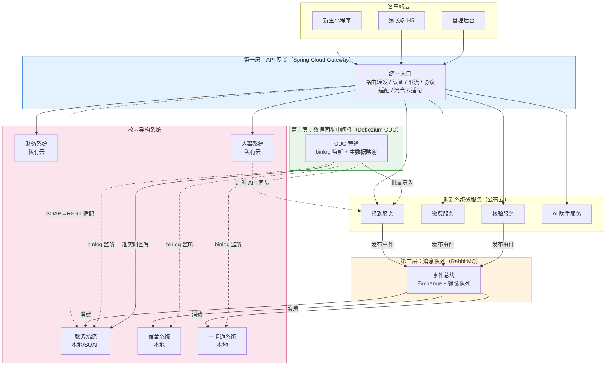

三层中间件在数据流中各司其职：API 网关处理所有同步请求的入口控制，消息队列承载跨系统的异步事件流转，CDC 管道负责数据层的状态同步。三层之间不直接耦合——网关不感知消息队列的存在，消息队列不感知 CDC 的存在，各自通过标准协议与迎新微服务及外部系统对接。

### 3.2 架构分层说明

| 层次 | 组件 | 核心职责 | 通信模式 |
| --- | --- | --- | --- |
| 第一层 | Spring Cloud Gateway | 统一入口、路由、认证、限流、协议适配、混合云适配 | 同步请求/响应 |
| 第二层 | RabbitMQ | 事件驱动解耦、异步通知、跨系统协作 | 异步发布/订阅 |
| 第三层 | Debezium CDC | 数据库变更捕获、批量/准实时数据同步、主数据映射 | 数据流管道 |

### 3.3 通信模式总览

系统集成存在三种通信模式，按场景选用：

| 通信模式 | 承载组件 | 适用场景 | 示例 |
| --- | --- | --- | --- |
| 同步 REST | API 网关 | 需要即时响应的查询与指令 | 新生查询报到状态、家长查询缴费信息 |
| 异步消息 | RabbitMQ | 跨系统协作、事件通知、解耦 | 报到成功后通知宿舍确认、一卡通制卡 |
| 数据同步 | Debezium CDC | 数据库状态一致性、批量导入 | 录取数据导入、报到状态回写教务 |

### 3.4 混合云部署拓扑

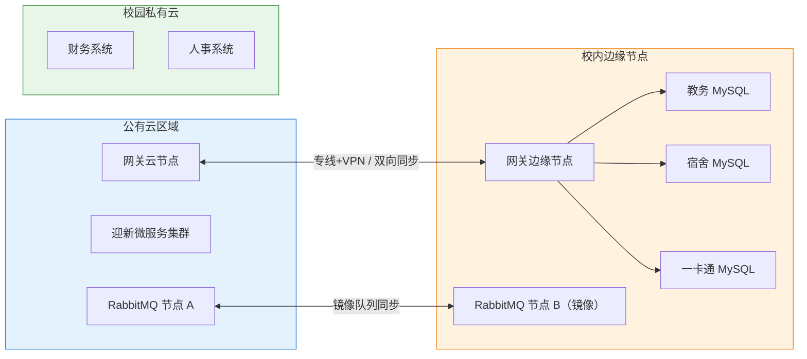

云边协同双节点架构中，公有云网关节点服务新生小程序、家长端 H5 与管理后台等互联网入口，校内边缘网关节点服务三个本地化系统。两个网关节点共享路由配置，通过专线双向同步会话状态，使任一节点宕机时流量可切换至另一节点。RabbitMQ 跨云部署为镜像队列，公有云节点为主、校内边缘节点为镜像，保证消息在两侧一致。

---

## 4 API 网关设计

API 网关基于 Spring Cloud Gateway 实现，采用响应式（Reactor Netty）非阻塞模型，是所有外部请求进入迎新系统的唯一入口。网关本身不承载业务逻辑，仅做横切控制：路由、认证、限流、协议适配、日志。

### 4.1 路由规则

网关按请求路径前缀将流量路由到对应微服务或外部系统。所有路由通过配置中心（Nacos）动态管理，支持运行时热更新，无需重启网关。

| 路由前缀 | 目标 | 协议 | 说明 |
| --- | --- | --- | --- |
| `/api/checkin/**` | 报到服务 | HTTP | 新生报到核心流程 |
| `/api/payment/**` | 缴费服务 | HTTP | 缴费查询与状态 |
| `/api/verify/**` | 核验服务 | HTTP | 身份核验 |
| `/api/ai/**` | AI 助手服务 | HTTP/SSE | 智能问答，SSE 流式响应 |
| `/api/parent/**` | 家长端聚合服务 | HTTP | 家长查询接口 |
| `/api/admin/**` | 管理后台 | HTTP | 内部管理 |
| `/proxy/edu/**` | 教务系统 | SOAP→REST | 经协议适配转发至校内教务 |
| `/proxy/fin/**` | 财务系统 | HTTP | 转发至校园私有云财务系统 |
| `/proxy/hr/**` | 人事系统 | HTTP | 转发至校园私有云人事系统 |

路由配置示例（YAML 片段）：

```yaml
spring:
  cloud:
    gateway:
      routes:
        - id: checkin-service
          uri: lb://checkin-service
          predicates:
            - Path=/api/checkin/**
          filters:
            - StripPrefix=2
            - name: JwtAuth
              args:
                roles: STUDENT,ADMIN
        - id: edu-soap-adapter
          uri: lb://edu-soap-adapter
          predicates:
            - Path=/proxy/edu/**
          filters:
            - StripPrefix=2
            - name: SoapRestAdapter
              args:
                wsdl: http://edu-local/edu?wsdl
```

### 4.2 认证机制

网关针对不同调用方提供两套认证体系，由全局过滤器 `AuthGlobalFilter` 统一拦截。

**JWT 认证（新生 / 家长）**。新生小程序与家长端 H5 在登录后获得 JWT，后续请求在 `Authorization` 头携带 `Bearer <token>`。网关校验签名、过期时间与角色声明，校验通过后将用户身份写入请求头 `X-User-Id`、`X-User-Role` 透传给下游服务。JWT 采用 HS256 签名，access token 有效期 2 小时，refresh token 有效期 7 天。

JWT 载荷结构：

```json
{
  "sub": "20260001",
  "role": "STUDENT",
  "name": "张三",
  "idCard": "330***********1234",
  "iat": 1722988800,
  "exp": 1722996000
}
```

家长端 JWT 的 `role` 为 `PARENT`，并额外携带 `studentId` 字段标识其关联新生，网关据此限制家长只能查询关联新生的数据。

**OAuth 2.0（外部系统）**。外部系统（财务、人事、一卡通）调用迎新系统接口时采用 OAuth 2.0 客户端凭证模式（client_credentials）。各系统在迎新系统注册 client_id 与 client_secret，先向网关 `/oauth/token` 端点换取 access token，再以该 token 访问受保护资源。Token 有效期 1 小时，scope 按最小权限授予，例如财务系统仅授予 `payment:read`。

| 调用方 | 认证方式 | Token 有效期 | 关键 scope |
| --- | --- | --- | --- |
| 新生小程序 | JWT | 2 小时 | `checkin:write`, `payment:read` |
| 家长端 H5 | JWT | 2 小时 | `parent:read` |
| 管理后台 | JWT | 2 小时 | `admin:full` |
| 财务系统 | OAuth 2.0 | 1 小时 | `payment:write` |
| 人事系统 | OAuth 2.0 | 1 小时 | `staff:read` |
| 一卡通系统 | OAuth 2.0 | 1 小时 | `card:write` |

认证失败统一返回 `401 Unauthorized`，权限不足返回 `403 Forbidden`，错误体遵循 API 文档错误码规范。

### 4.3 限流策略

网关采用令牌桶算法限流，基于 Redis 实现分布式计数，保证多实例下限流准确。限流维度按调用方与接口组合配置，不同业务场景设置不同速率。

| 调用方 | 接口/场景 | 限流速率 | 桶容量 | 维度 |
| --- | --- | --- | --- | --- |
| 新生 | AI 对话 `/api/ai/chat` | 10 次/分钟 | 10 | userId |
| 家长 | 查询 `/api/parent/**` | 30 次/分钟 | 30 | userId |
| 新生 | 报到操作 `/api/checkin/**` | 60 次/分钟 | 60 | userId |
| 外部系统 | 同步接口 `/proxy/**` | 1000 次/分钟 | 1000 | clientId |
| 全局 | 单 IP | 600 次/分钟 | 600 | clientIp |

限流配置示例（基于 `RequestRateLimiter` 过滤器 + Redis）：

```yaml
filters:
  - name: RequestRateLimiter
    args:
      redis-rate-limiter.replenishRate: 10
      redis-rate-limiter.burstCapacity: 10
      key-resolver: "#{@userKeyResolver}"
```

触发限流时返回 `429 Too Many Requests`，响应头携带 `X-RateLimit-Remaining` 与 `Retry-After`，前端据此提示用户等待。

### 4.4 协议适配（SOAP→REST）

校内教务系统建设于 2012 年，仅提供 SOAP/WebService 接口，无 REST 能力。网关内置 `SoapRestAdapter` 过滤器，将外部 REST 请求转换为 SOAP 调用，再将 SOAP 响应转换为 JSON 返回，使迎新系统侧统一面向 REST 编程。

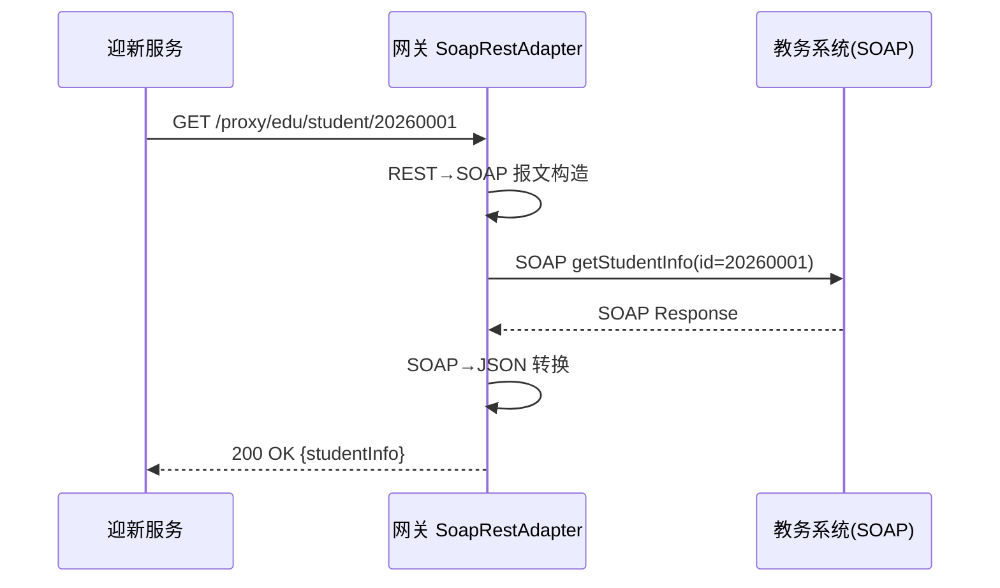

适配层维护一份接口映射表，记录 REST 路径与 SOAP operation、参数映射、命名空间的对应关系。复杂字段（嵌套对象、数组）通过 JSONPath 配置映射规则。适配层对 SOAP Fault 统一转换为 HTTP 状态码与 JSON 错误体：业务错误映射为 `422`，系统错误映射为 `502`。

为避免每次请求解析 WSDL，适配层在启动时加载并缓存 WSDL 元数据，运行时按缓存模板构造 SOAP 报文。教务系统接口平均响应 300 毫秒，适配层自身开销约 5 毫秒。

### 4.5 校园混合云适配

迎新系统核心服务在公有云，三个本地化系统（教务、宿舍、一卡通）在校内边缘机房，财务与人事在校园私有云。网关通过云边协同双节点架构适配这一混合云拓扑。

**双节点部署**。网关部署两个节点：云节点部署在公有云，边缘节点部署在校内机房。云节点服务互联网客户端（小程序、H5），边缘节点服务本地化系统调用。两节点共享 Nacos 路由配置，会话状态（JWT 黑名单、OAuth token 缓存）通过 Redis 跨云同步。

**本地化流量短路**。当云节点收到需访问校内本地化系统的请求时，经专线转发至边缘节点，由边缘节点直接访问本地系统，减少跨云往返。边缘节点同时作为本地系统反向调用迎新服务的入口。

**专线健康探测**。网关每 5 秒探测专线连通性，专线中断时自动降级：对本地化系统的同步请求转为排队，待专线恢复后重放；纯查询请求返回降级提示，引导用户稍后重试。专线指标（RTT、丢包率）接入监控，RTT 超过 50 毫秒或丢包超过 1% 触发告警。

### 4.6 请求日志

网关通过全局过滤器 `RequestLogFilter` 记录所有请求摘要，写入独立日志文件并采集到 ELK。每条记录包含：

| 字段 | 说明 |
| --- | --- |
| traceId | 链路追踪 ID，贯穿网关至下游服务 |
| timestamp | 请求到达时间 |
| method | HTTP 方法 |
| path | 请求路径（脱敏后） |
| userId / clientId | 调用方标识 |
| sourceIp | 来源 IP |
| status | 响应状态码 |
| latency | 总耗时（毫秒） |
| targetService | 路由目标 |

请求体与响应体不完整记录，仅记录长度与关键摘要，避免日志膨胀与敏感信息泄露。日志保留 90 天，用于故障排查与安全审计。

---

## 5 消息队列设计

消息队列基于 RabbitMQ 实现，承担迎新系统与宿舍、一卡通、教务系统的异步协作。采用事件驱动架构，生产者发布事件无需感知消费者，消费者按订阅关系独立处理，实现系统间解耦。

### 5.1 队列/交换机拓扑

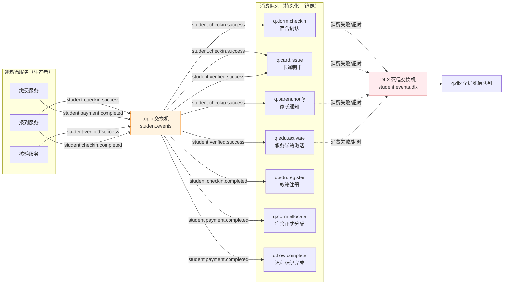

采用单一 topic 交换机 `student.events` 承载所有学生领域事件，按路由键模式分发到各业务队列。topic 交换机的优势在于支持通配符路由键，新增消费者只需绑定新的路由键模式，无需修改生产者。所有队列声明为持久化（durable），并配置镜像策略实现高可用。

| 队列 | 路由键绑定 | 消费者 | 用途 |
| --- | --- | --- | --- |
| q.dorm.checkin | student.checkin.success | 宿舍系统 | 报到后宿舍确认 |
| q.card.issue | student.checkin.success / student.verified.success | 一卡通系统 | 制卡发卡 |
| q.parent.notify | student.checkin.success | 通知服务 | 通知家长报到完成 |
| q.edu.activate | student.verified.success | 教务系统 | 学籍激活 |
| q.edu.register | student.checkin.completed | 教务系统 | 教籍注册 |
| q.dorm.allocate | student.payment.completed | 宿舍系统 | 缴费后正式分配 |
| q.flow.complete | student.payment.completed | 流程服务 | 标记整体流程完成 |

### 5.2 事件命名规范

事件名采用"领域-动作-结果"三段式格式，全部小写，以点号分隔：

```
{domain}.{action}.{result}
```

| 段 | 取值 | 示例 |
| --- | --- | --- |
| domain | 业务领域 | student、payment、dorm |
| action | 业务动作 | checkin、payment、verified |
| result | 动作结果 | success、completed、failed |

规范示例：

- `student.checkin.success`——学生报到成功
- `student.payment.completed`——缴费完成
- `student.verified.success`——身份核验通过
- `student.checkin.completed`——报到全流程完成

事件名作为路由键使用，消费者按需订阅精确或通配模式。如宿舍系统同时关心报到成功与缴费完成，可绑定 `student.checkin.success` 与 `student.payment.completed` 两个精确键；如需订阅学生领域所有成功事件，可绑定 `student.*.success`。

### 5.3 核心事件链

迎新流程由四条核心事件链驱动，每条链由一个触发事件引发多个下游动作。

**事件链一：报到成功链**

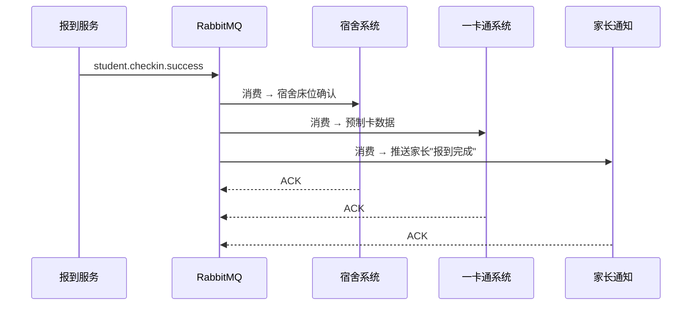

新生完成现场报到确认后，报到服务发布 `student.checkin.success`，宿舍系统据此确认床位预留、一卡通系统准备制卡数据、通知服务向家长推送报到完成消息。三个下游动作并行消费，互不阻塞。

**事件链二：缴费完成链**

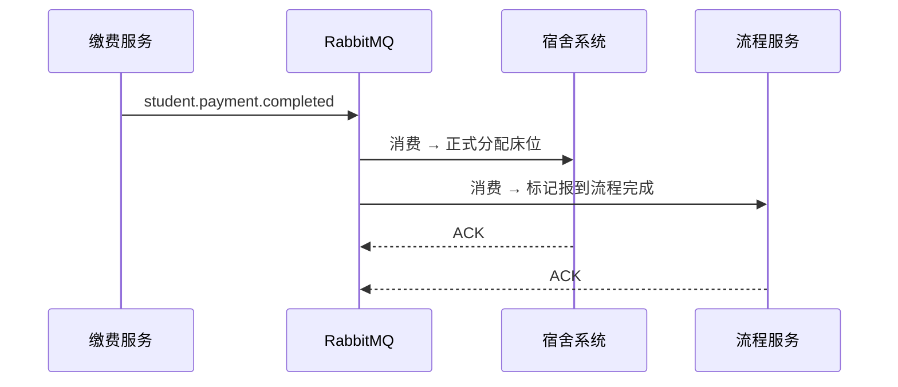

财务系统回调缴费成功后，缴费服务发布 `student.payment.completed`，宿舍系统将预分配床位转为正式分配，流程服务标记整体报到流程完成。此链中宿舍正式分配依赖缴费完成，避免未缴费学生占用床位。

**事件链三：核验成功链**

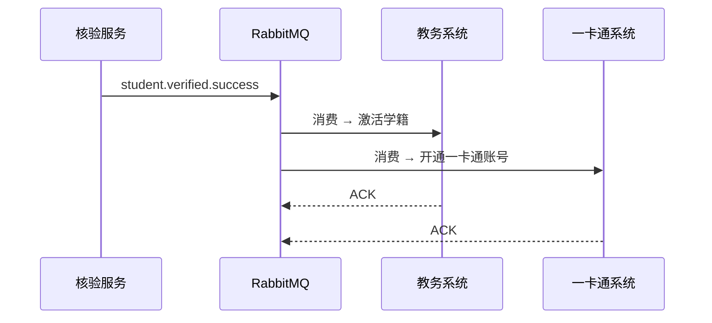

身份核验通过后，核验服务发布 `student.verified.success`，教务系统激活学籍、一卡通系统开通账号。学籍激活是后续选课、注册的前提。

**事件链四：报到完成链**

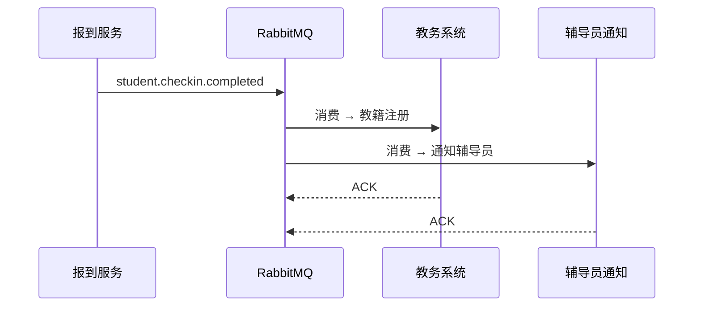

所有报到环节（缴费、核验、宿舍、一卡通）均完成后，报到服务发布 `student.checkin.completed`，教务系统完成教籍注册，辅导员收到本班新生报到完成通知。此事件由流程服务聚合判定后触发，确保前置环节齐全。

### 5.4 消息格式规范

所有事件消息统一信封格式，业务负载置于 `payload` 字段：

```json
{
  "eventId": "evt-2026-000001",
  "eventType": "student.checkin.success",
  "eventTime": "2026-08-28T09:30:15+08:00",
  "source": "checkin-service",
  "traceId": "trace-a1b2c3",
  "version": "1.0",
  "payload": {
    "studentId": "20260001",
    "idCard": "330***********1234",
    "name": "张三",
    "checkinTime": "2026-08-28T09:30:00+08:00",
    "checkinPoint": "主楼一层大厅"
  }
}
```

| 字段 | 类型 | 说明 |
| --- | --- | --- |
| eventId | string | 事件唯一 ID，UUID，用于幂等判重 |
| eventType | string | 事件类型，即路由键 |
| eventTime | string | 事件产生时间，ISO 8601 |
| source | string | 事件来源服务 |
| traceId | string | 链路追踪 ID |
| version | string | 事件模式版本 |
| payload | object | 业务负载，随事件类型变化 |

`eventId` 保证消费者可幂等处理：消费者消费前先查 Redis 是否已处理该 ID，已处理则直接 ACK 跳过，避免重复消费副作用。

### 5.5 高可用（镜像队列）

RabbitMQ 部署三节点集群，队列采用镜像策略，保证单节点故障时消息不丢失、服务不中断。

| 配置项 | 取值 | 说明 |
| --- | --- | --- |
| 镜像策略 | ha-mode=all | 队列在所有节点镜像 |
| 同步策略 | ha-sync-mode=automatic | 新镜像自动同步历史消息 |
| 主节点选举 | ha-promote-on-shutdown=when-synced | 仅同步完成的镜像可提升为主 |
| 镜像节点 | 3（公有云 1 + 校内边缘 2） | 跨云分布，防整云故障 |

跨云镜像通过专线同步，专线中断时镜像队列降级为单节点运行，已持久化消息不丢失，但失去高可用能力。专线恢复后自动重新同步。镜像同步延迟纳入监控，超过 10 秒告警。

---

## 6 数据同步中间件设计

数据同步中间件基于 Debezium CDC 实现，解决迎新系统与教务、宿舍等系统间的数据库状态一致性问题。与消息队列面向业务事件不同，CDC 面向数据状态，在数据库层捕获变更并同步，无需应用层主动推送。

### 6.1 CDC 架构

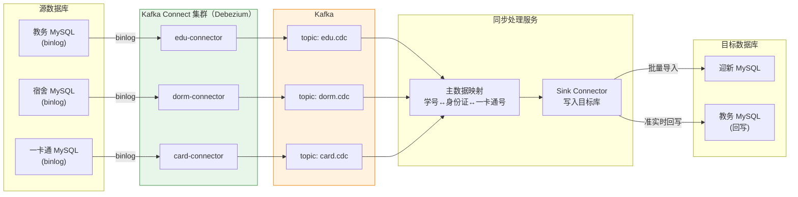

Debezium 以 Kafka Connect Connector 形式运行，每个源库对应一个 Connector，持续监听 binlog 并将变更事件写入 Kafka topic。同步处理服务消费这些 topic，经主数据映射后写入目标库。

源库需开启 binlog 并配置 `binlog_format=ROW`、`binlog_row_image=FULL`，保证 CDC 捕获完整变更前后镜像。Debezium Connector 记录 binlog 位点（gtid），重启后从断点续传，不丢不重。

### 6.2 批量同步策略

批量同步用于迎新季前的数据初始化，将教务、人事系统的存量数据导入迎新系统，为报到流程准备基础数据。

| 同步任务 | 源系统 | 目标 | 触发方式 | 同步范围 | 预计数据量 |
| --- | --- | --- | --- | --- | --- |
| 录取数据导入 | 教务系统 | 迎新系统 | 迎新前一次性 + 每日增量 | 当年录取新生全量字段 | 约 8000 条 |
| 辅导员数据同步 | 人事系统 | 迎新系统 | 每日凌晨定时 | 在职辅导员变更 | 约 200 条 |
| 院系专业数据同步 | 教务系统 | 迎新系统 | 每周定时 | 院系/专业/班级字典 | 约 500 条 |

批量同步采用全量 + 增量结合策略。首次迎新前执行全量同步，建立基线；之后按水位线（如 `update_time > last_sync_time`）增量同步变更。全量同步通过 Debezium 的快照机制实现：Connector 启动时先对全表加一致性快照读，再切换到 binlog 增量，保证全量与增量无缝衔接。

增量水位线机制：

```sql
-- 增量同步查询示例
SELECT * FROM edu_admission
WHERE update_time > #{lastSyncTime}
ORDER BY update_time ASC
LIMIT 1000;
```

同步采用分页拉取，每批 1000 条，避免大事务锁表。每批同步成功后更新水位线，记录到同步元数据表 `sync_watermark`。

### 6.3 准实时同步

准实时同步用于报到过程中迎新系统状态变更回写教务系统，保证教务侧及时掌握报到进度。典型场景：新生在迎新系统完成报到确认，教务系统需在 5 秒内看到报到状态更新，供学院辅导员查询统计。

CDC 监听迎新系统 MySQL 的 `checkin_record` 表 binlog，捕获 `status` 字段变更，经主数据映射转换为教务系统的学籍状态码，通过 Sink Connector 写入教务 MySQL 的 `student_status` 表。整条链路延迟控制在 5 秒内（P99）。

延迟构成：

| 环节 | 耗时（P99） |
| --- | --- |
| binlog 生成 | < 100 毫秒 |
| Debezium 捕获并写入 Kafka | < 500 毫秒 |
| 同步处理服务消费与映射 | < 1 秒 |
| Sink Connector 写入目标库 | < 1 秒 |
| 网络传输（专线） | < 200 毫秒 |
| 合计 | < 3 秒（留 2 秒余量） |

准实时同步仅同步状态类字段（报到状态、缴费状态、核验状态），不同步业务明细，控制同步数据量。明细数据通过消息队列事件异步同步。

### 6.4 主数据映射

五个异构系统对同一学生使用不同主键：教务用学号，迎新用身份证号，一卡通用卡号。CDC 同步时需在三者间翻译，主数据映射表 `id_mapping` 作为翻译层。

```sql
CREATE TABLE id_mapping (
    id BIGINT PRIMARY KEY AUTO_INCREMENT,
    student_id VARCHAR(20) NOT NULL COMMENT '学号',
    id_card VARCHAR(18) NOT NULL COMMENT '身份证号',
    card_id VARCHAR(20) COMMENT '一卡通号',
    status TINYINT DEFAULT 1 COMMENT '1有效 0失效',
    created_at DATETIME DEFAULT CURRENT_TIMESTAMP,
    updated_at DATETIME DEFAULT CURRENT_TIMESTAMP ON UPDATE CURRENT_TIMESTAMP,
    UNIQUE KEY uk_student (student_id),
    UNIQUE KEY uk_idcard (id_card),
    KEY idx_card (card_id)
) COMMENT='学号-身份证号-一卡通号主数据映射';
```

映射表在录取数据导入时由教务学号与新生身份证号建立初始记录；一卡通制卡后回填 `card_id`。CDC 同步处理服务在消费变更事件时，先查映射表将源主键翻译为目标主键，再写入目标库。

翻译示例：

```
源（教务）变更：student_id=20260001, status=已报到
↓ 查映射表
映射：student_id=20260001 → id_card=330***********1234
↓ 翻译后写入
目标（迎新）：id_card=330***********1234, checkin_status=已完成
```

映射表自身也通过 CDC 在迎新与教务间同步，保证两侧映射一致。映射缺失时（如新录取学生尚未导入），同步任务将变更暂存待处理队列，待映射建立后补处理，并告警提示。

### 6.5 异常处理与补偿

CDC 同步链路存在三类典型异常，每类配置对应处理策略。

| 异常类型 | 表现 | 处理策略 |
| --- | --- | --- |
| 源库连接中断 | Connector 无法读 binlog | 自动重连，重连后从断点续传；中断超 5 分钟告警 |
| 目标库写入失败 | Sink 写入报错 | 自动重试 3 次，间隔 10/30/60 秒；仍失败转死信队列 |
| 映射缺失 | 主数据映射查不到 | 暂存待处理队列，定时重试；超 1 小时未解决告警人工介入 |

自动重试采用指数退避策略，避免目标库故障期间持续冲击。重试 3 次仍失败的消息进入死信 topic `cdc.dlx`，由补偿服务人工处理或定时脚本批量重放。

补偿服务提供 Web 界面，运维人员可查看死信消息内容、失败原因，手动修正后触发重放。所有死信处理操作记录审计日志。

---

## 7 对接系统清单与接口规范

### 7.1 对接系统总览

| 系统 | 对接方式 | 数据流向 | 核心场景 | 优先级 | 部署位置 |
| --- | --- | --- | --- | --- | --- |
| 教务系统 | API + CDC | 双向 | 录取数据导入/学籍注册回写 | 高 | 校内本地 |
| 财务系统 | API + 消息队列 | 财务→迎新 | 缴费状态实时同步 | 高 | 校园私有云 |
| 宿舍管理系统 | 消息队列 | 迎新→宿舍 | 签到确认/缴费后正式分配 | 高 | 校内本地 |
| 一卡通系统 | API | 迎新→一卡通 | 核验通过后制卡发卡 | 中 | 校内本地 |
| 人事系统 | API（定时同步） | 人事→迎新 | 辅导员数据同步 | 中 | 校园私有云 |

### 7.2 教务系统

教务系统是集成的核心对接方，承担录取数据来源与学籍注册回写双向职责，采用 API + CDC 双通道。

**录取数据导入（教务→迎新，CDC 批量）**。迎新前通过 Debezium 快照 + 增量同步，将教务 `edu_admission` 表的录取数据导入迎新 `admission_record` 表。字段映射如下：

| 教务字段 | 迎新字段 | 类型 | 说明 |
| --- | --- | --- | --- |
| student_no | student_id | VARCHAR(20) | 学号 |
| id_card_no | id_card | VARCHAR(18) | 身份证号（脱敏存储） |
| student_name | name | VARCHAR(50) | 姓名 |
| gender_code | gender | TINYINT | 性别 |
| college_code | college_code | VARCHAR(10) | 院系代码 |
| major_code | major_code | VARCHAR(10) | 专业代码 |
| class_no | class_no | VARCHAR(20) | 班级 |
| admission_date | admission_date | DATE | 录取日期 |

**学籍注册回写（迎新→教务，CDC 准实时）**。报到完成后，迎新 `checkin_record.status` 变更经 CDC 同步回教务 `student_status` 表，将学籍状态由"未报到"更新为"在读"。

**SOAP 接口（双向，API）**。部分实时查询场景（如迎新管理后台查询学生历年档案）经网关 SOAP→REST 适配调用教务 WebService，主要 operation：

| REST 路径 | SOAP operation | 方向 | 用途 |
| --- | --- | --- | --- |
| GET /proxy/edu/student/{id} | getStudentInfo | 迎新→教务 | 查询学生基本信息 |
| GET /proxy/edu/college/list | listColleges | 迎新→教务 | 查询院系列表 |
| POST /proxy/edu/status/sync | updateStudentStatus | 迎新→教务 | 主动回写状态（CDC 兜底） |

异常处理：SOAP Fault 中 `businessError` 映射 HTTP 422，`systemError` 映射 502。CDC 同步失败按 6.5 节重试与补偿策略处理。学籍回写为幂等操作，重复同步同一状态不产生副作用。

### 7.3 财务系统

财务系统部署在校园私有云，通过 API + 消息队列双向对接，核心场景是缴费状态实时同步到迎新系统。

**缴费状态同步（财务→迎新）**。学生在财务系统（或迎新系统跳转财务支付页）完成缴费后，财务系统调用迎新网关接口推送缴费结果，迎新缴费服务更新本地状态并发布 `student.payment.completed` 事件。

接口定义：

```
POST /api/payment/callback
Headers: Authorization: Bearer <oauth-token>  (scope: payment:write)
Body:
{
  "studentId": "20260001",
  "payOrderNo": "PAY20260828001",
  "payAmount": 5800.00,
  "payTime": "2026-08-28T10:00:00+08:00",
  "payMethod": "WECHAT",
  "status": "SUCCESS"
}
```

响应：

```json
{ "code": 0, "msg": "success", "data": { "accepted": true } }
```

该接口需幂等：相同 `payOrderNo` 重复推送返回成功但不重复处理。迎新服务以 `payOrderNo` 为幂等键，已处理则直接返回 `accepted: true`。

**缴费状态查询（迎新→财务，API）**。新生或家长查询缴费明细时，迎新系统经网关调用财务查询接口。

异常处理：财务回调失败时，财务系统按 1/5/30 分钟间隔重试 3 次；仍失败则财务系统将缴费记录写入待推送队列，由对账任务次日补推。迎新侧若 30 分钟未收到回调，主动调用财务查询接口拉取该订单状态作为兜底。

### 7.4 宿舍管理系统

宿舍系统部署在校内本地，通过消息队列单向接收迎新系统指令，无主动调用迎新的需求，采用纯异步事件驱动。

**报到后床位确认**。迎新发布 `student.checkin.success`，宿舍系统消费后确认该学生床位预留状态，更新为"已确认"。

**缴费后正式分配**。迎新发布 `student.payment.completed`，宿舍系统消费后将床位由"预留/确认"转为"正式分配"，标记入住生效。

消费消息负载：

```json
{
  "eventId": "evt-2026-000001",
  "eventType": "student.payment.completed",
  "payload": {
    "studentId": "20260001",
    "idCard": "330***********1234",
    "name": "张三",
    "gender": "M",
    "collegeCode": "01",
    "dormBuilding": "3号楼",
    "roomNo": "301",
    "bedNo": "2"
  }
}
```

异常处理：宿舍系统消费失败按消息可靠性保障（第 8 章）进入重试与死信队列。死信消息由运维人工核查后重放。宿舍分配为关键操作，宿舍系统本地维护分配日志表，支持幂等：重复消费同一 `eventId` 不重复分配。

### 7.5 一卡通系统

一卡通系统部署在校内本地，通过 API 单向接收迎新系统指令，核验通过后制卡发卡。

**制卡发卡接口**。核验服务发布 `student.verified.success` 后，一卡通系统作为消费者收到通知，或迎新系统主动调用一卡通制卡接口触发制卡。

接口定义（迎新经网关调用一卡通）：

```
POST /proxy/card/issue
Headers: Authorization: Bearer <oauth-token>  (scope: card:write)
Body:
{
  "studentId": "20260001",
  "idCard": "330***********1234",
  "name": "张三",
  "collegeCode": "01",
  "photoUrl": "https://oss.xxx.edu.cn/photo/20260001.jpg",
  "issueType": "NEW"
}
```

响应：

```json
{
  "code": 0,
  "data": { "cardId": "CRD20260001", "status": "ISSUED", "issueTime": "2026-08-28T10:05:00+08:00" }
}
```

一卡通号 `cardId` 生成后回填到主数据映射表 `id_mapping.card_id`，供后续 CDC 同步翻译使用。

异常处理：制卡接口失败时迎新服务重试 3 次；仍失败则将制卡任务标记为待处理，由运维在管理后台手动触发或现场补制。一卡通账号开通与制卡解耦：账号开通（事件链三）先于物理制卡完成，保证学生可即时使用电子卡功能。

### 7.6 人事系统

人事系统部署在校园私有云，通过 API 定时同步辅导员数据到迎新系统，数据单向流动（人事→迎新）。

**辅导员数据同步**。每日凌晨 2 点，迎新系统定时任务调用人事系统接口拉取辅导员变更数据，更新迎新 `counselor` 表。

接口定义：

```
GET /proxy/hr/counselor?updatedSince=2026-08-27T00:00:00
Headers: Authorization: Bearer <oauth-token>  (scope: staff:read)
```

响应：

```json
{
  "code": 0,
  "data": {
    "total": 15,
    "items": [
      {
        "staffId": "T20100001",
        "name": "李老师",
        "collegeCode": "01",
        "managedClasses": ["计科2401", "计科2402"],
        "phone": "138****1234",
        "status": "ACTIVE"
      }
    ]
  }
}
```

字段映射：

| 人事字段 | 迎新字段 | 说明 |
| --- | --- | --- |
| staffId | counselor_id | 工号 |
| name | name | 姓名 |
| collegeCode | college_code | 院系 |
| managedClasses | managed_classes | 管辖班级（JSON） |
| phone | phone | 联系电话（脱敏） |
| status | status | 在职状态 |

异常处理：定时任务失败时记录日志并次日重试；连续 3 天失败告警。辅导员数据变更影响面有限（仅影响通知下发对象），延迟一天可接受，无需准实时同步。离职辅导员（status=INACTIVE）在迎新侧标记失效，其管辖班级转交记录由管理后台人工处理。

---

## 8 消息可靠性保障

迎新场景下消息丢失会导致学生报到状态与宿舍、一卡通等系统不一致，引发现场混乱。消息可靠性通过持久化、生产确认、消费确认、死信队列、重试策略五道防线保障，目标消息不丢失率 0%。

### 8.1 消息持久化

所有队列与消息均声明为持久化。队列 `durable=true` 保证 RabbitMQ 重启后队列元数据不丢；消息 `deliveryMode=2`（persistent）保证消息写入磁盘后才可被投递。

生产者发布时强制持久化：

```java
MessageProperties props = MessagePropertiesBuilder.newInstance()
    .setDeliveryMode(MessageDeliveryMode.PERSISTENT)
    .build();
Message message = MessageBuilder.withBody(json.getBytes())
    .andProperties(props)
    .build();
rabbitTemplate.send("student.events", routingKey, message);
```

镜像队列的持久化消息在所有镜像节点同步落盘，主节点故障时镜像节点已有完整副本。

### 8.2 消费确认机制

消费者采用手动 ACK 模式，仅当业务处理成功后才向 RabbitMQ 确认。处理异常时根据异常类型选择 NACK 重入队列或拒绝转死信。

```java
@RabbitListener(queues = "q.dorm.checkin", ackMode = "MANUAL")
public void onCheckinSuccess(Message message, Channel channel) throws IOException {
    long tag = message.getMessageProperties().getDeliveryTag();
    try {
        dormService.confirmBed(message);
        channel.basicAck(tag, false);          // 成功确认
    } catch (RetryableException e) {
        channel.basicNack(tag, false, true);   // 可重试异常，重入队列
    } catch (NonRetryableException e) {
        channel.basicNack(tag, false, false);  // 不可重试，转死信
    }
}
```

确认策略：

| 处理结果 | 确认动作 | 后续 |
| --- | --- | --- |
| 成功 | ACK | 消息从队列移除 |
| 可重试异常（网络抖动、临时不可用） | NACK + requeue=true | 重新投递，触发重试计数 |
| 不可重试异常（数据格式错误、业务校验失败） | NACK + requeue=false | 进入死信队列 |
| 消费者宕机未确认 | 无 ACK | RabbitMQ 自动重新投递给其他消费者 |

为避免无限重入队列导致消息风暴，requeue 重试与下文延迟重试队列配合，超过阈值后转入死信。

### 8.3 死信队列

每个业务队列配置死信交换机（DLX），被拒绝、过期或超长的消息自动转入死信队列，避免阻塞正常消费。

队列死信配置：

```java
QueueBuilder.durable("q.dorm.checkin")
    .withArgument("x-dead-letter-exchange", "student.events.dlx")
    .withArgument("x-dead-letter-routing-key", "dorm.checkin")
    .withArgument("x-message-ttl", 86400000)  // 消息 TTL 24 小时
    .build();
```

消息进入死信队列的三种情况：

| 触发条件 | 说明 |
| --- | --- |
| 消费者 basicNack + requeue=false | 不可重试异常，主动转死信 |
| 消息 TTL 过期 | 超过 24 小时未被消费 |
| 队列长度超限 | 队列超过最大长度（配置 10000），最早消息被挤入死信 |

全局死信队列 `q.dlx` 由补偿服务监控。运维通过管理界面查看死信消息的原始队列、原因、内容，处理后选择重放（重新投递回原队列）或丢弃（标记为已处理）。死信队列同样持久化与镜像，保证死信不丢。

### 8.4 重试策略

针对可重试异常，采用延迟重试队列实现阶梯退避，避免立即重试冲击下游并防止消息风暴。

重试拓扑：

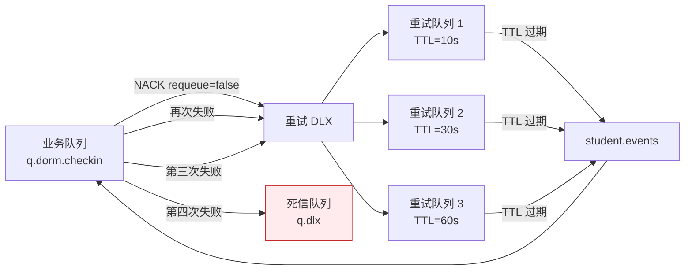

重试阶梯：

| 重试次数 | 延迟 | 累计耗时 |
| --- | --- | --- |
| 第 1 次 | 10 秒 | 10 秒 |
| 第 2 次 | 30 秒 | 40 秒 |
| 第 3 次 | 60 秒 | 100 秒 |
| 超过 3 次仍失败 | — | 转死信队列 |

重试次数通过消息头 `x-retry-count` 传递，每经一次重试队列递增。达到上限后 NACK + requeue=false 直接进入死信队列。重试期间消息不在业务队列，不影响正常消息消费。生产者侧同时启用 publisher confirm，确保消息成功写入 RabbitMQ 才返回：

```java
rabbitTemplate.setConfirmCallback((correlationData, ack, cause) -> {
    if (!ack) {
        log.error("消息发送失败, cause={}", cause);
        // 落库本地消息表，由定时任务补偿重发
        localMessageStore.saveForRetry(correlationData);
    }
});
```

本地消息表作为生产者侧兜底：消息发布前先写本地库，confirm 回调成功后标记已发送；失败则定时任务扫描未发送记录重发，保证生产端不丢消息。

---

## 9 数据一致性保障

分布式环境下五个系统间数据复制存在延迟与失败可能，无法保证强一致。本系统采用最终一致性模型，配合对账机制与补偿事务，保证数据在有限时间内收敛一致。

### 9.1 最终一致性模型

迎新集成场景下，一致性分为两个层级：

**强一致场景**。迎新系统内部各微服务共享同一 MySQL，通过本地事务保证强一致。如报到服务更新报到状态与发布事件在同一事务内（事务消息模式），要么都成功要么都回滚。

**最终一致场景**。跨系统的数据流转通过消息队列与 CDC 异步完成，允许短暂不一致。如新生报到成功后，宿舍系统确认床位、一卡通制卡存在秒级到分钟级延迟，期间各系统状态不一致，但最终均会收敛。

一致性边界约定：

| 场景 | 一致性级别 | 收敛时效 |
| --- | --- | --- |
| 迎新内部状态更新 | 强一致 | 实时（本地事务） |
| 报到状态回写教务（CDC） | 最终一致 | ≤ 5 秒 |
| 宿舍分配通知（消息） | 最终一致 | ≤ 30 秒 |
| 一卡通制卡（API） | 最终一致 | ≤ 2 分钟 |
| 缴费状态同步（API + 消息） | 最终一致 | ≤ 1 分钟 |

业务流程设计上，关键决策点（如是否允许进入下一步）查询迎新系统本地数据，不跨系统实时查询，避免不一致窗口影响业务正确性。外部系统对迎新状态的依赖通过 CDC 同步到本地副本，查询本地副本而非跨系统调用。

### 9.2 对账机制

对账是发现并修复数据不一致的核心手段。每日凌晨对迎新系统与各外部系统的关键数据进行比对，生成对账报告，差异自动修复或告警人工处理。

对账任务清单：

| 对账任务 | 比对双方 | 比对维度 | 频率 | 差异处理 |
| --- | --- | --- | --- | --- |
| 报到状态对账 | 迎新 vs 教务 | 学号、报到状态 | 每日 | 以迎新为准回写教务 |
| 缴费状态对账 | 迎新 vs 财务 | 学号、缴费订单、金额、状态 | 每日 | 以财务为准回写迎新 |
| 宿舍分配对账 | 迎新 vs 宿舍 | 学号、楼栋、房号、床号、状态 | 每日 | 以迎新为准回写宿舍 |
| 一卡通对账 | 迎新 vs 一卡通 | 学号、卡号、制卡状态 | 每日 | 标记差异人工核查 |
| 主数据映射对账 | 迎新 id_mapping vs 各系统 | 学号、身份证、卡号三方一致 | 每日 | 缺失项自动补建，冲突项告警 |

对账流程：

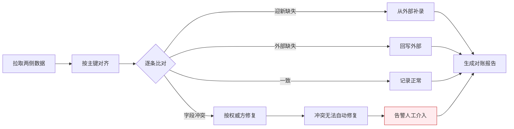

对账报告记录总记录数、一致数、差异数、修复数、待人工数，存入 `reconcile_report` 表并在管理后台展示。迎新季期间每日对账，非迎新季每周对账。

### 9.3 补偿事务

部分跨系统操作需多步骤完成，若中间步骤失败需回滚已执行步骤。采用 Saga 模式，将分布式操作拆为一系列本地事务，每步定义补偿动作。

以"报到完成"流程为例，涉及宿舍正式分配、学籍激活、一卡通开通、流程标记四步：

| 步骤 | 正向操作 | 补偿操作 |
| --- | --- | --- |
| 1 | 宿舍正式分配（消息触发） | 释放床位，恢复预留状态 |
| 2 | 学籍激活（消息触发） | 学籍状态回退为"未报到" |
| 3 | 一卡通开通（API） | 注销一卡通账号 |
| 4 | 流程标记完成（本地） | 流程状态回退为"进行中" |

Saga 协调由流程服务承担，记录每步执行状态到 `saga_log` 表。任一步失败，按逆序执行已完成步骤的补偿动作。补偿动作通过消息或 API 触发，保证最终一致。

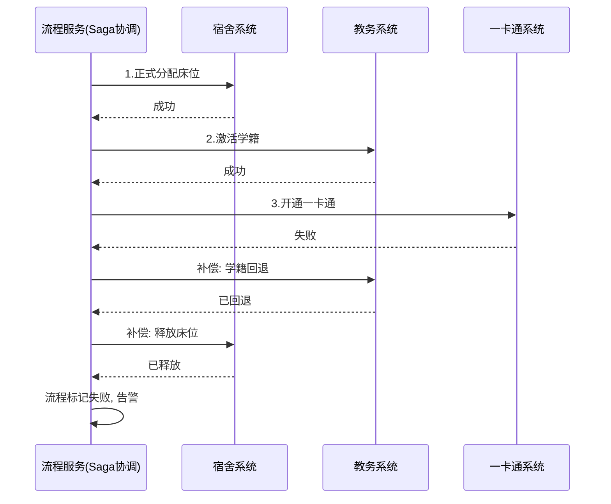

补偿动作需幂等，因网络重试可能执行多次。如学籍回退多次调用结果一致。Saga 日志保留 90 天，用于故障复盘。

---

## 10 监控与运维

中间件的可观测性是迎新季稳定运行的基础。三层中间件的指标统一接入 Prometheus 采集、Grafana 展示、Alertmanager 告警，关键异常通过钉钉/短信通知运维值班人员。

### 10.1 监控体系总览

| 监控对象 | 采集方式 | 核心指标 | 展示面板 |
| --- | --- | --- | --- |
| API 网关 | Micrometer + Prometheus | QPS、延迟分位、限流拒绝数、5xx 错误率 | 网关实时大盘 |
| RabbitMQ | rabbitmq_exporter | 队列深度、消费速率、积压量、连接数 | 消息队列大盘 |
| Debezium CDC | Kafka JMX + 自定义指标 | 同步延迟、错误率、Connector 状态 | CDC 同步大盘 |
| 业务对账 | 定时任务上报 | 差异数、修复数、待人工数 | 数据一致性大盘 |

### 10.2 消息积压监控

队列积压是迎新季最常见的隐患，下游消费能力不足或消费者宕机都会导致积压。监控每个队列的 `messages_ready`（待消费数）与消费速率。

| 队列 | 积压告警阈值 | 严重告警阈值 | 预期消费速率 |
| --- | --- | --- | --- |
| q.dorm.checkin | > 500 | > 2000 | ≥ 50 条/秒 |
| q.card.issue | > 300 | > 1000 | ≥ 30 条/秒 |
| q.parent.notify | > 1000 | > 5000 | ≥ 100 条/秒 |
| q.edu.activate | > 200 | > 1000 | ≥ 20 条/秒 |
| q.dlx（死信） | > 0 | > 50 | 0（死信需人工处理） |

积压量超过告警阈值时，Alertmanager 推送钉钉告警，包含队列名、当前积压量、消费速率、消费者实例数。运维据此判断是否需扩容消费者实例。死信队列任何消息都触发告警，因死信代表需人工介入的异常。

Grafana 面板展示各队列积压趋势曲线，迎新季期间值班人员每小时巡检一次。

### 10.3 同步延迟监控

CDC 同步延迟反映数据从源库到目标库的端到端耗时。监控方式：在源库定时写入测试记录（含时间戳），在目标库检测该记录到达时间，二者差值即同步延迟。

| 监控项 | 采集频率 | 告警阈值 | 严重阈值 |
| --- | --- | --- | --- |
| 教务→迎新 录取同步延迟 | 30 秒 | > 10 秒 | > 30 秒 |
| 迎新→教务 状态回写延迟 | 10 秒 | > 5 秒 | > 15 秒 |
| 映射表同步延迟 | 30 秒 | > 10 秒 | > 30 秒 |
| CDC Connector 状态 | 10 秒 | 任一 Connector DOWN | — |
| binlog 位点滞后 | 30 秒 | > 60 秒 | > 300 秒 |

同步延迟超过阈值通常由目标库写入慢或网络抖动引起。告警包含延迟值、当前 binlog 位点、Kafka 消费位点，辅助定位瓶颈环节。Connector 状态告警为最高优先级，表示 CDC 管道中断，数据同步停滞，需立即处理。

### 10.4 告警规则

告警按严重程度分级，不同级别采用不同通知渠道与响应时效。

| 级别 | 含义 | 通知渠道 | 响应时效 | 示例 |
| --- | --- | --- | --- | --- |
| P0 紧急 | 核心功能不可用 | 电话 + 短信 + 钉钉 | 立即 | RabbitMQ 集群宕机、网关全部节点不可用 |
| P1 严重 | 核心功能受损 | 短信 + 钉钉 | 15 分钟 | 队列严重积压、CDC 中断、同步延迟严重超限 |
| P2 警告 | 潜在风险 | 钉钉 | 1 小时 | 队列积压告警、死信产生、限流拒绝率升高 |
| P3 提示 | 需关注 | 钉钉（静默汇总） | 当日 | 对账差异、重试触发、专线 RTT 波动 |

核心告警规则（Prometheus AlertManager 规则示例）：

```yaml
groups:
  - name: middleware-critical
    rules:
      - alert: RabbitMQClusterDown
        expr: rabbitmq_up{job="rabbitmq"} == 0
        for: 1m
        labels:
          severity: P0
        annotations:
          summary: "RabbitMQ 节点 {{ $labels.instance }} 宕机"

      - alert: QueueBacklogCritical
        expr: rabbitmq_queue_messages_ready{queue=~"q.dorm.*|q.edu.*"} > 2000
        for: 2m
        labels:
          severity: P1
        annotations:
          summary: "队列 {{ $labels.queue }} 积压 {{ $value }} 条"

      - alert: CDCLagCritical
        expr: cdc_sync_lag_seconds{direction="fcs_to_edu"} > 15
        for: 1m
        labels:
          severity: P1
        annotations:
          summary: "迎新→教务同步延迟 {{ $value }} 秒"

      - alert: DeadLetterReceived
        expr: increase(rabbitmq_queue_messages_ready{queue="q.dlx"}[5m]) > 0
        labels:
          severity: P2
        annotations:
          summary: "死信队列新增消息"
```

### 10.5 运维操作手册要点

迎新季前、中、后三个阶段的关键运维操作：

**迎新前（8 月中下旬）**：

- 验证 CDC 全量同步完成，迎新系统录取数据与教务对账一致；
- RabbitMQ 镜像队列同步状态检查，三节点均 `synchronized`；
- 网关限流配置按预估并发量调优，压测验证 5000 条/秒吞吐；
- 各消费者实例预扩容，按峰值 2 倍冗余部署；
- 告警通道（电话、短信、钉钉）联通测试。

**迎新中（8 月底至 9 月初）**：

- 值班人员每小时巡检 Grafana 大盘，重点关注队列积压与同步延迟；
- P0/P1 告警 7×24 响应，值班轮换保证不间断；
- 每日对账报告复核，差异当日修复；
- 死信队列每日清零，无法自动修复的当日人工处理；
- 监控专线 RTT 与丢包率，异常时联系网络中心。

**迎新后（9 月中旬）**：

- 完成最终对账，确认迎新与各外部系统数据完全一致；
- CDC 管道切换为日常模式（降低采集频率）；
- 消息队列清理迎新季临时队列；
- 归档迎新季监控数据与告警记录，输出运维总结报告。

常见故障处置速查：

| 故障现象 | 可能原因 | 处置步骤 |
| --- | --- | --- |
| 队列积压持续增长 | 消费者宕机或处理慢 | 检查消费者实例状态；扩容消费者；排查慢消费日志 |
| 同步延迟超阈值 | 目标库慢或网络抖动 | 检查目标库负载；检查专线 RTT；必要时暂停非核心同步 |
| 死信队列持续增长 | 下游业务异常或数据格式错误 | 查看死信原因；修正数据后重放；联系下游系统排查 |
| 网关 5xx 错误率升高 | 下游服务不可用或超时 | 检查下游服务健康；必要时熔断降级；扩容下游 |
| 专线中断 | 物理链路故障 | 联系网络中心抢修；网关降级本地化流量；启用应急预案 |
