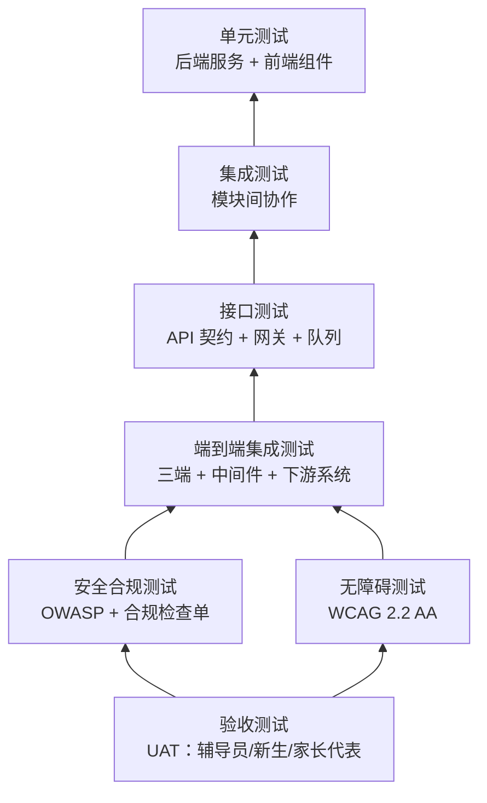
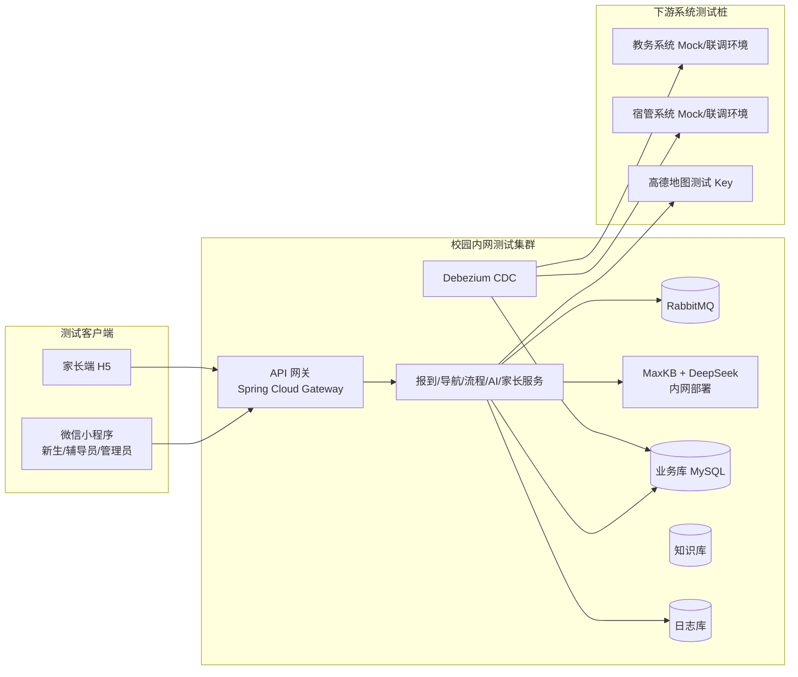
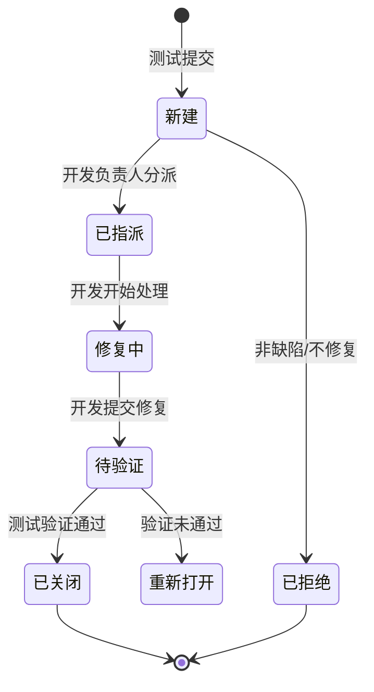
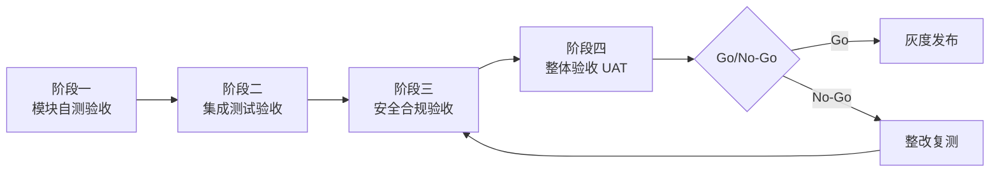
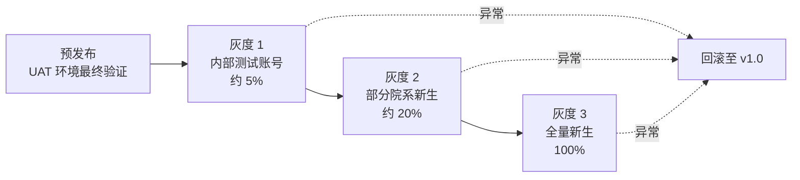

# 微迎新（CampusArrive） v1.1 测试计划与验收方案

| 项目名称 | 微迎新（CampusArrive） |
| --- | --- |
| 文档名称 | 测试计划与验收方案（Test Plan & Acceptance Plan） |
| 文档编号 | TP-CA-2026-10 |
| 文档版本 | v1.1.0 |
| 状态 | 待审批 |
| 编制日期 | 2026-08-07 |
| 适用版本 | v1.1（基于 v1.0 迭代） |
| 密级 | L2 内部敏感 |

## 版本历史

| 版本 | 日期 | 修订人 | 修订说明 |
| --- | --- | --- | --- |
| v1.1.0 | 2026-08-07 | 测试组 | 首次编制，覆盖测试策略、环境、工具、用例范围、准入准出、验收矩阵与灰度发布方案 |

## 审批签署

| 角色 | 姓名/单位 | 签字 | 日期 |
| --- | --- | --- | --- |
| 项目经理 |  |  |  |
| 技术负责人 |  |  |  |
| 测试负责人 |  |  |  |
| 安全合规负责人 |  |  |  |
| 校方信息中心 |  |  |  |

---

## 1 目的与范围

### 1.1 编写目的

本方案规定微迎新（CampusArrive） v1.1 迭代的测试策略、测试环境、测试工具、用例范围、准入准出标准、验收流程与灰度发布策略，作为测试执行、缺陷管理、上线门槛判定与最终验收的统一依据。文档面向测试工程师、开发工程师、项目经理、安全合规负责人与校方信息中心验收代表。

### 1.2 测试范围

v1.1 在 v1.0 已上线能力基础上新增五大模块，测试范围覆盖新增模块的功能与非功能质量属性，并对 v1.0 基线功能执行回归测试，确保增量集成不破坏既有能力。

| 范围类别 | 具体内容 |
| --- | --- |
| 新增功能测试 | AI 迎新智能助手、无障碍访问改造、家长查看端、系统集成中间件、安全与合规保障 |
| 回归测试 | v1.0 报到流程指引、校园导航（MCP 集成高德地图）、报到进度追踪、学校自主流程配置、三端协作 |
| 非功能测试 | 性能、可用性、安全（OWASP Top 10）、无障碍（WCAG 2.2 AA）、兼容性、数据一致性 |
| 集成测试 | 报到系统与教务/宿管系统经 API 网关、RabbitMQ、Debezium CDC 的端到端数据同步 |
| 验收测试 | 模块验收、安全合规验收、整体验收（含辅导员与新生代表试用） |

### 1.3 不在测试范围内

- 等保三级正式测评送检（属 v1.2+ 范围，本次仅做自测评）；
- ISO 27001 认证审核；
- 高德地图 SDK 自身内部缺陷（作为第三方依赖，仅验证集成接口行为）；
- 教务/宿管等下游系统内部功能（仅验证对接接口与数据一致性）。

### 1.4 参考文档

| 编号 | 名称 | 用途 |
| --- | --- | --- |
| REF-01 | 01-项目章程 | 验收标准与上线门槛基线 |
| REF-02 | 03-需求规格说明书 | 功能需求编号与追溯依据 |
| REF-03 | 04-系统架构设计文档 | 技术架构与集成边界 |
| REF-04 | 06-API接口设计文档 | 接口契约与测试入参 |
| REF-05 | 07-AI智能助手设计文档 | AI 对话与知识库测试场景 |
| REF-06 | 08-系统集成中间件设计文档 | 网关/队列/CDC 测试场景 |
| REF-07 | 09-安全与合规方案 | 安全测试与合规验收依据 |
| REF-08 | WCAG 2.2 | 无障碍测试判定标准 |
| REF-09 | OWASP Top 10（2021） | 安全测试风险清单 |

---

## 2 测试策略

### 2.1 测试分层模型

v1.1 采用"金字塔 + AI/无障碍专项"的分层测试模型，自下而上逐层收敛质量风险。

各层职责与准入准出关系如下：

| 层级 | 范围 | 责任方 | 准入条件 | 准出条件 |
| --- | --- | --- | --- | --- |
| 单元测试 UT | 后端服务方法、前端组件逻辑 | 开发 | 代码评审通过 | 行覆盖 ≥ 70%，核心模块 ≥ 85%，无 P0/P1 缺陷 |
| 集成测试 IT | 模块间接口协作、数据流转 | 测试 + 开发 | 单元测试准出 | 接口契约一致，无 P0/P1 缺陷 |
| 接口测试 IFT | API 网关路由/鉴权/限流、队列收发、CDC 同步 | 测试 | 集成环境部署完成 | 接口用例通过率 100%，限流/降级场景验证通过 |
| 端到端测试 E2E | 三端全流程 + 中间件 + 下游系统联调 | 测试 | 接口测试准出 | 核心业务流程全通过，无 P0 缺陷 |
| 无障碍测试 A1 | 小程序与家长端 WCAG 2.2 AA 达标 | 测试 + 前端 | 前端改造完成 | 自测 + 工具审计无严重违规 |
| 安全合规测试 A2 | OWASP Top 10、合规检查单、AI 安全 | 测试 + 安全合规 | 端到端测试基本通过 | 无高危漏洞，合规检查单全通过 |
| 验收测试 UAT | 辅导员/新生/家长代表试用 | 校方 + 测试 | 安全合规测试准出 | 验收用例通过，遗留问题经确认可接受 |

### 2.2 测试类型矩阵

| 测试类型 | 目标 | 适用模块 | 主要方法 |
| --- | --- | --- | --- | 
| 功能测试 | 验证需求规格说明书定义的功能点正确实现 | 全部模块 | 黑盒等价类/边界值/场景法 |
| 接口测试 | 验证 API 契约、鉴权、限流、异常码 | 网关、AI 助手、家长端、集成中间件 | Postman/Apifox 自动化 |
| 集成测试 | 验证模块间数据流转与状态一致 | 报到系统 ↔ 中间件 ↔ 教务/宿管 | 端到端链路验证 + 数据一致性比对 |
| 性能测试 | 验证并发承载与响应时间 | AI 助手、网关、报到主流程 | JMeter 压测 |
| 无障碍测试 | 验证 WCAG 2.2 AA 达标 | 小程序、家长端 | 自动审计 + 读屏手动验证 |
| 安全测试 | 验证 OWASP Top 10 无高危 | 全部对外接口与数据层 | 自动扫描 + 手工渗透 |
| 兼容性测试 | 验证多机型/多浏览器可用 | 小程序、家长端 H5 | 真机矩阵 + 云测 |
| 数据一致性测试 | 验证 CDC 同步延迟与准确性 | 集成中间件 | 变更注入 + 延时比对 |
| AI 质量测试 | 验证答复准确率、护栏、降级 | AI 智能助手 | 标注测试集 + 敏感词注入 |

### 2.3 测试阶段与排期

v1.1 迭代 6 周，测试与开发并行推进，按阶段设置准入准出闸口。

| 阶段 | 周次 | 测试活动 | 关键交付 |
| --- | --- | --- | --- |
| 阶段一：基础搭建与 PoC | W1 | 测试环境搭建、用例框架搭建、AI 测试集标注 | 测试环境就绪、用例骨架 |
| 阶段二：核心开发与模块自测 | W2–W3 | 随开发进行单元/接口测试、AI 知识库与对话冒烟、无障碍基线审计 | 模块自测报告、AI 冒烟通过 |
| 阶段三：集成联调与端到端 | W4 | 接口联调、CDC 同步验证、三端端到端、性能压测 | 集成测试报告、压测报告 |
| 阶段四：安全合规与验收 | W5–W6 | OWASP 安全测试、无障碍全量自测、合规检查单、UAT、灰度发布 | 安全测试报告、验收报告、上线检查单 |

---

## 3 测试环境

### 3.1 环境拓扑

系统部署于校园内网，测试环境独立于生产环境，拓扑结构对齐生产以验证集成行为。

### 3.2 环境清单

| 环境 | 用途 | 数据 | 网络 | 说明 |
| --- | --- | --- | --- | --- |
| 开发环境（DEV） | 日常开发自测 | 模拟数据 | 内网 | 开发人员自建数据，可随时重置 |
| 集成测试环境（SIT） | 接口与端到端联调 | 脱敏测试数据集 | 内网 | 对齐生产拓扑，含下游系统 Mock 或联调环境 |
| 性能测试环境（PERF） | 压测 | 模拟数据（量级对齐生产预估） | 内网独立资源 | 避免压测影响其他环境 |
| 安全测试环境（SEC） | 安全扫描与渗透 | 脱敏数据 | 内网隔离 | 用于 OWASP 扫描与手工渗透 |
| 验收环境（UAT） | 用户验收试用 | 接近真实脱敏数据 | 内网 | 校方代表与辅导员/新生代表试用 |
| 生产环境（PROD） | 正式上线 | 真实数据 | 校园内网 | 灰度发布逐步放量 |

### 3.3 环境管理规则

- 环境由 DevOps 统一维护，版本通过 CI/CD 流水线部署，禁止手工改包；
- SIT/UAT 环境数据库使用脱敏数据，严禁导入生产明文 PII；
- 下游教务/宿管系统优先使用校方提供的联调环境；若联调环境不可用，使用 Mock 服务并标注待联调风险；
- 环境变更须在测试群通知，避免并行测试互相干扰；
- 每轮测试前由 DevOps 执行环境健康检查并输出就绪确认。

---

## 4 测试工具

| 类别 | 工具 | 用途 | 备注 |
| --- | --- | --- | --- |
| 单元测试 | JUnit 5 + Mockito（后端）、Jest（前端） | 方法级断言与 Mock | 后端覆盖率由 JaCoCo 采集 |
| 接口测试 | Apifox / Postman | API 契约验证、自动化回归 | 导入接口设计文档契约 |
| 性能测试 | JMeter | 并发压测、响应时间与吞吐量 | 配合监控采集 TPS/RT |
| 无障碍审计 | Axe DevTools、Lighthouse | 自动化 WCAG 违规扫描 | 小程序用微信开发者工具无障碍审计 |
| 读屏验证 | iOS VoiceOver、Android TalkBack | 手动无障碍场景验证 | 覆盖视障操作路径 |
| 安全扫描 | OWASP ZAP、Nessus | 自动化漏洞扫描 | 扫描后人工复核去重 |
| 安全渗透 | Burp Suite | 手工注入与访问控制测试 | 由安全合规负责人执行 |
| CDC 验证 | 自研比对脚本 | 源库与目标库数据一致性比对 | 记录同步延迟 |
| AI 测试 | 自研标注评估脚本 + MaxKB 调试台 | 答复准确率、敏感词、降级验证 | 标注测试集由校方口径确认 |
| 缺陷管理 | 禅道 / Jira | 缺陷登记、跟踪、统计 | 统一缺陷生命周期 |
| 用例管理 | 禅道 / TestLink | 用例编写、执行、追溯 | 与需求编号 FR-XX-XX 关联 |

---

## 5 测试用例范围

### 5.1 需求追溯原则

每一条功能需求 `FR-XX-XX` 须至少对应一条测试用例，用例编号采用 `TC-模块-序号`，并在用例管理工具中建立需求—用例—缺陷的双向追溯。验收阶段以追溯矩阵核验覆盖率，未覆盖需求不得通过验收。

### 5.2 模块用例概览

| 模块 | 用例数量目标 | 重点场景 |
| --- | --- | --- |
| AI 迎新智能助手 | ≥ 60 | 标准流程跳转、RAG 检索作答、MCP 工具调用、敏感词拦截、人工接管、降级至 FAQ、数据不出校 |
| 无障碍访问改造 | ≥ 40 | 读屏可读、键盘可达、焦点可见、对比度达标、表单标签关联、错误提示明确 |
| 家长查看端 | ≥ 30 | 授权绑定、脱敏展示、只读权限、网关鉴权、无障碍达标 |
| 系统集成中间件 | ≥ 50 | 网关路由/鉴权/限流、队列收发与重试、CDC 同步延迟与一致性、下游系统异常降级 |
| 安全与合规保障 | ≥ 30 | PII 脱敏、AI 内容标识、访问控制、OWASP Top 10 专项、合规检查单逐项 |
| v1.0 回归 | ≥ 80 | 报到流程、校园导航、进度追踪、流程配置、三端协作全量回归 |

### 5.3 AI 智能助手专项用例

AI 助手质量直接影响新生体验与合规底线，单列专项用例集。

| 场景 | 用例要点 | 预期 |
| --- | --- | --- |
| 标准流程主导 | 新生沿流程操作，仅在遇疑时唤起对话 | 对话为辅，不阻断主流程 |
| 知识检索作答 | 提问报到地点、所需材料、缴费方式 | 基于知识库准确作答，引用来源 |
| MCP 工具调用 | 提问"怎么去报到点" | 调用导航工具返回路径 |
| 越权提问 | 提问他人信息、系统配置 | 拒绝作答并提示权限不足 |
| 敏感词/有害内容 | 注入违规提问 | 命中过滤，返回安全兜底话术 |
| AI 不可用降级 | 模拟 DeepSeek 不可达 | 降级至 FAQ 检索，流程不中断 |
| 内容标识 | 对话输出 | 包含 AI 生成标识 |
| 数据不出校 | 抓包验证 | 问答数据仅在内网流转 |
| 答复准确率 | 标注测试集 N 条 | 准确率 ≥ 约定阈值（见第 7 节） |
| 人工接管 | 触发接管条件 | 平滑转接辅导员，上下文可见 |

### 5.4 系统集成中间件专项用例

| 场景 | 用例要点 | 预期 |
| --- | --- | --- |
| 网关路由 | 各服务请求经网关分发 | 路由正确，非法路由拒绝 |
| 网关鉴权 | 无 Token/过期 Token/越权 Token | 返回 401/403 |
| 网关限流 | 超阈值并发 | 触发限流，返回 429 |
| 队列正常收发 | 报到状态变更事件 | 下游正确消费 |
| 队列重试与死信 | 消费失败 | 按策略重试，超限进死信队列 |
| CDC 同步正常 | 业务库变更 | 下游库准实时一致 |
| CDC 同步延迟 | 注入变更并计时 | 延迟 ≤ 约定阈值 |
| 下游异常降级 | 教务/宿管不可达 | 不阻断报到主流程，记录待补 |
| 数据一致性 | 源库与目标库全量比对 | 无丢失、无错位 |

---

## 6 缺陷管理

### 6.1 缺陷分级

| 级别 | 定义 | 处理时限 | 是否阻断上线 |
| --- | --- | --- | --- |
| P0 致命 | 核心功能不可用、数据丢失/泄露、安全高危漏洞 | 24 小时内修复 | 是，必须清零 |
| P1 严重 | 主要功能异常、性能严重不达标、无障碍严重违规 | 48 小时内修复 | 是，必须清零 |
| P2 一般 | 次要功能异常、有规避路径 | 上线前修复或确认可遗留 | 否，经评估可带病上线 |
| P3 轻微 | 界面/文案/体验问题 | 排入后续迭代 | 否 |

### 6.2 缺陷生命周期

### 6.3 缺陷统计与报告

- 每日站会同步新增/关闭 P0/P1 缺陷；
- 周报输出缺陷趋势图（新增/关闭/遗留）与模块分布；
- 阶段准出须输出缺陷遗留清单与风险确认。

---

## 7 准入与准出标准

### 7.1 各阶段准入标准

| 阶段 | 准入条件 |
| --- | --- |
| 单元测试 | 代码评审通过，代码已合入开发分支 |
| 集成测试 | 单元测试准出，模块间接口契约冻结 |
| 接口测试 | SIT 环境部署完成，接口文档定版 |
| 端到端测试 | 接口测试准出，三端与中间件联调可用 |
| 性能测试 | 端到端主流程通过，PERF 环境就绪 |
| 无障碍测试 | 前端改造完成，组件可独立验证 |
| 安全测试 | 端到端测试基本通过，SEC 环境就绪 |
| 验收测试 UAT | 安全合规测试准出，UAT 环境就绪，验收用例评审通过 |

### 7.2 准出标准（上线门槛）

上线须同时满足以下全部条件，对应项目章程第 6.1 节前置条件：

| 维度 | 准出标准 |
| --- | --- |
| 功能 | 需求追溯覆盖率 100%；P0/P1 缺陷清零；P2 缺陷经评估确认可遗留 |
| 接口 | 接口用例通过率 100%；限流/鉴权/降级场景验证通过 |
| 性能 | AI 首词响应 ≤ 2s（P95）；报到主流程接口 RT ≤ 500ms（P95）；并发承载达到预估峰值 |
| 无障碍 | 小程序与家长端 WCAG 2.2 AA 自测无严重违规；读屏/键盘/对比度场景通过 |
| 安全 | OWASP Top 10 无高危漏洞；PII 脱敏验证通过；AI 内容标识验证通过 |
| 合规 | 数据分类分级目录确认；PIPIA 评审通过；GB/T 45654-2025 自评估无高危；等保 2.0 自测评无高危；合规检查单全通过 |
| 集成 | CDC 同步延迟 ≤ 约定阈值；源库与目标库一致性比对无差异；下游异常降级验证通过 |
| AI 质量 | 答复准确率 ≥ 约定阈值；敏感词拦截率 100%；人工接管链路可用 |
| 验收 | UAT 验收用例通过；遗留问题经校方确认可接受 |

> 上述任一维度不达标即触发 No-Go，不得进入灰度发布。

### 7.3 AI 答复准确率阈值约定

AI 助手答复准确率是本次迭代的关键业务指标，阈值约定如下：

| 指标 | 阈值 | 测量方式 |
| --- | --- | --- |
| 知识库命中类问题准确率 | ≥ 90% | 标注测试集人工评判 |
| 流程指引类问题准确率 | ≥ 95% | 标注测试集人工评判 |
| 敏感/有害内容拦截率 | 100% | 敏感词测试集注入 |
| 人工接管成功率 | 100% | 接管链路端到端验证 |
| 不可用时降级成功率 | 100% | 故障注入验证 |

阈值由校方信息中心与辅导员代表共同确认，测试集口径以校方发布的迎新政策与流程为准。

---

## 8 验收方案

### 8.1 验收阶段划分

验收分四阶段递进，前阶段通过方可进入后阶段。

### 8.2 验收矩阵

验收矩阵将模块验收标准（来自项目章程第 6.2 节）细化至可验证项，并指定验证方式与责任方。

| 模块 | 验收项 | 验证方式 | 责任方 | 通过标准 |
| --- | --- | --- | --- | --- |
| AI 迎新智能助手 | 知识库覆盖迎新高频问题 | 知识库条目审查 + 高频问题测试集 | 测试 + 辅导员 | 覆盖率达标，测试集通过 |
| AI 迎新智能助手 | 答复准确率达约定阈值 | 标注测试集评估 | 测试 | ≥ 第 7.3 节阈值 |
| AI 迎新智能助手 | 双层交互流程可用 | 端到端场景验证 | 测试 | 标准流程 + 对话均可用 |
| AI 迎新智能助手 | 对话日志与审计完整 | 日志抽样核查 | 测试 + 安全合规 | 日志含完整对话与标识 |
| AI 迎新智能助手 | 数据不出校验证通过 | 抓包 + 网络流量审计 | 安全合规 | 无外网问答数据流转 |
| 无障碍访问改造 | WCAG 2.2 AA 自测通过 | 工具审计 + 手动读屏 | 测试 + 前端 | 无严重违规 |
| 无障碍访问改造 | 读屏/键盘/对比度场景通过 | 专项用例执行 | 测试 | 场景用例全通过 |
| 家长查看端 | 授权绑定流程可用 | 端到端验证 | 测试 | 绑定成功且权限正确 |
| 家长查看端 | 进度展示脱敏且一致 | 数据比对 | 测试 | 脱敏规则生效，数据一致 |
| 家长查看端 | 经网关鉴权访问 | 接口测试 | 测试 | 非法访问被拒 |
| 家长查看端 | 无障碍达标 | 无障碍专项 | 测试 | AA 自测通过 |
| 系统集成中间件 | 网关路由与鉴权生效 | 接口测试 | 测试 | 路由正确，鉴权生效 |
| 系统集成中间件 | 消息队列收发正常 | 队列专项用例 | 测试 | 收发一致，重试/死信正常 |
| 系统集成中间件 | CDC 同步延迟与一致性达标 | 变更注入比对 | 测试 + DevOps | 延迟达标，无差异 |
| 系统集成中间件 | 与教务/宿管联调通过 | 联调记录 | 测试 + 对接方 | 联调用例通过 |
| 安全与合规保障 | 上线前置条件全部通过 | 合规检查单 | 安全合规 | 检查单全勾选 |
| 安全与合规保障 | 合规检查单签批 | 书面签批 | 校方信息中心 | 签批完成 |

### 8.3 验收流程与角色

| 步骤 | 活动 | 主持 | 参与 | 产出 |
| --- | --- | --- | --- | --- |
| 1 | 验收用例评审 | 测试负责人 | 项目经理、开发、辅导员代表 | 评审通过的验收用例集 |
| 2 | 模块自测验收 | 测试 | 开发 | 模块自测报告 |
| 3 | 集成测试验收 | 测试负责人 | 开发、DevOps | 集成测试报告 |
| 4 | 安全合规验收 | 安全合规负责人 | 测试、DevOps | 安全测试报告 + 合规检查单 |
| 5 | 整体验收 UAT | 项目经理 | 校方信息中心、辅导员代表、新生代表 | 验收报告 + 遗留问题清单 |
| 6 | Go/No-Go 决策 | 校方信息中心 | 项目经理、技术负责人、安全合规 | 上线决策书 |

### 8.4 验收遗留问题处理

- 验收发现的缺陷按第 6.1 节分级处理；
- P0/P1 不得遗留，须修复复测后重新验收；
- P2/P3 经校方信息中心书面确认可遗留的，纳入遗留问题清单，明确责任人与计划修复版本；
- 遗留问题清单作为验收报告附件，纳入版本基线。

---

## 9 灰度发布策略

### 9.1 发布原则

v1.1 采用灰度发布策略，先小范围验证再逐步放量，确保问题在影响最小时被发现与回滚。发布遵循"可观测、可回滚、可降级"三原则。

### 9.2 灰度阶段

| 阶段 | 范围 | 时长 | 观测重点 | 放行条件 |
| --- | --- | --- | --- | --- |
| 预发布 | UAT 环境最终验证 | 0.5 天 | 全链路冒烟、监控基线 | 冒烟通过，监控无异常 |
| 灰度 1 | 内部测试账号（约 5%） | 0.5–1 天 | AI 答复质量、接口错误率、CDC 同步 | 无 P0/P1，错误率低于阈值 |
| 灰度 2 | 部分院系新生（约 20%） | 1 天 | 并发性能、辅导员反馈、家长端访问 | 无 P0/P1，性能达标 |
| 灰度 3 | 全量新生（100%） | 持续 | 全量稳定性、满意度 | 运行稳定，进入正式运维 |

### 9.3 回滚机制

- 每个灰度阶段设回滚判定窗口，观测到 P0/P1 或关键指标异常即触发回滚；
- 回滚目标为 v1.0 稳定版本，回滚操作由 DevOps 预案演练，确保 15 分钟内完成；
- 回滚后保留问题现场日志，用于根因分析；
- 数据库变更须保证向后兼容，回滚不丢数据；CDC 同步在回滚后暂停，待版本稳定后恢复。

### 9.4 监控与告警

灰度期间重点监控以下指标，异常触发告警：

| 指标 | 告警阈值 | 责任方 |
| --- | --- | --- |
| 接口错误率（5xx） | > 1% | DevOps |
| AI 首词响应 P95 | > 3s | DevOps |
| CDC 同步延迟 | > 约定阈值 | DevOps |
| 队列积压 | 死信队列新增 | DevOps |
| AI 敏感词拦截 | 命中即告警 | 安全合规 |
| 用户反馈负向 | 集中同类反馈 | 项目经理 |

---

## 10 风险与应对

| 风险 | 影响 | 可能性 | 应对措施 |
| --- | --- | --- | --- |
| AI 答复准确率不达标 | 验收受阻 | 中 | 测试集与校方口径对齐；早期介入知识库质量测试；预留调优时间 |
| 下游系统联调环境不可用 | 集成测试阻塞 | 高 | 优先使用 Mock，联调环境可用后补测；联调风险标注并跟踪 |
| 无障碍改造在真机上差异大 | 达标风险 | 中 | 多机型真机验证；以 WCAG 2.2 条款为判定基准而非主观感受 |
| 排期紧凑导致测试时间压缩 | 质量风险 | 高 | 测试左移与开发并行；非核心用例降级；严格范围管理拒绝蔓延 |
| 安全扫描误报/漏报 | 合规判定偏差 | 中 | 自动扫描 + 人工复核；安全合规负责人终判 |
| 灰度阶段发现重大问题 | 上线延期 | 中 | 回滚预案演练；灰度阶段设明确放行条件 |

---

## 11 测试交付物

| 交付物 | 责任方 | 阶段 |
| --- | --- | --- |
| 测试计划与验收方案（本文档） | 测试负责人 | W1 |
| 测试用例集（含需求追溯） | 测试 | W1–W2 |
| AI 标注测试集 | 测试 + 辅导员 | W2 |
| 单元测试报告 | 开发 | 持续 |
| 接口测试报告 | 测试 | W3–W4 |
| 集成测试报告 | 测试 | W4 |
| 性能测试报告 | 测试 + DevOps | W4 |
| 无障碍自测报告 | 测试 + 前端 | W5 |
| 安全测试报告 | 测试 + 安全合规 | W5 |
| 合规检查单与签批 | 安全合规 | W5–W6 |
| 验收报告与遗留问题清单 | 项目经理 | W6 |
| 灰度发布记录与监控报告 | DevOps | W6 |

---

## 12 附录

### 附录 A 需求—用例—缺陷追溯矩阵模板

| 需求编号 | 需求描述 | 用例编号 | 用例描述 | 执行结果 | 关联缺陷 | 状态 |
| --- | --- | --- | --- | --- | --- | --- |
| FR-AI-01 | 新生在标准流程中唤起 AI 对话 | TC-AI-001 | 流程页点击对话入口 | 通过 | — | 已验证 |

### 附录 B 合规检查单摘要

| 检查项 | 依据 | 责任方 | 结果 |
| --- | --- | --- | --- |
| 数据分类分级目录完成并确认 | JY/T 0661-2025 | 安全合规 | □ |
| PIPIA 评审通过 | PIPL | 安全合规 | □ |
| 生成式 AI 安全自评估无高危 | GB/T 45654-2025 | 安全合规 | □ |
| 等保 2.0 自测评无高危 | GB/T 22239-2019 | 安全合规 | □ |
| OWASP Top 10 无高危 | OWASP Top 10 | 测试 + 安全合规 | □ |
| PII 五层防护验证通过 | 09-安全与合规方案 | 测试 + 安全合规 | □ |
| AI 生成内容标识验证通过 | 生成式 AI 管理办法 | 测试 | □ |
| 上线检查单全部勾选签批 | 项目章程 6.1 | 校方信息中心 | □ |

> 本方案经审批签署后生效，作为 v1.1 迭代测试执行与验收的正式基线。测试范围、用例或验收标准的变更须经项目经理与校方信息中心确认并更新版本号。
