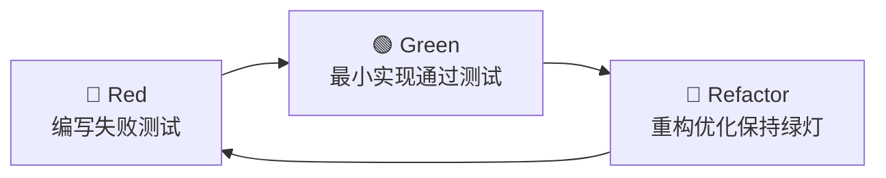
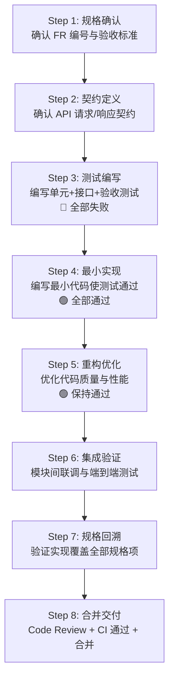
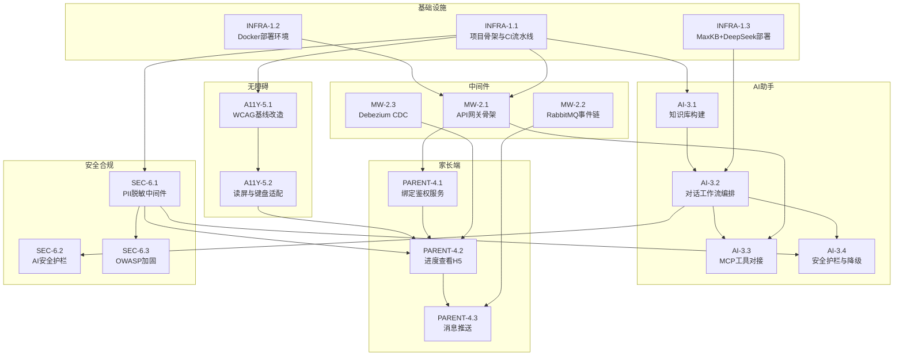
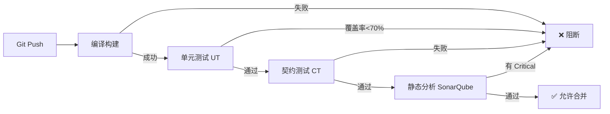

# 微迎新（CampusArrive） v1.1 SDD+TDD 开发任务书

| 项目名称 | 微迎新（CampusArrive） |
| --- | --- |
| 文档名称 | SDD+TDD 开发任务书（Specification-Driven & Test-Driven Development Tasks） |
| 文档编号 | DEV-CA-2026-11 |
| 文档版本 | v1.1.0 |
| 状态 | 待审批 |
| 编制日期 | 2026-08-07 |
| 适用版本 | v1.1（基于 v1.0 迭代） |
| 密级 | L2 内部敏感 |

## 版本历史

| 版本 | 日期 | 修订人 | 修订说明 |
| --- | --- | --- | --- |
| v1.1.0 | 2026-08-07 | 项目组 | 首次编制，基于 SDD+TDD 方法论制定开发任务分解、测试先行规范与验收定义 |

---

## 1 方法论概述

### 1.1 SDD（规格驱动开发）

SDD 要求每一行代码均可追溯至规格说明。本项目的规格基线由已发布的 10 份前期文档构成，每个开发任务必须标注其对应的规格来源（需求编号 `FR-XX-XX`、架构决策、接口契约等），确保"无规格不编码"。

规格驱动链路：

```
项目章程 → 需求规格(SRS) → 架构设计(SAD) → 接口契约(API) → 开发任务(Task) → 测试用例(TestCase) → 代码实现(Code)
```

每个任务的交付物必须包含：
- **规格引用**：对应的 FR 编号或架构决策条目
- **契约定义**：接口输入/输出契约（来自 API 设计文档）
- **验收测试**：可执行的验收标准（来自 SRS 验收标准列）

### 1.2 TDD（测试驱动开发）

TDD 采用 Red-Green-Refactor 循环，测试先于实现：



TDD 在本项目中的落地规则：
- **单元测试先行**：每个类/方法在实现前先编写单元测试，测试失败后方可编写实现代码
- **接口契约测试先行**：每个 API 端点在开发前先编写契约测试（基于 API 设计文档的请求/响应定义）
- **验收测试先行**：每个功能需求在开发前先编写验收测试用例（基于 SRS 验收标准）
- **测试覆盖率门禁**：单元测试行覆盖 ≥ 70%，核心模块 ≥ 85%，CI 流水线自动拦截不达标提交

### 1.3 SDD+TDD 协同工作流



---

## 2 任务编号与属性规范

### 2.1 任务编号规则

```
TASK-{模块代号}-{阶段}.{序号}
```

| 模块代号 | 模块名称 |
| --- | --- |
| AI | AI 迎新智能助手 |
| A11Y | 无障碍访问改造 |
| PARENT | 家长查看端 |
| MW | 系统集成中间件 |
| SEC | 安全与合规保障 |
| INFRA | 基础设施与环境 |

### 2.2 任务属性

每个任务包含以下属性：

| 属性 | 说明 |
| --- | --- |
| 任务编号 | 唯一标识 |
| 规格来源 | 对应的 FR 编号或文档条目 |
| 优先级 | P0(必须) / P1(应该) / P2(可以) |
| 负责角色 | 后端 / 前端 / 测试 / DevOps |
| 估时 | 人天（0.5 粒度） |
| 依赖任务 | 前置任务编号 |
| TDD 类型 | UT(单元) / CT(契约) / AT(验收) |
| DoD | 完成定义（测试通过 + 覆盖率 + 规格覆盖） |

---

## 3 任务依赖关系总览



---

## 4 阶段一：基础设施与环境（W1）

### TASK-INFRA-1.1 项目骨架与 CI 流水线

| 属性 | 值 |
| --- | --- |
| 规格来源 | SAD 第 3 节技术选型、第 5 节部署架构 |
| 优先级 | P0 |
| 负责角色 | DevOps + 后端 |
| 估时 | 2 人天 |
| 依赖任务 | 无 |
| TDD 类型 | UT |

**任务描述**

搭建多模块 Maven/Gradle 项目骨架，配置 CI 流水线（含编译、单元测试、覆盖率门禁、镜像构建），建立 Git 分支策略。

**测试先行清单**

| 编号 | 测试内容 | 类型 | 预期 |
| --- | --- | --- | --- |
| UT-INFRA-001 | CI 流水线触发：提交代码至 feature 分支触发构建 | 流水线 | 构建成功，产出报告 |
| UT-INFRA-002 | 覆盖率门禁：覆盖率 < 70% 时构建失败 | 流水线 | CI 报错并阻断合并 |
| UT-INFRA-003 | Docker 镜像构建：mvn package 产出可运行镜像 | 集成 | 镜像启动后健康检查通过 |

**DoD（完成定义）**

- [ ] 项目多模块结构创建完成（`gateway` / `checkin-service` / `ai-service` / `parent-service` / `integration-service`）
- [ ] CI 流水线含编译 → 单元测试 → 覆盖率检查 → 镜像构建四阶段
- [ ] 覆盖率门禁 70% 生效，低于阈值自动拦截
- [ ] Git 分支策略文档输出（main / develop / feature / hotfix）
- [ ] 骨架项目的冒烟测试通过

---

### TASK-INFRA-1.2 Docker 部署环境

| 属性 | 值 |
| --- | --- |
| 规格来源 | SAD 第 5 节部署架构、09-安全与合规方案第 6 节 |
| 优先级 | P0 |
| 负责角色 | DevOps |
| 估时 | 1.5 人天 |
| 依赖任务 | TASK-INFRA-1.1 |
| TDD 类型 | UT |

**任务描述**

编写 `docker-compose.yml`，编排 MySQL、RabbitMQ、Spring Cloud Gateway、后端服务、MaxKB、Debezium 等组件，配置校园内网网络隔离。

**测试先行清单**

| 编号 | 测试内容 | 类型 | 预期 |
| --- | --- | --- | --- |
| UT-INFRA-004 | docker-compose up：全部容器健康启动 | 集成 | 所有服务 health 状态为 up |
| UT-INFRA-005 | 网络隔离：外部网络不可达内网服务 | 安全 | 仅网关端口可达，内部端口拒绝外部连接 |
| UT-INFRA-006 | 数据持久化：容器重启后数据不丢失 | 集成 | MySQL/RabbitMQ 数据卷持久化验证通过 |

**DoD**

- [ ] `docker-compose.yml` 覆盖全部运行组件
- [ ] 内网网络隔离配置生效（仅网关 443/80 对外）
- [ ] 数据卷挂载配置完成
- [ ] 环境健康检查脚本就绪
- [ ] SIT / UAT / PERF 三套环境可一键拉起

---

### TASK-INFRA-1.3 MaxKB + DeepSeek 内网部署

| 属性 | 值 |
| --- | --- |
| 规格来源 | AID-CA-2026-07 第 3 节技术选型、第 4 节部署架构 |
| 优先级 | P0 |
| 负责角色 | DevOps + 后端-AI |
| 估时 | 2 人天 |
| 依赖任务 | TASK-INFRA-1.2 |
| TDD 类型 | UT |

**任务描述**

内网部署 MaxKB v1.10 LTS 与 DeepSeek V4，初始化知识库空间，验证对话链路连通性（Go/No-Go 验证点）。

**测试先行清单**

| 编号 | 测试内容 | 类型 | 预期 |
| --- | --- | --- | --- |
| UT-INFRA-007 | MaxKB 健康：API 可达且返回正常状态 | 集成 | `/api/status` 返回 200 |
| UT-INFRA-008 | DeepSeek 连通：发送测试 prompt 返回响应 | 集成 | 响应非空，首词响应 < 3s |
| UT-INFRA-009 | 数据不出校：抓包确认无外网请求 | 安全 | 网络审计无出站流量 |

**DoD**

- [ ] MaxKB 可通过内网 IP 访问管理界面
- [ ] DeepSeek API 内网可达且响应正常
- [ ] 知识库空间初始化完成
- [ ] 网络流量审计确认数据不出校
- [ ] 部署文档输出

---

## 5 阶段二：系统集成中间件（W2）

### TASK-MW-2.1 API 网关骨架与路由鉴权

| 属性 | 值 |
| --- | --- |
| 规格来源 | FR-04-01 / FR-04-02 / FR-04-03 / FR-04-04、API 第 2 节接口规范 |
| 优先级 | P0 |
| 负责角色 | 后端-中间件 |
| 估时 | 3 人天 |
| 依赖任务 | TASK-INFRA-1.1、TASK-INFRA-1.2 |
| TDD 类型 | CT（契约测试） |

**任务描述**

实现 Spring Cloud Gateway 网关，包含路由分发、JWT 鉴权过滤器、令牌桶限流、SOAP↔REST 协议适配。

**测试先行清单**

| 编号 | 测试内容 | 类型 | 规格来源 | 预期 |
| --- | --- | --- | --- | --- |
| CT-MW-001 | 路由分发：各服务请求路由至正确后端 | CT | FR-04-01 | 路由准确，非法路由返回 404 |
| CT-MW-002 | 鉴权拦截：无 Token / 过期 Token / 越权 Token | CT | FR-04-02 | 分别返回 401 / 401 / 403 |
| CT-MW-003 | 限流触发：超阈值并发请求 | CT | FR-04-03 | 返回 429， Retry-After 头正确 |
| CT-MW-004 | SOAP 适配：SOAP 请求转为 REST 调用 | CT | FR-04-04 | 字段映射正确，往返结果一致 |
| UT-MW-001 | JWT 解析：合法/非法/过期令牌解析 | UT | — | 合法通过，非法/过期拒绝 |
| UT-MW-002 | 限流计数器：令牌桶算法准确性 | UT | — | 令牌补充速率正确，超限拒绝 |

**DoD**

- [ ] 4 项契约测试全部通过
- [ ] 2 项单元测试全部通过
- [ ] 路由配置覆盖全部后端服务
- [ ] 鉴权过滤器支持 JWT 与 OAuth 2.0 scope
- [ ] 限流配置可按接口与租户粒度调整
- [ ] 网关日志含 request_id 链路追踪

---

### TASK-MW-2.2 RabbitMQ 事件链与异步解耦

| 属性 | 值 |
| --- | --- |
| 规格来源 | FR-04-05 / FR-04-06、SIM-CA-2026-08 第 3 节 |
| 优先级 | P0 |
| 负责角色 | 后端-中间件 |
| 估时 | 2.5 人天 |
| 依赖任务 | TASK-MW-2.1 |
| TDD 类型 | UT + CT |

**任务描述**

设计并实现 RabbitMQ 主题/队列结构，实现签到→缴费→核验→完成四类核心事件链，含重试与死信队列。

**测试先行清单**

| 编号 | 测试内容 | 类型 | 规格来源 | 预期 |
| --- | --- | --- | --- | --- |
| CT-MW-005 | 事件发布与消费：报到状态变更事件 | CT | FR-04-05 | 生产者发布后消费者正确收到 |
| CT-MW-006 | 事件链顺序：签到→缴费→核验→完成 | CT | FR-04-06 | 事件按序触发，缺环可检测 |
| CT-MW-007 | 重试与死信：消费失败后重试超限进死信 | CT | — | 重试 3 次后进入死信队列 |
| UT-MW-003 | 事件序列化：事件对象 JSON 序列化/反序列化 | UT | — | 字段无损，event_id 唯一 |
| UT-MW-004 | 幂等消费：重复事件不重复处理 | UT | — | 相同 event_id 仅处理一次 |

**DoD**

- [ ] 3 项契约测试 + 2 项单元测试全部通过
- [ ] 队列/交换机/绑定配置完成
- [ ] 死信队列配置生效
- [ ] 事件幂等机制验证通过
- [ ] 镜像队列高可用配置完成

---

### TASK-MW-2.3 Debezium CDC 数据同步

| 属性 | 值 |
| --- | --- |
| 规格来源 | FR-04-07 / FR-04-08、SIM-CA-2026-08 第 4 节 |
| 优先级 | P0 |
| 负责角色 | 后端-中间件 + DevOps |
| 估时 | 3 人天 |
| 依赖任务 | TASK-MW-2.2 |
| TDD 类型 | CT |

**任务描述**

部署 Debezium Connector 监听 MySQL binlog，实现报到数据变更向教务/宿管等下游系统的准实时同步，含断点续传与批量初始化。

**测试先行清单**

| 编号 | 测试内容 | 类型 | 规格来源 | 预期 |
| --- | --- | --- | --- | --- |
| CT-MW-008 | 变更捕获：INSERT/UPDATE/DELETE 均被捕获 | CT | FR-04-07 | 三类操作均产生变更事件 |
| CT-MW-009 | 断点续传：Connector 重启后从中断点继续 | CT | FR-04-07 | 无数据丢失，无重复 |
| CT-MW-010 | 同步延迟：注入变更并测量端到端延迟 | CT | FR-04-08 | P95 延迟 ≤ 5s |
| CT-MW-011 | 数据一致性：源库与目标库全量比对 | CT | — | 无丢失、无错位 |
| CT-MW-012 | 下游异常降级：目标系统不可达时不阻断主流程 | CT | — | 变更缓存待补，主流程不受影响 |

**DoD**

- [ ] 5 项契约测试全部通过
- [ ] Debezium Connector 配置完成并稳定运行
- [ ] binlog GTID 断点续传验证通过
- [ ] 批量初始化脚本可重跑
- [ ] 同步延迟监控告警配置完成

---

## 6 阶段二：AI 迎新智能助手（W2–W3）

### TASK-AI-3.1 知识库构建与检索验证

| 属性 | 值 |
| --- | --- |
| 规格来源 | FR-01-07 / FR-01-08 / FR-01-09 / FR-01-10 / FR-01-12 |
| 优先级 | P0 |
| 负责角色 | 后端-AI + 辅导员（口径确认） |
| 估时 | 3 人天 |
| 依赖任务 | TASK-INFRA-1.3 |
| TDD 类型 | AT（验收测试） |

**任务描述**

将报到流程手册、校园 POI、FAQ、材料清单模板结构化入库 MaxKB，构建向量索引，验证检索召回率。

**测试先行清单**

| 编号 | 测试内容 | 类型 | 规格来源 | 预期 |
| --- | --- | --- | --- | --- |
| AT-AI-001 | 流程手册检索：提问"报到需要什么材料" | AT | FR-01-07 | 召回相关片段，召回率 ≥ 85% |
| AT-AI-002 | POI 检索：提问"食堂在哪里" | AT | FR-01-08 | 返回正确 POI 信息 |
| AT-AI-003 | FAQ 检索：提问高频问题 | AT | FR-01-09 | 匹配标准答案 |
| AT-AI-004 | 材料清单：按身份查询 | AT | FR-01-10 | 本科/研究生/留学生返回不同清单 |
| AT-AI-005 | 溯源：检索结果可引用来源片段 | AT | FR-01-12 | 每条回答附带知识库片段引用 |

**DoD**

- [ ] 5 项验收测试全部通过
- [ ] 知识库条目经辅导员复核确认口径
- [ ] 向量索引构建完成，Top-K 召回相关性达标
- [ ] 知识库维护手册输出
- [ ] 召回率测试报告产出（≥ 85%）

---

### TASK-AI-3.2 对话工作流编排与 DeepSeek 生成

| 属性 | 值 |
| --- | --- |
| 规格来源 | FR-01-01 / FR-01-02 / FR-01-03 / FR-01-11 / FR-01-13 / FR-01-14 |
| 优先级 | P0 |
| 负责角色 | 后端-AI + 前端 |
| 估时 | 3.5 人天 |
| 依赖任务 | TASK-AI-3.1 |
| TDD 类型 | CT + AT |

**任务描述**

在 MaxKB 中编排对话工作流（检索→生成→内容标识），对接 DeepSeek V4 实现流式生成，前端实现双层交互入口与对话面板。

**测试先行清单**

| 编号 | 测试内容 | 类型 | 规格来源 | 预期 |
| --- | --- | --- | --- | --- |
| CT-AI-001 | 对话接口：POST /api/v1/ai/chat 请求/响应 | CT | FR-01-01 | 契约一致，SSE 流式返回正常 |
| CT-AI-002 | WebSocket 流式对话：连接→发送→接收 | CT | FR-01-01 | 首词响应 ≤ 2s，流式无断连 |
| AT-AI-006 | 流程问答：提问环节顺序/材料/地点 | AT | FR-01-02 | 回答与流程版本一致，可溯源 |
| AT-AI-007 | POI 查询：提问校园地点信息 | AT | FR-01-03 | 信息与导航库一致 |
| AT-AI-008 | 内容标识：AI 回复含"AI 生成"标识 | AT | FR-01-14 | 每条回复带可见标识与来源 |
| AT-AI-009 | 首词响应时间：测量首个 token 到达 | AT | FR-01-13 | P95 ≤ 2s |
| UT-AI-001 | 工作流编排：节点配置变更可版本化 | UT | FR-01-11 | 版本记录可追溯，可回滚 |

**DoD**

- [ ] 2 项契约测试 + 4 项验收测试 + 1 项单元测试全部通过
- [ ] MaxKB 工作流编排完成（检索→生成→标识→输出）
- [ ] DeepSeek 流式生成对接完成
- [ ] 小程序双层交互入口与对话面板可用
- [ ] 对话日志与审计记录完整

---

### TASK-AI-3.3 MCP 工具对接

| 属性 | 值 |
| --- | --- |
| 规格来源 | FR-01-15 / FR-01-16 |
| 优先级 | P0 |
| 负责角色 | 后端-AI |
| 估时 | 2 人天 |
| 依赖任务 | TASK-AI-3.2、TASK-MW-2.1 |
| TDD 类型 | CT |

**任务描述**

通过 MCP 协议向大模型暴露系统能力（跳转报到环节、调用校园导航），实现 AI 工具化应答。

**测试先行清单**

| 编号 | 测试内容 | 类型 | 规格来源 | 预期 |
| --- | --- | --- | --- | --- |
| CT-AI-003 | MCP 工具-跳转环节：AI 调用跳转至指定环节 | CT | FR-01-15 | 跳转目标正确，携带上下文 |
| CT-AI-004 | MCP 工具-调用导航：AI 触发导航至某地点 | CT | FR-01-16 | 起终点正确，室内外衔接一致 |
| UT-AI-002 | MCP 工具注册：工具描述与参数校验 | UT | — | 非法参数被拒，合法参数执行 |

**DoD**

- [ ] 2 项契约测试 + 1 项单元测试全部通过
- [ ] MCP 工具注册与调用链路打通
- [ ] 工具调用日志记录完整
- [ ] 导航工具与 v1.0 高德地图服务联调通过

---

### TASK-AI-3.4 安全护栏与降级机制

| 属性 | 值 |
| --- | --- |
| 规格来源 | FR-01-05 / FR-01-17 / FR-01-18、SCS-CA-2026-09 第 4 节 AI 安全 |
| 优先级 | P0 |
| 负责角色 | 后端-AI + 安全合规 |
| 估时 | 2.5 人天 |
| 依赖任务 | TASK-AI-3.2、TASK-SEC-6.2 |
| TDD 类型 | AT |

**任务描述**

实现 AI 输入/输出安全护栏（敏感词过滤、越权拒绝、有害内容拦截）、情绪识别转人工、DeepSeek 不可用降级至 FAQ。

**测试先行清单**

| 编号 | 测试内容 | 类型 | 规格来源 | 预期 |
| --- | --- | --- | --- | --- |
| AT-AI-010 | 敏感词拦截：注入违规提问 | AT | FR-01-17 | 命中过滤，返回安全兜底话术 |
| AT-AI-011 | 越权拒绝：提问他人信息/系统配置 | AT | — | 拒绝作答，提示权限不足 |
| AT-AI-012 | 情绪转人工：注入负面情绪/多次未解决 | AT | FR-01-05 | 自动转人工，携带上下文摘要 |
| AT-AI-013 | 降级至 FAQ：模拟 DeepSeek 不可达 | AT | FR-01-17 | 3s 内降级，回答带"FAQ 模式"标识 |
| AT-AI-014 | 降级可观测：降级事件上报监控 | AT | FR-01-18 | 降级即记录，连续降级触发告警 |
| UT-AI-003 | 敏感词库匹配：正则与关键词匹配 | UT | — | 命中率 100%，无误报 |

**DoD**

- [ ] 5 项验收测试 + 1 项单元测试全部通过
- [ ] 敏感词库配置完成并经安全合规确认
- [ ] 降级链路验证通过（DeepSeek 不可达 → FAQ 模式）
- [ ] 情绪识别与转人工链路可用
- [ ] 降级监控告警配置完成
- [ ] 数据不出校抓包验证通过

---

## 7 阶段三：家长查看端（W3–W4）

### TASK-PARENT-4.1 绑定鉴权服务

| 属性 | 值 |
| --- | --- |
| 规格来源 | FR-03-01 / FR-03-02、API 第 4 节家长端接口 |
| 优先级 | P0 |
| 负责角色 | 后端 |
| 估时 | 2 人天 |
| 依赖任务 | TASK-MW-2.1 |
| TDD 类型 | CT |

**任务描述**

实现家长手机号验证码绑定与 JWT 令牌签发，校验预登记手机号，令牌仅关联学生 ID 不含敏感字段。

**测试先行清单**

| 编号 | 测试内容 | 类型 | 规格来源 | 预期 |
| --- | --- | --- | --- | --- |
| CT-PAR-001 | 绑定接口：POST /api/v1/parent/bind | CT | FR-03-01 | 预登记手机号绑定成功，非预登记拒绝 |
| CT-PAR-002 | 验证码：有效/过期/错误验证码 | CT | FR-03-01 | 5 分钟内有效，过期/错误返回明确错误码 |
| CT-PAR-003 | 限频防刷：同一手机号 60s 内重复请求 | CT | FR-03-01 | 返回 429 限流 |
| CT-PAR-004 | JWT 签发：令牌结构与有效期 | CT | FR-03-02 | 令牌含 student_id，有效期 30 天，不含敏感字段 |
| CT-PAR-005 | 令牌吊销：已吊销令牌访问被拒 | CT | FR-03-02 | 返回 401 |
| UT-PAR-001 | 验证码生成：6 位数字，随机性 | UT | — | 无规律，不可预测 |
| UT-PAR-002 | JWT 载荷解析：字段完整性校验 | UT | — | 仅含 student_id / exp / iat |

**DoD**

- [ ] 5 项契约测试 + 2 项单元测试全部通过
- [ ] 绑定流程经网关鉴权
- [ ] 验证码限频防刷生效
- [ ] JWT 令牌不含敏感字段（身份证号、姓名等）
- [ ] 令牌吊销机制可用

---

### TASK-PARENT-4.2 进度查看 H5 与脱敏展示

| 属性 | 值 |
| --- | --- |
| 规格来源 | FR-03-03 / FR-03-04 / FR-03-05 / FR-03-07 |
| 优先级 | P0 |
| 负责角色 | 前端 + 后端 |
| 估时 | 3 人天 |
| 依赖任务 | TASK-PARENT-4.1、TASK-SEC-6.1、TASK-A11Y-5.2 |
| TDD 类型 | CT + AT |

**任务描述**

开发家长端 H5 页面，展示报到环节列表与完成状态，实现数据最小化脱敏规则，确保不暴露身份证号、宿舍门牌号、缴费金额等。

**测试先行清单**

| 编号 | 测试内容 | 类型 | 规格来源 | 预期 |
| --- | --- | --- | --- | --- |
| CT-PAR-006 | 进度接口：GET /api/v1/parent/progress | CT | FR-03-03 | 返回环节列表，仅含名称与状态 |
| AT-PAR-001 | 环节列表展示：与新生端一致 | AT | FR-03-03 | 列表一致，仅显示环节名称与状态 |
| AT-PAR-002 | 完成状态一致性：与新生端实时一致 | AT | FR-03-04 | 状态同步，延迟 < 1s |
| AT-PAR-003 | 到校状态：已到校/未到校及日期 | AT | FR-03-05 | 签到后即时更新，仅显示日期 |
| AT-PAR-004 | 数据最小化：接口与页面不含敏感字段 | AT | FR-03-07 | 身份证号/宿舍门牌号/缴费金额不可见 |
| AT-PAR-005 | 越权访问：篡改 student_id 访问他人进度 | AT | FR-03-07 | 返回 403，不可越权 |
| AT-PAR-006 | 无障碍达标：家长端 H5 WCAG 2.2 AA | AT | FR-02-01 | 无严重违规 |

**DoD**

- [ ] 1 项契约测试 + 6 项验收测试全部通过
- [ ] H5 页面在微信内置浏览器与普通浏览器均可用
- [ ] 脱敏规则在后端接口层强制执行
- [ ] 越权访问被网关鉴权拦截
- [ ] 无障碍自测通过

---

### TASK-PARENT-4.3 消息推送

| 属性 | 值 |
| --- | --- |
| 规格来源 | FR-03-06 |
| 优先级 | P0 |
| 负责角色 | 后端 + 前端 |
| 估时 | 1.5 人天 |
| 依赖任务 | TASK-PARENT-4.2、TASK-MW-2.2 |
| TDD 类型 | CT |

**任务描述**

学生签到后通过 RabbitMQ 事件触发家长端微信消息推送，推送内容仅含到校提示，不含敏感信息。

**测试先行清单**

| 编号 | 测试内容 | 类型 | 规格来源 | 预期 |
| --- | --- | --- | --- | --- |
| CT-PAR-007 | 签到事件触发推送：学生签到 → 家长收到通知 | CT | FR-03-06 | 签到后 10s 内送达 |
| CT-PAR-008 | 推送内容脱敏：不含敏感信息 | CT | FR-03-06 | 仅含"您的孩子已到校"提示 |
| CT-PAR-009 | 未绑定家长不推送：无绑定时事件静默丢弃 | CT | — | 不报错，记录日志 |

**DoD**

- [ ] 3 项契约测试全部通过
- [ ] 推送延迟 ≤ 10s
- [ ] 推送内容经脱敏审查
- [ ] 异常情况（未绑定/推送失败）不阻断主流程

---

## 8 阶段三：无障碍访问改造（W3–W5）

### TASK-A11Y-5.1 WCAG 2.2 AA 基线改造

| 属性 | 值 |
| --- | --- |
| 规格来源 | FR-02-01 / FR-02-02 / FR-02-03 / FR-02-05 |
| 优先级 | P0 |
| 负责角色 | 前端 |
| 估时 | 3 人天 |
| 依赖任务 | TASK-INFRA-1.1 |
| TDD 类型 | AT |

**任务描述**

对小程序与家长端 H5 进行 WCAG 2.2 AA 级改造，补充 ARIA 语义标签、高对比度模式、触控目标尺寸，建立 axe-core 自动化审计 CI 集成。

**测试先行清单**

| 编号 | 测试内容 | 类型 | 规格来源 | 预期 |
| --- | --- | --- | --- | --- |
| AT-A11Y-001 | ARIA 语义：交互元素含 role/aria-label/aria-live | AT | FR-02-02 | 屏幕阅读器可正确朗读 |
| AT-A11Y-002 | 高对比度：文本与背景对比度 ≥ 4.5:1 | AT | FR-02-03 | 大文本 ≥ 3:1，切换后布局不错乱 |
| AT-A11Y-003 | 触控目标：可点击元素 ≥ 24×24 CSS px | AT | FR-02-05 | 全量页面达标 |
| AT-A11Y-004 | axe-core 自动审计：CI 中自动扫描 | AT | FR-02-01 | 无严重违规，审计报告产出 |
| AT-A11Y-005 | Lighthouse 无障碍评分 | AT | FR-02-01 | ≥ 90 |

**DoD**

- [ ] 5 项验收测试全部通过
- [ ] ARIA 语义标签覆盖全部交互元素
- [ ] 高对比度主题切换可用
- [ ] axe-core CI 集成完成，违规自动拦截
- [ ] Lighthouse 无障碍评分 ≥ 90

---

### TASK-A11Y-5.2 读屏与键盘适配

| 属性 | 值 |
| --- | --- |
| 规格来源 | FR-02-04 / FR-02-06 / FR-02-07 |
| 优先级 | P0 |
| 负责角色 | 前端 |
| 估时 | 2.5 人天 |
| 依赖任务 | TASK-A11Y-5.1 |
| TDD 类型 | AT |

**任务描述**

实现键盘可达替代方案（拖拽式流程编辑器键盘操作）、字体缩放 200% 支持、VoiceOver/TalkBack 兼容验证。

**测试先行清单**

| 编号 | 测试内容 | 类型 | 规格来源 | 预期 |
| --- | --- | --- | --- | --- |
| AT-A11Y-006 | 键盘替代拖拽：仅键盘完成流程编辑等价操作 | AT | FR-02-04 | 操作结果与拖拽一致 |
| AT-A11Y-007 | 字体缩放 200%：无横向滚动/遮挡/功能缺失 | AT | FR-02-06 | 布局完整，功能可用 |
| AT-A11Y-008 | VoiceOver 兼容：iOS 关键流程可独立完成 | AT | FR-02-07 | 报到流程全程可操作 |
| AT-A11Y-009 | TalkBack 兼容：Android 关键流程可独立完成 | AT | FR-02-07 | 报到流程全程可操作 |
| AT-A11Y-010 | 焦点可见性：键盘焦点有清晰视觉指示 | AT | — | 焦点边框可见，顺序合理 |

**DoD**

- [ ] 5 项验收测试全部通过
- [ ] 键盘操作替代方案覆盖全部拖拽场景
- [ ] 200% 字体缩放验证通过
- [ ] iOS VoiceOver + Android TalkBack 真机验证通过
- [ ] 无障碍自测报告输出

---

## 9 阶段四：安全与合规保障（W2–W5，贯穿）

### TASK-SEC-6.1 PII 脱敏中间件

| 属性 | 值 |
| --- | --- |
| 规格来源 | SCS-CA-2026-09 第 3 节数据安全、FR-03-07 |
| 优先级 | P0 |
| 负责角色 | 后端 + 安全合规 |
| 估时 | 2.5 人天 |
| 依赖任务 | TASK-INFRA-1.1 |
| TDD 类型 | UT + CT |

**任务描述**

实现 PII 五层防护（采集/传输/存储/展示/日志）脱敏中间件，按数据分级 L1/L2/L3 配置脱敏规则，AES-256 加密存储 L3 敏感数据。

**测试先行清单**

| 编号 | 测试内容 | 类型 | 规格来源 | 预期 |
| --- | --- | --- | --- | --- |
| UT-SEC-001 | 脱敏规则：身份证号/手机号/姓名脱敏 | UT | — | 中间四位掩码，不可逆 |
| UT-SEC-002 | AES-256 加密：L3 数据加密存储 | UT | — | 密文不可逆，密钥轮换可解密 |
| CT-SEC-001 | 接口脱敏：API 响应中 PII 字段已脱敏 | CT | FR-03-07 | 响应不含明文 PII |
| CT-SEC-002 | 日志脱敏：日志中不含明文 PII | CT | — | 日志审计无明文敏感字段 |
| AT-SEC-001 | 数据分级目录：L1/L2/L3 分级覆盖全部字段 | AT | — | 分级目录经校方确认 |

**DoD**

- [ ] 2 项单元测试 + 2 项契约测试 + 1 项验收测试全部通过
- [ ] 脱敏中间件集成至网关响应过滤器
- [ ] L3 数据 AES-256 加密存储配置完成
- [ ] 数据分类分级目录经校方信息中心确认
- [ ] 密钥管理方案输出

---

### TASK-SEC-6.2 AI 安全护栏

| 属性 | 值 |
| --- | --- |
| 规格来源 | SCS-CA-2026-09 第 4 节 AI 安全、GB/T 45654-2025 |
| 优先级 | P0 |
| 负责角色 | 后端-AI + 安全合规 |
| 估时 | 2 人天 |
| 依赖任务 | TASK-AI-3.2 |
| TDD 类型 | AT |

**任务描述**

实现 AI 输入/输出双层安全护栏：输入层敏感词过滤与越权拦截，输出层有害内容检测与 AI 生成内容标识，对标 GB/T 45654-2025。

**测试先行清单**

| 编号 | 测试内容 | 类型 | 规格来源 | 预期 |
| --- | --- | --- | --- | --- |
| AT-SEC-002 | 输入护栏：敏感词/越权/注入提问 | AT | GB/T 45654-2025 | 输入被拦截，返回安全话术 |
| AT-SEC-003 | 输出护栏：有害内容检测 | AT | GB/T 45654-2025 | 有害输出被拦截或替换 |
| AT-SEC-004 | 内容标识：AI 生成内容含可见标识 | AT | 生成式 AI 管理办法 | 每条回复带标识与来源 |
| AT-SEC-005 | 对话日志审计：全量对话可追溯 | AT | — | 日志含完整对话、时间、标识 |

**DoD**

- [ ] 4 项验收测试全部通过
- [ ] 输入/输出护栏配置完成
- [ ] AI 生成内容标识机制生效
- [ ] 对话日志全量审计可用
- [ ] GB/T 45654-2025 自评估报告初稿产出

---

### TASK-SEC-6.3 OWASP Top 10 加固

| 属性 | 值 |
| --- | --- |
| 规格来源 | SCS-CA-2026-09 第 5 节应用安全、OWASP Top 10 |
| 优先级 | P0 |
| 负责角色 | 后端 + 安全合规 + 测试 |
| 估时 | 2.5 人天 |
| 依赖任务 | TASK-SEC-6.1 |
| TDD 类型 | AT |

**任务描述**

针对 OWASP Top 10 进行安全加固与渗透测试：注入防护、失效访问控制、安全配置错误、身份认证缺陷等。

**测试先行清单**

| 编号 | 测试内容 | 类型 | 规格来源 | 预期 |
| --- | --- | --- | --- | --- |
| AT-SEC-006 | SQL 注入：注入测试 payload | AT | OWASP A03 | 注入被参数化查询拦截 |
| AT-SEC-007 | XSS：跨站脚本注入 | AT | OWASP A03 | 输出编码生效，脚本不执行 |
| AT-SEC-008 | 越权访问：水平/垂直越权 | AT | OWASP A01 | 越权请求返回 403 |
| AT-SEC-009 | 安全配置：错误信息不泄露堆栈 | AT | OWASP A05 | 错误响应不含堆栈/版本信息 |
| AT-SEC-010 | ZAP 自动扫描：全量接口扫描 | AT | OWASP Top 10 | 无高危漏洞 |

**DoD**

- [ ] 5 项验收测试全部通过
- [ ] OWASP Top 10 无高危漏洞
- [ ] ZAP 扫描报告产出
- [ ] 安全加固清单逐项确认
- [ ] 等保 2.0 自测评报告初稿产出

---

## 10 任务汇总与排期映射

### 10.1 全量任务清单

| 任务编号 | 任务名称 | 模块 | 优先级 | 估时(人天) | 依赖 | 周次 |
| --- | --- | --- | --- | --- | --- | --- |
| INFRA-1.1 | 项目骨架与 CI 流水线 | 基础设施 | P0 | 2.0 | — | W1 |
| INFRA-1.2 | Docker 部署环境 | 基础设施 | P0 | 1.5 | 1.1 | W1 |
| INFRA-1.3 | MaxKB + DeepSeek 部署 | 基础设施 | P0 | 2.0 | 1.2 | W1 |
| MW-2.1 | API 网关骨架与路由鉴权 | 中间件 | P0 | 3.0 | 1.1, 1.2 | W2 |
| MW-2.2 | RabbitMQ 事件链 | 中间件 | P0 | 2.5 | 2.1 | W2 |
| MW-2.3 | Debezium CDC 同步 | 中间件 | P0 | 3.0 | 2.2 | W3 |
| AI-3.1 | 知识库构建 | AI 助手 | P0 | 3.0 | 1.3 | W2 |
| AI-3.2 | 对话工作流编排 | AI 助手 | P0 | 3.5 | 3.1 | W2–W3 |
| AI-3.3 | MCP 工具对接 | AI 助手 | P0 | 2.0 | 3.2, 2.1 | W3 |
| AI-3.4 | 安全护栏与降级 | AI 助手 | P0 | 2.5 | 3.2, 6.2 | W3 |
| PARENT-4.1 | 绑定鉴权服务 | 家长端 | P0 | 2.0 | 2.1 | W3 |
| PARENT-4.2 | 进度查看 H5 | 家长端 | P0 | 3.0 | 4.1, 6.1, 5.2 | W4 |
| PARENT-4.3 | 消息推送 | 家长端 | P0 | 1.5 | 4.2, 2.2 | W4 |
| A11Y-5.1 | WCAG 基线改造 | 无障碍 | P0 | 3.0 | 1.1 | W3 |
| A11Y-5.2 | 读屏与键盘适配 | 无障碍 | P0 | 2.5 | 5.1 | W4–W5 |
| SEC-6.1 | PII 脱敏中间件 | 安全合规 | P0 | 2.5 | 1.1 | W2 |
| SEC-6.2 | AI 安全护栏 | 安全合规 | P0 | 2.0 | 3.2 | W3 |
| SEC-6.3 | OWASP Top 10 加固 | 安全合规 | P0 | 2.5 | 6.1 | W5 |

**合计**：18 个任务，43.5 人天

### 10.2 周次产能分配

| 周次 | 任务 | 投入人天 | 可用产能 | 利用率 |
| --- | --- | --- | --- | --- |
| W1 | INFRA-1.1 + 1.2 + 1.3 | 5.5 | 30 | 18% |
| W2 | MW-2.1 + 2.2 + AI-3.1 + SEC-6.1 | 11.0 | 30 | 37% |
| W3 | MW-2.3 + AI-3.2 + 3.3 + PARENT-4.1 + A11Y-5.1 + SEC-6.2 | 16.0 | 30 | 53% |
| W4 | AI-3.4 + PARENT-4.2 + 4.3 + A11Y-5.2 | 9.5 | 30 | 32% |
| W5 | SEC-6.3 + A11Y-5.2(续) | 5.0 | 30 | 17% |
| W6 | 集成测试、验收、灰度（见测试计划） | — | 30 | — |

> W1–W2 利用率偏低为设计预留：基础设施与核心骨架阶段需留调试与 PoC 验证缓冲；W3 为关键路径高峰，需确保资源聚焦。

### 10.3 关键路径

```
INFRA-1.1 → INFRA-1.2 → INFRA-1.3 → AI-3.1 → AI-3.2 → AI-3.3 → AI-3.4 → 集成验收
```

关键路径上的任何延期将直接影响 v1.1 上线时间，需每日站会跟踪。

---

## 11 TDD 执行规范

### 11.1 测试编写顺序

每个任务的测试编写严格遵循以下顺序：

```
1. 阅读规格 → 确认 FR 编号与验收标准
2. 编写验收测试(AT) → 定义"完成"的可执行标准
3. 编写契约测试(CT) → 锁定接口输入/输出
4. 编写单元测试(UT) → 覆盖方法级逻辑边界
5. 运行全部测试 → 确认全部 RED（失败）
6. 编写最小实现 → 逐个使测试 GREEN（通过）
7. 重构 → 保持全部 GREEN
8. 提交 → CI 流水线验证
```

### 11.2 测试代码规范

| 规范项 | 要求 |
| --- | --- |
| 命名 | `{类型}-{模块}-{序号}`，如 `AT-AI-001`，与本文档编号一致 |
| 结构 | Arrange-Act-Assert 三段式 |
| 独立性 | 测试间无依赖，可任意顺序执行 |
| 可读性 | 测试名称描述预期行为，如 `shouldReturn401WhenTokenExpired` |
| Mock | 外部依赖（DB/MQ/DeepSeek）使用 Mockito Mock，不依赖真实环境 |
| 数据 | 测试数据使用工厂方法或 Builder，禁止硬编码魔法值 |
| 覆盖率 | 行覆盖 ≥ 70%，核心模块 ≥ 85%，由 JaCoCo 采集 |

### 11.3 CI 流水线门禁



---

## 12 Code Review 规范

### 12.1 Review 清单

每个 PR 合并前须由至少 1 名同行 Review，关键模块须由技术负责人 Review：

| 检查项 | 要求 |
| --- | --- |
| 规格覆盖 | 代码可追溯至 FR 编号或架构决策 |
| 测试先行 | 测试用例先于实现编写，PR 含测试代码 |
| 测试通过 | CI 全绿，无跳过的测试 |
| 覆盖率达标 | 新增代码覆盖率 ≥ 85% |
| 无安全隐患 | 无硬编码密钥、无 SQL 拼接、无明文 PII |
| 代码规范 | 符合项目 Checkstyle/SpotBugs 规则 |
| 命名清晰 | 类名/方法名/变量名语义自解释 |
| 无冗余 | 无注释掉的代码、无 TODO（或已登记 Issue） |

### 12.2 PR 模板

```
## 关联规格
- 需求编号: FR-XX-XX
- 任务编号: TASK-XX-X.X
- 架构决策: SAD 第 X 节

## 变更说明
[简要描述本次变更内容]

## 测试说明
- [x] 单元测试已编写并通过
- [x] 契约测试已编写并通过
- [x] 覆盖率达标（XX%）
- [ ] 验收测试已编写并通过（如适用）

## Review 要点
[请 Reviewer 重点关注的部分]
```

---

## 13 规格回溯矩阵

每个任务完成后须填写回溯矩阵，确认实现覆盖全部规格项：

| 任务编号 | 规格来源 | 测试用例 | 实现状态 | 回溯确认 |
| --- | --- | --- | --- | --- |
| INFRA-1.1 | SAD 第 3/5 节 | UT-INFRA-001~003 | ☐ | |
| INFRA-1.2 | SAD 第 5 节 | UT-INFRA-004~006 | ☐ | |
| INFRA-1.3 | AID 第 3/4 节 | UT-INFRA-007~009 | ☐ | |
| MW-2.1 | FR-04-01~04 | CT-MW-001~004, UT-MW-001~002 | ☐ | |
| MW-2.2 | FR-04-05~06 | CT-MW-005~007, UT-MW-003~004 | ☐ | |
| MW-2.3 | FR-04-07~08 | CT-MW-008~012 | ☐ | |
| AI-3.1 | FR-01-07~10,12 | AT-AI-001~005 | ☐ | |
| AI-3.2 | FR-01-01~03,11,13,14 | CT-AI-001~002, AT-AI-006~009, UT-AI-001 | ☐ | |
| AI-3.3 | FR-01-15~16 | CT-AI-003~004, UT-AI-002 | ☐ | |
| AI-3.4 | FR-01-05,17~18 | AT-AI-010~014, UT-AI-003 | ☐ | |
| PARENT-4.1 | FR-03-01~02 | CT-PAR-001~005, UT-PAR-001~002 | ☐ | |
| PARENT-4.2 | FR-03-03~05,07 | CT-PAR-006, AT-PAR-001~006 | ☐ | |
| PARENT-4.3 | FR-03-06 | CT-PAR-007~009 | ☐ | |
| A11Y-5.1 | FR-02-01~03,05 | AT-A11Y-001~005 | ☐ | |
| A11Y-5.2 | FR-02-04,06~07 | AT-A11Y-006~010 | ☐ | |
| SEC-6.1 | SCS 第 3 节, FR-03-07 | UT-SEC-001~002, CT-SEC-001~002, AT-SEC-001 | ☐ | |
| SEC-6.2 | SCS 第 4 节, GB/T 45654 | AT-SEC-002~005 | ☐ | |
| SEC-6.3 | SCS 第 5 节, OWASP | AT-SEC-006~010 | ☐ | |

> 规格回溯矩阵在迭代过程中持续维护，每完成一个任务即更新对应行，作为上线前规格覆盖审查的依据。

---

> 本任务书经审批签署后生效，作为 v1.1 迭代开发执行的正式基线。SDD+TDD 执行过程中如遇规格变更或任务调整，须经项目经理评审并更新版本号。
